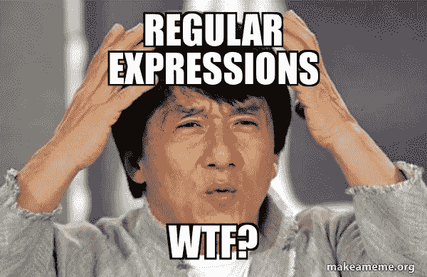
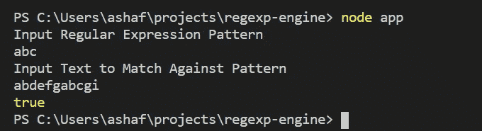
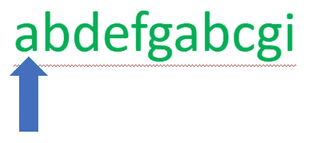
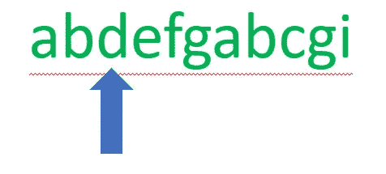
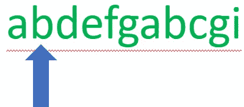
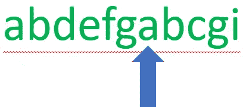
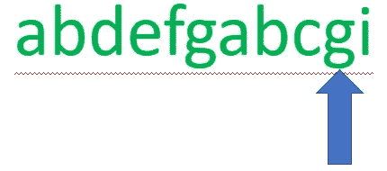
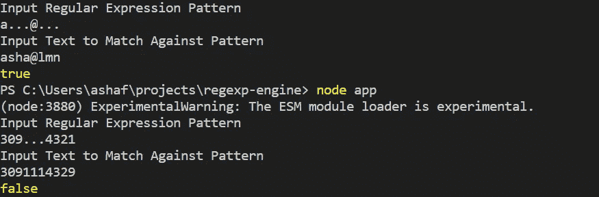

# 理解正则表达式第 4 部分

> 原文：<https://javascript.plainenglish.io/introduction-to-regular-expressions-c481e5c34df0?source=collection_archive---------14----------------------->

编写正则表达式引擎



在本系列的上一期中，我们重点关注了重复字符以及“match”和“matchAll”的更多用法在本文中，我将稍微绕一下路，研究正则表达式引擎本身是如何工作的。为此，我将简要回顾一些基本的正则表达式概念。然后我会开始编写我们自己的正则表达式引擎。

首先，我们需要回到一些基本的正则表达式概念和术语。正则表达式是一组表示文本模式的符号。这些符号是由正则表达式引擎解释的正式语言，用于匹配、搜索和替换文本。许多编程语言使用正则表达式引擎，包括 JavaScript。NET、Python、Ruby、C、C++、Java、PHP 和 Perl 等等。在 JavaScript 中，正则表达式的符号遵循以下基本格式:

```
/[pattern]/[flag(s)]
```

从上面可以看出，两个正斜杠之间是引擎在文本中搜索的正则表达式模式。该模式可以包括文字字符和特殊字符，这些字符提供了关于如何匹配模式的更详细的信息。这些标志规定了发动机运行的模式。例如，“I”表示不区分大小写的模式，在这种模式下，引擎会忽略小写/大写的区别。

现在我们已经有了一些基础知识，让我们开始创建自己的正则表达式引擎，以了解更多关于正则表达式匹配如何工作的“幕后”机制。对于这个项目，我们的正则表达式引擎的第一次迭代将比真正的正则表达式引擎更简单，但它将阐明基本的正则表达式思想。我将使用 node.js 来解决这个问题。此外，我将尽量避免使用 javascript 的内置“助手”方法。如果你想看这个程序的最新版本，这里是 GitHub 库。

```
const readline = require('readline')
const rl = readline.createInterface({
  input: process.stdin,
  output: process.stdout
})
const ask = query => new Promise((resolve,reject) => {
  rl.question(query, answer => resolve(answer))
})let [pattern, text ] = ['','']ask("Input Regular Expression Pattern\n")
  .then(result => { 
      pattern = result
      return ask("Input Text to Match Against Pattern\n")
    })
   .then(text => {
       rl.close()
       console.log(test(pattern, text))
   })
  .catch(error => console.log(error))
```

该代码片段对于设置我们的环境是必要的，但对于我们引擎的整体逻辑并不重要。我简单解释一下。我们需要一个“readline”库来设置用户界面。创建接口行设置一个接口对象，它使用标准输入和标准输出来与对象交互。

接下来，我设置了一个函数“asks ”,承诺为用户输入和输出功能创建一个异步流。最后一个块的必要步骤如下:请求正则表达式模式，然后请求文本与模式匹配；然后用两个结果创建一个对象；然后关闭界面；然后再解构出两个变量。最后，我们使用测试函数来确定文本是否包含模式。

说到这里，让我们来看看测试函数对引擎的影响。该函数接收模式和文本作为输入，同时返回 true(如果找到模式)或 false(如果没有找到模式)作为输出。查看下面的代码，我们可以看到该函数的主要逻辑由两个循环组成—第一个循环遍历字符串中的每个字符。匹配的第一个字符启动第二个内部循环。

```
function test(pattern,text){
  let i = 0
  //outer while loop moves from one character to another in the text          //until the end is reached or a match is found
  while(i < text.length) {
    if(text.charAt(i) === pattern[0]){
      let j = 1
      **while(j < pattern.length && pattern[j] 
                  === text.charAt(i + j)){****j += 1
    }**
   //all characters are equal to pattern return true
     **if(j === pattern.length){return true}**
   }
   i += 1
  }
  //the loop has gone through every character in the text and no 
  //pattern is matched  
  **return false**
}
```

整体逻辑很简单，说明了正则表达式引擎工作的必要过程。

1.  在外部循环中，引擎检查文本中的每个字符。
2.  第一个字符匹配启动第二个内部循环。
3.  这个内部循环使用另一个计数器来验证所有的模式是否匹配该部分文本。
4.  当引擎找到一个模式时，它返回 true。
5.  否则，引擎放弃在该索引处查找该模式，外部循环继续。
6.  如果循环遍历整个文本，但没有找到任何模式，则返回 false。

让我们看一个例子来更深入地了解它是如何工作的。在我们的终端中，我们运行程序，输入正则表达式模式和要匹配的文本。结果是真的。让我们按照步骤来看看这是如何发生的。



pattern: ‘abc’, input text: ‘abdefgabcgi’



1.  引擎从第一个字符开始并检查其值。它发现该字母与模式匹配。



2.该引擎检查每个字符，只要它匹配“abc”模式。它发现这种模式不可能完全满足。



3.该模式失败，引擎从循环通过每个字符的下一个字母重新开始。



4.在迭代许多字符后，引擎最终找到一个再次匹配的字母。



5.内部循环遍历每个字符。这一次，所有的字符都与模式匹配。该函数随后返回 true。

匹配一组文字字符是匹配过程如何工作的最简单的例子。让我们添加一些简单的功能，通过添加“通配符”来“增强”引擎通配符表示“任何字符”换句话说，引擎只需验证某个字符是否在该位置就可以通过通配符测试。

```
export default function test(pattern, text) {
  let i = 0;
  while (i < text.length) {
    if (text.charAt(i) === pattern[0] || pattern[0] === '.') {
      let j = 1;
      while (j < pattern.length && (pattern[j] === text.charAt(i + j) || **pattern[j] === '.'**)) {
        j += 1;
        **if (i + j > text.length) {
          return false;
        }**
      }
      if (j === pattern.length) {
        return true;
      }
    }
    i += 1;
  }
  return false;
}
```

查看上面的代码，我们可以看到新代码包含对旧代码的两处修改。首先，对于内部循环，如果模式字符是通配符，迭代将继续。其次，添加了一个条件，以确保模式匹配循环不会超过字符串的末尾。

下面是对我们终端新功能的一个快速测试。第一个测试基于字符的数量和类型成功地识别出测试中的正确模式，允许任意的通配符。第二个测试通过拒绝不符合模式的文本来产生预期的结果。



Testing new wildcard functionality

## 关键要点

1.  正则表达式引擎是用于匹配文本中正则表达式模式的代码。
2.  正则表达式引擎不局限于特定的语言，在多种语言中都有相似的规则，包括 JavaScript。NET、Python、Ruby、C、C++、Java、PHP 和 Perl。
3.  该引擎通过逐个字符地迭代文本来寻找正则表达式模式的匹配。
4.  如果模式开始但不完整，引擎将回溯，从而防止在引擎继续迭代时丢失模式。

在本系列的下一部分[中，我们将构建我们的引擎，并回顾正则表达式中使用的一些更特殊的字符和标志。](https://medium.com/@GreatDeveloper66/introduction-to-regular-expressions-8be3b2271af)

## 更多资源

[RegExpr](https://regexr.com/)-学习、构建和测试正则表达式的在线工具

[正则表达式](https://en.wikipedia.org/wiki/Regular_expression)-维基百科文章

[正则表达式备忘单](https://www.rexegg.com/regex-quickstart.html)

[雄辩的 JavaScript](https://eloquentjavascript.net/09_regexp.html)——著名的 JavaScript 书《雄辩的 JavaScript》有一章专门讨论正则表达式。

[GitHub](https://github.com/GreatDeveloper66/RegExp-Engine)——GitHub 储存库，用于本文中回顾的代码。