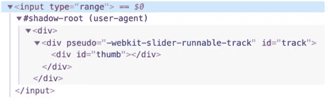

# JavaScript 中的阴影 Dom 简介

> 原文：<https://javascript.plainenglish.io/introduction-to-shadow-dom-in-javascript-62ef0b6da708?source=collection_archive---------12----------------------->

## 通过例子理解 JavaScript 中影子 Dom 的概念

Photo by [Christopher Gower](https://unsplash.com/@cgower?utm_source=medium&utm_medium=referral) on [Unsplash](https://unsplash.com?utm_source=medium&utm_medium=referral)

# 什么是暗影 DOM？

在我们定义影子 DOM 之前，我们需要先了解文档对象模型或 DOM，它是 HTML 文档作为节点的表示，由浏览器构建。另一方面，影子 DOM 用于封装。它允许组件拥有自己的“影子”DOM 树，不会从主文档中意外访问，可能有本地样式规则，等等。

影子 DOM 有自己的作用域，影子 DOM 内部的任何元素都不能影响 DOM 内部的外部元素。

Photo by [Pankaj Patel](https://unsplash.com/@pankajpatel?utm_source=medium&utm_medium=referral) on [Unsplash](https://unsplash.com?utm_source=medium&utm_medium=referral)

# 内置阴影 DOM

你想过浏览器控件的创建和样式有多复杂吗？如`**<input type="range">**`:

HTML Input Element.

浏览器内部使用 DOM 或者 CSS 来绘制它们。DOM 结构通常对我们是隐藏的，但是我们可以在开发工具中看到它。例如，在 Chrome 中，我们需要在开发工具中启用“显示用户代理阴影 DOM”选项。

然后`**<input type="range">**`看起来是这样的:

Shadow Dom in the Developer tools.

你在`**#shadow-root**`下看到的被称为“影子王国”。

*我们无法通过常规的 JavaScript 调用或选择器获得内置的影子 DOM 元素。这些不是普通的孩子，而是一种强大的封装技术。*

# 结论

如你所见，如果你只想使用阴影树的样式，而不是主文档的样式，阴影 DOm 非常有用。您也可以创建自己的阴影 DOM。所以这只是对这个主题的一个简单介绍，如果你感兴趣的话，请确保从其他资源中了解更多。

喜欢这篇文章吗？如果有，通过 [**订阅获取更多类似内容解码，我们的 YouTube 频道**](https://www.youtube.com/channel/UCtipWUghju290NWcn8jhyAw) **！**