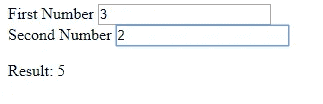

# 共享工作者简介

> 原文：<https://javascript.plainenglish.io/introduction-to-shared-workers-533d9abe9de3?source=collection_archive---------2----------------------->


Photo by [Brooke Cagle](https://unsplash.com/@brookecagle?utm_source=medium&utm_medium=referral) on [Unsplash](https://unsplash.com?utm_source=medium&utm_medium=referral)

共享工作器是特殊的 web 工作器，可以由多个浏览器上下文访问，如浏览器标签、窗口、iframes 或其他工作器等。

他们不同于敬业的员工，因为他们是`SharedWorkers`的实例，并且具有不同的全球范围。

根据同源策略，所有浏览器上下文必须在同一个域中。

在本文中，我们将研究 shared 和 workers 的特征以及如何创建它们。

# 共享工作者的特征

专用工作器和共享工作器的区别在于专用工作器只能由一个脚本访问。即使每个页面在不同的窗口中运行，多个脚本也可以访问共享工作器。

这使得多个脚本之间的通信更加灵活。

访问工人的脚本可以通过使用`SharedWorker.port`属性创建的`MessagePort`对象来访问工人。如果使用`addEventListener`附加`onmessage`事件，则使用`start`方法手动启动端口。

当端口启动时，多个脚本可以向 worker 发送消息，并分别使用`port.postMessage`和`port.onmessage`处理发送的消息。

除此之外，脚本仍然通过向工作器发送消息来与共享工作器通信，并通过脚本从工作器获取消息。

`SharedWorker`构造函数还接受一个选项对象，该对象包含以下选项:

*   `type`:指定要创建的 worker 类型的字符串。该值可以是`classic`或`module`，默认为`classic`。
*   `credentials`:指定工作者使用的凭证类型的字符串。该值可以是`omit`(不需要凭证)、`same-origin`或`include`。如果未指定，则`type`为`class`，默认为`omit`。
*   `name`:指定代表工作器范围的`SharedWorkerGlobalScope`的标识名的字符串。主要用于调试。

如果不允许启动 workers，比如 URL 无效或者违反了同源策略，构造函数将抛出一个`SecurityError`。

如果工作脚本的 MIME 类型不正确，将引发`NetworkError`。

`SyntaxError`引发的是工作人员的 URL 无法解析。


Photo by [Icons8 Team](https://unsplash.com/@icons8?utm_source=medium&utm_medium=referral) on [Unsplash](https://unsplash.com?utm_source=medium&utm_medium=referral)

# 创建和使用共享工作器

我们可以创建一个共享的工人，使用它没有太多的麻烦。首先，我们必须创建一个共享工作者。然后我们必须创建脚本来使用它。最后，我们添加 HTML，这样我们就可以用它做一些事情。

首先创建一个`scripts`文件夹并添加一个`sharedWorker.js`文件:

```
onconnect = (ev) => {
  const [port] = ev.ports; port.onmessage = e => {
    const [first, second] = e.data;
    let sum = +first + +second;
    if (isNaN(sum)) {
      port.postMessage("Both inputs should be numbers");
    }
    else {
      const workerResult = `Result: ${sum} `;
      port.postMessage(workerResult);
    }
  };
};
```

在上面的代码中，我们将一个`onconnect` 处理程序分配给了`onconnect` 属性。然后在处理函数内部，我们得到共享工作器用来与其他脚本通信的端口。

接下来，我们将一个事件处理程序分配给从`onconnect`处理程序的参数中获得的`port`的`onmesaage`属性。然后我们可以从`onmessage` 处理程序的参数中获取数据并计算总和。

在处理程序中，我们检查从外部脚本发送的两个数据是否都是数字，如果是，就把数字加在一起，然后发送给脚本。

如果我们想用`addEventListener`给`message`事件添加一个监听器，而不是给`onmessage`分配一个事件处理程序，我们必须在最后调用`onconnect`事件处理程序中的`port.start();`。

另一方面，我们向外部脚本发回一条消息，表明发送的数据不是一个数字。

然后我们在`script.js`中创建一个`main.js`和`main2.js`并添加:

```
const sharedWorker = new SharedWorker("scripts/sharedWorker.js");
const first = document.getElementById("number1");
const second = document.getElementById("number2");
const result = document.getElementById("result");
sharedWorker.port.start();
first.onkeyup = () => {
  sharedWorker.port.postMessage([first.value, second.value]);
};second.onkeyup = () => {
  sharedWorker.port.postMessage([first.value, second.value]);
};sharedWorker.port.onmessage = e => {
  result.textContent = e.data;
};
```

我们从将要创建的 HTML 文件中获取输入，然后将其发送给我们的共享工作者。我们必须使用共享工作器的`port`来完成这项工作，就像我们使用 `sharedWorker.port.postMessage`一样。

在:

```
sharedWorker.port.onmessage = e => {
  result.textContent = e.data;
};
```

我们取回从共享工作者发送的数据。

`main.js`和`main2.js`做同样的事情，但是它们被不同的页面使用。

最后，创建`index.html`和`index2.html`并添加:

```
<!DOCTYPE html>
<html>
  <head>
    <title>Add Worker</title>
  </head>
  <body>
    <form>
      <div>
        <label for="number1">First Number</label>
        <input type="text" id="number1" value="0" />
      </div>
      <div>
        <label for="number2">Second Number</label>
        <input type="text" id="number2" value="0" />
      </div>
    </form>
    <p id="result">Result</p>
    <script src="scripts/main.js"></script>
  </body>
</html>
```

最后，我们得到:



当我们走到`index.html`或者`index2.html`的时候。我们应该能够在两页上进行计算，而不会互相干扰。

创建一个共享工作者和创建一个专注的工作者没有太大的区别。构造函数参数完全相同。唯一的区别是我们可以在多个脚本中使用它，并且我们需要让`port`对象在外部脚本和共享工作器之间进行通信。

**用简单英语写的 JavaScript 笔记**

我们总是有兴趣帮助推广高质量的内容。如果你有一篇文章想用简单的英语提交给 JavaScript，用你的中级用户名发邮件到 submissions@javascriptinplainenglish.com[](mailto:submissions@javascriptinplainenglish.com)**给我们，我们会把你添加为作者。**

**我们还推出了三种新的出版物！请关注我们的新出版物，表达对它们的爱:[**AI in Plain English**](https://medium.com/ai-in-plain-english)，[**UX in Plain English**](https://medium.com/ux-in-plain-english)，[**Python in Plain English**](https://medium.com/python-in-plain-english)**—谢谢，继续学习！****