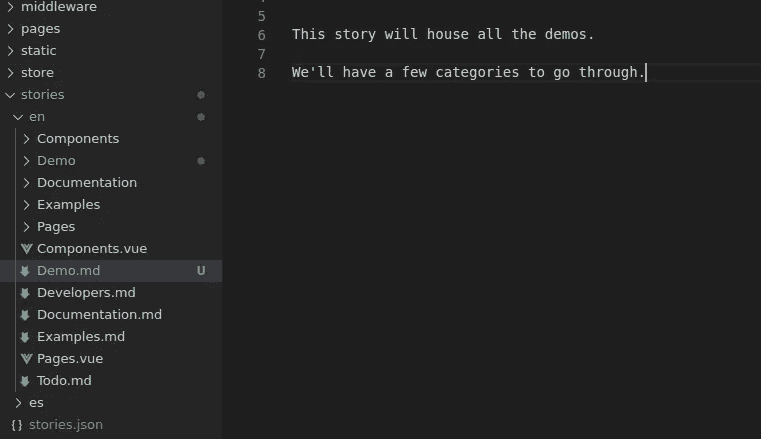
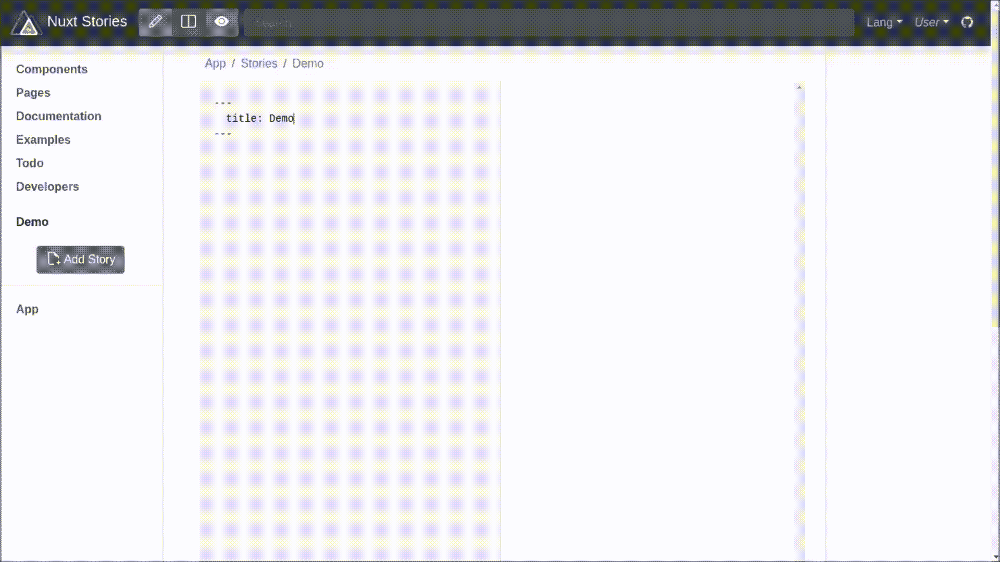

# 使用 Nuxt 故事介绍故事驱动开发

> 原文：<https://javascript.plainenglish.io/introduction-to-story-driven-development-with-nuxt-stories-5f2f160aaccb?source=collection_archive---------6----------------------->

## 以思想的速度发展！

你希望你的想法在你想到的时候变成现实。当你写下这些想法的时候，你就要求从即时的功能中得到即时的满足。nuxt-stories 是一个模块，你可以用它为你的 nuxt 网络应用快速编写故事、游戏计划、笔记、文档等等。其实你想想，连你收藏的*故事*都可以当你的 app！

对于不耐烦的人，你可能希望直接快进到[演示](https://medium.com/@richard.e.schloss/introduction-to-story-driven-development-with-nuxt-stories-5f2f160aaccb#3e47)。

声明:我是 [nuxt-stories](https://www.npmjs.com/package/nuxt-stories) 的作者。

定义:**故事** ( *名词*，【 [2](https://www.google.com/search?q=story&rlz=1C1CHBF_enUS917US917&oq=story&aqs=chrome.0.69i59j0j69i59j69i60l2j69i61j69i65l2.397j0j7&sourceid=chrome&ie=UTF-8) ):“对某人生活中或某事物演变过程中的往事的记述。”

# 介绍

大约一年前，我向世界介绍了 Nuxt-stories 1 . x([Nuxt story booking:The 无痛之路](https://medium.com/javascript-in-plain-english/nuxt-storybooking-the-painless-way-eb5a3653265f))。当我意识到我可以简单地使用 web 框架提供的功能时，我第一次对简化(传统上乏味的)故事书工作流程感到高兴:不需要完全从头开始，我可以简单地扩展我的应用程序的路线，在需要时显示故事，否则隐藏它们。一行配置更改让我不再周末头疼。

几个月后，我有了第二个啊哈时刻，我意识到这可能是我一直想要的构成应用程序本身的故事，而不仅仅是应用程序的需求。我认为可以直接在 UI 上管理的故事，而不是文件系统，可以允许更快的工作流程。

这与现代 web 开发形成了鲜明的对比，在现代 web 开发中，通常在文件系统上进行更改，然后这些更改在 UI 上可见。等待文件系统变化在 UI 上显现的固有延迟是我一直觉得与我的思维速度相违背的。我需要翻转箭头:而不是让 UI 上的更改自动保存回文件系统。

## 精神突破:我们从来不想要应用程序，我们想要功能性的故事

我想到，也许即使我们都已经习惯了使用*应用*，也许我们从来没有真正想要使用它们，而是*功能故事*。用我们的方式写的故事，而不是其他人的。符合我们思维过程的故事，看起来是我们想要的样子。故事的组成部分是按照我们个人的喜好组织的，而不是分散在屏幕上的应用程序，要求我们在它们之间跳来跳去。

所有的人类历史都建立在*故事*之上:我们曾经有过的想法，我们曾经学到的教训，我们曾经经历过的时代，以及我们曾经进行过的独特计算。每个人都会遇到如此多的变化，任何一个应用程序如何能够完全满足任何一个人的需求呢？即使应用程序完全按照我们的要求运行，为什么还要更新呢？答案是他们不会，也永远不会，因为我们的需求会随着时间的推移而改变。

相反，我们需要我们可以写的故事，这些故事可以解释我们所写的东西，以形象化我们所寻求的知识，然后在我们这样做的时候进行调整。让故事不仅包含想法，还包含*功能组件*可能是将想法带入生活的最快方式。此外，当这样的故事可以以一种松散地看起来像大多数人的 PostIt 笔记(即 [Markdown](https://github.com/adam-p/markdown-here/wiki/Markdown-Cheatsheet) )的格式编写时，那么故事编写甚至伪代码都可以由一个世界的人来完成，而不仅仅是软件开发人员。

例如，单个故事点可能是:

```
* The weather in **{{ destination }}**:
<weather :location="destination" />
```

最理想的是看到它迅速转变成这样:

*   旧金山的天气:


Screenshot of Google Weather; this example would have “destination” set to “San Francisco” in the stories’ reserved data section

从那时起，这个功能部件将永远是故事的一部分。可以完全控制小部件的位置和样式。理想情况下，这一切都将在小部件语法被写下来时发生，而不需要去某个应用商店。应用程序商店可能会被一个组件或故事“商店”取代，这样就不用下载整个应用程序，只下载感兴趣的部分。或者更好的是，小部件可能有内置的“from”或“variant”属性，可以按需实例化特定的小部件:

`<weather from=”google” location=”San Francisco” />`

无需去商店，无需等待下载完成，只需在标签以“/>”结束时检索感兴趣的信息。不需要敲“Ctrl + Enter”或者有一些键盘快捷键的知识。只要输入你想要的就能得到你想要的。

# **故事的重要特征**

*   故事是不断变化的。计算机代码一直在分支，正是因为我们的*故事*分支。因此，当与版本控制系统(如 git)结合使用时，故事书工具将是最有用的，这样就可以快速地改变分支。
*   不断变化的故事需要动态的主持人来倾听这些变化。nuxt-stories 使用 nuxt-socket-io 来完成这项工作。
*   故事可以不断变化，但有时内容是静态托管的，因此其他人不能更改它。例如，说明指南或文档。nuxt-stories 允许配置静态主机选项。
*   故事既可以*上传*到一个中心位置，也可以*分发*给(并且只给)一个订户网络。全息链(h-wiki)是后者的灵感来源。
*   故事和故事书工具应该对所有人开放，而不仅仅是那些知道如何编码的人。因此，直接在 UI 上编辑是一个不可协商的要求。在首选的 IDE 中脱离 UI 进行开发也应该有可能满足这些用户。这样，在 UI 上创建的故事可以保存回文件系统，反之亦然。
*   故事的所有部分，包括功能部分，都应该是有反应的，因为在*瞬间*我们写下它们。就像画家在绘画时需要看到笔画一样，故事讲述者需要看到 UI 小部件在书写时变得栩栩如生，而不是在 3-4 秒后。哪怕是 1 秒钟的延迟都会让人心烦意乱。
*   故事被写下来后必须自动保存。早在计算机出现之前，“Ctrl + S”从来不是保护一个人的书面思想的必要条件，在我看来，现在也不应该是。另一方面，自动分发有自己的一套要求。

# **故事组织**

在 nuxt-stories 中，故事组织如下:

`[app root]/[storiesDir; default: “stories”]/[lang; default: “en”]`

对于下面这篇文章中的演示，使用了下面的组织结构:



Stories Organization



Introduction

如上所示，可以看出，故事既可以写成“Vue 优先”，也可以写成“Markdown 优先”。在我个人看来，“Markdown-first”更加直观和可移植，因此这里介绍的所有演示都将使用这种方法。此外，从这一点开始，nuxt-stories 模块将只支持对“先降价”的故事进行添加/编辑/删除操作。我向任何习惯了“Vue 优先”的第 1 版用户道歉，但是，我想你会更喜欢“Markdown 优先”的。

# **演示**

对于本文的其余部分，我将让视频来说话。我写这些是为了帮助你的阅读速度跟上我的写作速度。您可以暂停/播放/搜索控制按钮，以准确找到您想要的花絮。这可能是了解 nuxt-stories 到底是什么以及它的计划是什么的最佳方式。

## 基本用法

[https://youtu.be/myvO23cYJnQ](https://youtu.be/myvO23cYJnQ)

## 自动生成的目录

[https://youtu.be/apok3ioB53c](https://youtu.be/apok3ioB53c)

## 输入数据

[https://youtu.be/njkbUIRZ3ls](https://youtu.be/njkbUIRZ3ls)

## 重新排序故事

[https://youtu.be/inR-ICj1Iog](https://youtu.be/inR-ICj1Iog)

## 自动导入组件

[https://youtu.be/Y1Eftqe77n0](https://youtu.be/Y1Eftqe77n0)

## 自动更新计算

[https://youtu.be/ti9KGER7Nx4](https://youtu.be/ti9KGER7Nx4)

## 视频带来的乐趣

[https://youtu.be/PXN_Xr75EJQ](https://youtu.be/PXN_Xr75EJQ)

# **重要提示**

1.  由于 UI 允许你做实时编辑和实时编译，技术上有很多违反规则的地方，但没关系，因为这只是一个简单的*开发工具*主要用于*本地*。预计会看到控制台日志语句变得混乱。当您键入时，由于组件名不完整，编译自然会失败。我的最佳建议是暂时屏蔽控制台错误，或者禁用开发工具中的“错误”日志级别。
2.  对于基于 markdown 的故事，故事首先由 markdown 解析器解析，然后由 Vue 编译器编译。在左窗格中输入的任何内容都会被解析/编译，所以请确保您信任输入的内容。nuxt-stories 模块包含了一个 DOMpurify 包，您可能希望启用它来清理降价。但是，这可能会妨碍您的工作流程。选择你想用多少速度来换取安全，反之亦然。
3.  随着每个单独故事的增长，解析和编译将在您键入*时发生，如果故事变得太大，这可能会导致响应速度变慢。虽然有一个可配置的去抖时间帮助，确切地说，在击键和解析之间有 300 ms 的延迟，但请将此视为进一步改善故事组织的一种方式。它们越小，也就越容易组织你的思想。将来也可能计划拥有允许暂停/恢复实时编译的 UI 控件。
4.  在 UI 中，还有一些功能没有实现，比如搜索框、语言选择器和用户控件。其实还有很多 [Todo](https://nuxt-stories.netlify.app/stories/en/Todo) 。

# 结论

虽然 nuxt-stories 的版本 1 非常酷，但事后看来，它并没有完全实现我对故事驱动开发的所有期望。版本 2 有一些重大的改进，但是仍然有许多工作要做。然而，更大的收获是提供故事驱动开发的具体例子，这样概念可以很容易地被重用和改进。事实上，版本 2 不仅是在 5 个月的集思广益之后出现的，而且是从其他人那里学习而来的，比如 ObservableHQ，bootstrap-vue，nuxt-content，h-wiki，甚至 storybookjs。他们也很受尊敬。

*   想投稿？不管有没有代码，伟大的想法都会改进项目。就是这里:[https://github.com/richardeschloss/nuxt-stories](https://github.com/richardeschloss/nuxt-stories)
*   想要连接吗？在 Linkedin 上找到我:[https://www.linkedin.com/in/richardeschloss/](https://www.linkedin.com/in/richardeschloss/)