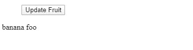
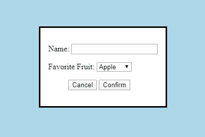

# HTML 对话框元素介绍

> 原文：<https://javascript.plainenglish.io/introduction-to-the-html-dialog-element-39a369d80028?source=collection_archive---------5----------------------->


Photo by [Ben White](https://unsplash.com/@benwhitephotography?utm_source=medium&utm_medium=referral) on [Unsplash](https://unsplash.com?utm_source=medium&utm_medium=referral)

web 应用程序中经常使用对话框。它们用于显示确认消息、警告和其他适合弹出窗口的东西。

在对话框元素出现之前，我们只有内置在 JavaScript 中的`alert`和`confirm`函数来显示纯文本消息。它们不能设置样式，也不能显示除文本之外的任何内容。

另外`alert`和`confirm`对话框除了内置的按钮之外不能有任何按钮。

为了在不添加库的情况下更容易地创建对话框，现在我们可以使用`dialog`元素来创建弹出对话框。

在这篇文章中，我们将看看如何将`dialog`元素添加到我们的应用程序中，并用它们做些什么。


Photo by [Celine Sayuri Tagami](https://unsplash.com/@celine_sayuri?utm_source=medium&utm_medium=referral) on [Unsplash](https://unsplash.com?utm_source=medium&utm_medium=referral)

# 创建对话框

为了创建对话框，我们将添加如下的`dialog`元素:

```
<dialog open>
  <p>Greetings!</p>
</dialog>
```

我们有一个带有`open`属性的`dialog`来显示对话框。默认样式取决于浏览器。

在 Chrome 中，默认情况下是这样的:


我们可以向一个`dialog`元素添加任何 HTML。例如，我们可以添加如下表单:

```
<dialog open>
  <form method="dialog">
    <p>
      <label>
        Name:
      </label>
      <input type='type' name='name'>
    </p> <p>
      <label>
        Favorite Fruit:
      </label>
      <select name='fruit'>
        <option value='apple' selected>Apple</option>
        <option value='banana'>Banana</option>
        <option value='grape'>Grape</option>
      </select>
    </p> <menu>
      <button value="cancel">Cancel</button>
      <button id="confirm-btn" value="default">Confirm</button>
    </menu>
  </form>
</dialog><menu>
  <button id="dialog-button">Update Fruit</button>
</menu><output></output>
```

我们的`dialog`有一个`form`元素，其中`method`被设置为`dialog`。这允许我们设置对话框的返回值，我们可以在点击确认关闭`dialog`后使用。

我们还有一个`input`和`select`元素，让我们在表单中输入一些东西。

此外，我们有一个 ID 为`dialog-button`的按钮来打开我们的`dialog`元素

然后在我们的 JavaScript 代码中，我们可以控制对话框的打开和关闭，并获得如下输入值:

```
const dialogButton = document.getElementById('dialog-button');
const dialog = document.querySelector('dialog');
const output = document.querySelector('output');
const input = document.querySelector('input');
const select = document.querySelector('select');
const confirmBtn = document.getElementById('confirm-btn');dialogButton.addEventListener('click', () => {
  if (typeof dialog.showModal === "function") {
    dialog.showModal();
  }
});select.addEventListener('change', (e) => {
  confirmBtn.value = [select.value, input.value].join(' ');
});input.addEventListener('change', (e) => {
  confirmBtn.value = [select.value, input.value].join(' ');
});dialog.addEventListener('close', () => {
  output.value = dialog.returnValue;
});
```

打开`dialog`我们有:

```
dialogButton.addEventListener('click', () => {
  if (typeof dialog.showModal === "function") {
    dialog.showModal();
  }
});
```

`showModal`方法打开`dialog`。

然后我们为`select`和`input`准备了监听器，如果用户输入任何内容，监听器就会获取它们的值。

我们有:

```
confirmBtn.value = [select.value, input.value].join(' ');
```

获取`input`和`select`的值，并将其设置为`confirmBtn`的`value`属性，即确认按钮。这也将`dialog`的`returnValue`设置为`confirmBtn.value`。

最后，我们有:

```
dialog.addEventListener('close', () => {
  output.value = dialog.returnValue;
});
```

获取`returnValue`，它是从`input`和`select`监听器中分配的`confirmBtn.value`中获得的。

然后我们得到:


一旦我们点击确认，我们会得到:



# 设计背景

要样式化`dialog`的背景，我们可以通过使用`::backdrop` CSS 伪元素来选择它，并对其应用样式。仅当显示`dialog`时，才绘制背景。

例如，我们可以将其样式化如下:

```
dialog::backdrop {
  background-color: lightblue !important;
}
```

上面的代码将背景颜色从默认改为`lightblue`。

然后我们得到以下结果:



在创建弹出对话框时,`dialog`元素为我们节省了一些精力。我们不需要库或大量代码来创建简单的对话框。

为了在`dialog`关闭时设置`dialog.returnValue`的值，我们将`form`元素的`method`设置为`dialog`，并将确认按钮的`value`属性设置为我们想要设置的值。

当`dialog`打开时，我们可以使用`::backdrop`伪元素来设计背景的颜色。