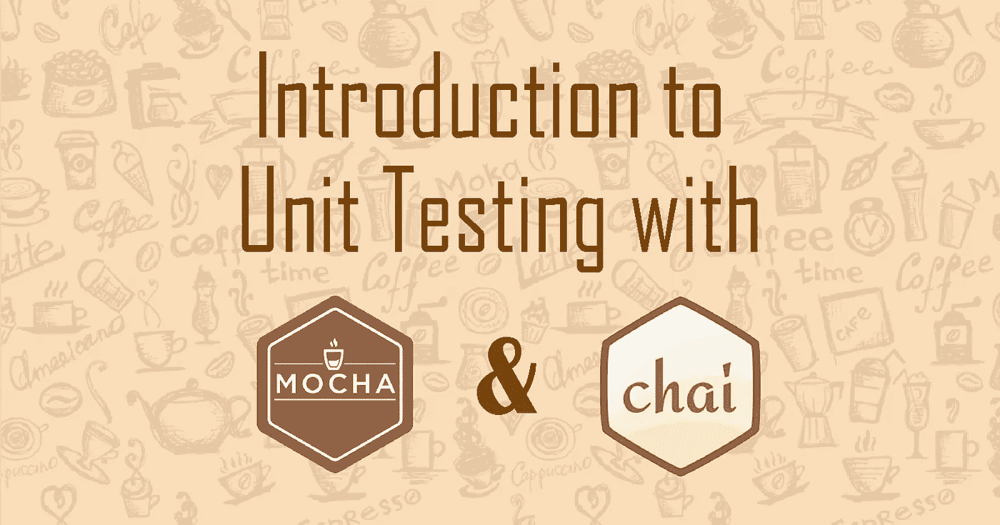
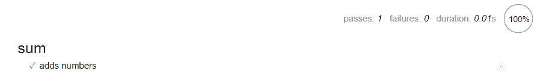

# Mocha & Chai 单元测试简介

> 原文：<https://javascript.plainenglish.io/introduction-to-unit-testing-with-mocha-chai-4cc4c3578a77?source=collection_archive---------12----------------------->

## 用于测试的 JavaScript 测试框架和断言库



测试是开发的重要部分。如果你还没有读过，请看看我在 Node.js 的[自动化测试上的帖子，我在那里讲述了 JavaScript 的基本测试过程，并讨论了为什么它对质量保证很重要。](https://medium.com/javascript-in-plain-english/automated-testing-with-node-js-for-beginners-2e1fecd1ac68?source=friends_link&sk=f21b0e1ab180b81d1d6157991ed141ee)

这一次，我将介绍一种叫做**单元测试**的新型测试。

# 单元测试

测试一个应用程序的单个部分，如函数或方法，是否适合使用。一个单元可以被定义为一个应用程序的最小可测试部分。开发人员执行单元测试，以确保一个单元能够独立地执行**它想要做的事情，而不会影响**代码的其他区域。

随着新函数、依赖项和类的出现，代码变得越来越复杂，在应用程序中进行单元测试以测试任何新代码是否会在应用程序中产生错误是非常重要的。这使得检测代码中的 bug 和错误更加有效。

在 JavaScript 中，我们可以使用[摩卡](https://mochajs.org/)和[柴](https://www.chaijs.com/api/)来编写单元测试用例。

# 摩卡和柴

Mocha 是一个可以用来运行测试的测试框架。Chai 是一个断言库，它为我们的测试断言提供了描述性的、易于阅读的语法。

> *在单元测试中，断言是指确认功能/测试的输出与预期输出完全相同的过程。*

# 步骤 1:下载 Node.js 和 npm

在[https://nodejs.org/en/download/](https://nodejs.org/en/download/)下载 Node.js(带 npm)

安装后，要检查它是否存在，请转到您的命令提示符:

```
node -v
npm -v
```

# 第二步:安装摩卡

为了在我们的浏览器上进行测试，我们在项目文件中运行了以下内容:

```
npm install mocha chai --save-dev
```

名为`node_modules`的文件夹应该出现在您的项目中。

# 步骤 3:创建一个测试页面

让我们首先创建一个测试页面，在这里我们可以看到测试的结果。

```
<!DOCTYPE html>
<html>
  <head>
    <title>Unit Testing Tutorial</title>
    <link rel="stylesheet" href="node_modules/mocha/mocha.css">
  </head>
  <body>
    <div id="mocha"></div>
    <script src="node_modules/mocha/mocha.js"></script>
    <script src="node_modules/chai/chai.js"></script>
    <script>mocha.setup('bdd')</script>

    <!-- Test code here -->

    <script>
      mocha.run();
    </script>
  </body>
</html>
```

正如你在代码中看到的，我们使用 Mocha 自己的 CSS 来设计页面样式，并将`mocha.js`和`chai.js` <脚本>加载到页面中。然后我们调用`mocha.setup('bdd')`来加载它的 **BDD(行为驱动开发)**接口。

> *BDD 是一种技术，* ***描述*** *一个功能，解释***做什么，并使用测试用例对* ***断言*** *按预期工作。**

*在设置下面，我们将编写下面的测试代码，最后，我们将使用* 

# *步骤 4:创建一个测试文件夹*

*为了保持测试代码有组织，我们将通过在我们项目的根目录中创建一个`/tests`文件夹，把所有的测试文件放在一个单独的目录中。*

*稍后，我们可以将我们所有的测试文件(即 testFunction1.js，testModule1.js)放在`/tests`文件夹中。*

# *步骤 5:样本测试*

*让我们创建一个样本测试。首先在您的`/tests`文件夹中创建一个`sumTest.js`，并创建一个测试:*

```
*var assert = chai.assert;

describe("sum", function() {
  it("adds numbers", function() {
       assert.equal(sum(6, 3), 9);
  });
});*
```

*这个测试是 BDD 技术的一个简单例子:*

*   *首先我们`describe`这个函数。它被称为“和”。*
*   *接下来我们解释一下`it`的作用。在 sum 函数的例子中，它将数字相加。*
*   *最后，我们使用`assert.equal()`给出一个测试用例，其中第一个参数是函数，第二个是函数的预期输出。*

# *第六步:求和函数*

*所以我们创建了我们的测试。但是我们还没有创建求和函数。如果我们现在运行测试，它将给出错误。让我们在根目录下创建一个`sum.js`，代码如下:*

```
*function sum(num1, num2){
    return num1 + num2;
}*
```

*太好了！现在让我们运行我们的测试。*

# *运行测试*

*首先将我们的`sumTest.js`和`sum.js`添加到我们的 HTML 页面。它应该看起来像:*

```
*<!DOCTYPE html>
<html>
  <head>
    <title>Unit Testing Tutorial</title>
    <link rel="stylesheet" href="node_modules/mocha/mocha.css">
  </head>
  <body>
    <div id="mocha"></div>
    <script src="node_modules/mocha/mocha.js"></script>
    <script src="node_modules/chai/chai.js"></script>
    <script>mocha.setup('bdd')</script>

    **<script src="sum.js"></script>

    <script src="tests/sumTest.js"></script>** 
    <script>
      mocha.run();
    </script>
  </body>
</html>*
```

*现在，如果我们在浏览器中运行我们的 testPage.html，它应该看起来像这样:*

**

*耶！我们通过了测试！这意味着我们的功能应该如我们所愿。*

> **注:实际上，在很多情况下，功能可能不正确，但测试通过。处理这一问题的正确方法是理解函数应该做什么，并针对特定用途进行测试。**

# *今天就到这里吧！*

*有了单元测试，你可以用 Mocha 和 Chai 做更多的事情！这个简单的例子并不是测试函数的好方法。通常，会有更多的“it”和“assert”语句来检查函数必须满足的各种条件，以便按预期工作。我建议您在项目中进行自己的测试，以学习如何设计能够有效检测代码中的缺陷/错误的测试。*

*一些阅读材料可供参考:*

*   *[https://javascript.info/testing-mocha](https://javascript.info/testing-mocha)*
*   *[https://mochajs.org/](https://mochajs.org/)*
*   *https://www.chaijs.com/api/bdd/*
*   *[https://www . freecodecamp . org/learn/information-security-and-quality-assurance/quality-assurance-and-test-with-chai/](https://www.freecodecamp.org/learn/information-security-and-quality-assurance/quality-assurance-and-testing-with-chai/)*

*感谢阅读！请分享下面的任何评论或问题，祝单元测试好运！干杯！*