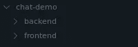

# 让我们使用 Socket 构建一个实时聊天应用程序。IO、React、Node.js 和 MongoDB

> 原文：<https://javascript.plainenglish.io/introduction-to-web-sockets-building-a-real-time-chat-application-9cf1002e1398?source=collection_archive---------1----------------------->

## web 套接字介绍


# 为什么是 web 套接字？

随着网络的发展，支持它的技术也在发展。虽然 **REST** 仍然是 web 服务架构的默认选择，但是大多数现代应用程序需要一些 **REST** 无法可靠提供的特性。这些功能有一个共同点，**实时**。无论是通知系统、聊天室还是活动跟踪器，都需要源源不断的信息。这正是套接字的亮点，它能够来回发送数据，而不必为每个动作重新初始化连接。处理 web sockets 最好的库之一是 [**Socket。IO**](https://socket.io/) 。

# 堆栈

我们将使用 [**React**](https://reactjs.org/) 作为前端， [**Node.js**](https://nodejs.org/en/) 作为后端， [**Express**](https://expressjs.com/) 作为 web 框架， [**MongoDB**](https://www.mongodb.com/) 作为数据库，[**mongose**](https://mongoosejs.com/)作为 ODM。然后我们将能够使用 [**插座连接两端。IO**惊人的 API。
我会假设你已经安装了最新版本的 **Node.js** ，以及自己 OS 的特定 **MongoDB** 发行版。或者，你可以简单地使用](https://socket.io/) [**图集**](https://www.mongodb.com/cloud/atlas) 。

# 项目结构

让我们继续创建一个新文件夹， *chat-demo/* 。在其中，我们可以创建两个子文件夹: *frontend/* 和 *backend/* ，它们将包含各自的源代码:



You can name the folders however you’d like, of course.

# 设置 React

我们将使用[**create-React-app**](https://create-react-app.dev/docs/getting-started)创建一个新的 React 应用程序。在 *frontend/* 文件夹中键入以下命令:

```
$ npx create-react-app .
```

我们可以删除一些我们不需要的文件。
里面*公/* ，我们把除了*index.html*之外的都删掉吧。
在 *src/* 里面，删除除 *App.js* 、 *index.css* 和 *index.js* 以外的所有内容。


Deleting said files is not mandatory either, but will leave us with a cleaner structure.

# 创建我们的聊天组件

首先，我们通过在 *frontend/* 文件夹中键入以下命令来安装 **socket.io-client** 包:

```
$ npm i socket.io-client
```

我们现在可以在 *App.js* 中编写我们的聊天组件了。

This is quite a lot to take in so let’s explain everything as best we can!

我们在第 6 行全局声明我们的套接字实例。我们传递的参数是服务器的 URL 和一个包含选项的对象。在这种情况下，我们将通过的唯一选项是 **autoConnect: false** ，以便延迟连接，直到我们的所有组件都设置好。这里我们有三个 React 组件，**聊天**、**消息**和**消息框:**

**聊天**组件是主组件，它有状态，即消息列表。
**在第 51 行**，我们定义了 **addMessage** ，这是一个允许我们向状态添加一个或多个消息的方法。
**在第 55 行**处，我们添加了一个 **useEffect 钩子**，它只会运行一次，就在我们的组件已经安装好并准备就绪之后。这是我们初始化套接字连接的最佳位置。
**在第 57 行**，我们在我们的套接字上添加了一个处理程序，在“latest”路径上。成功连接后，服务器将在所述路径上发回最新消息。
**在第 61 行**，我们在我们的套接字上添加了另一个处理程序，在路径“message”上。每当有新消息发送到聊天室时，服务器将使用此路径通知我们。我们所要做的就是使用 **addMessage** 方法将新消息添加到我们的列表中。
**线 65** ，我们连接到插座。
**聊天**组件返回一个包含消息列表的视图，由单独的**消息**组件以及 **MessageBox** 组件表示，我们可以在其中输入我们的消息。

**消息**组件接受一个参数，消息。它没有状态，返回一个格式良好的日期，以及消息的内容。

**消息框**不接受任何参数。它有状态，即我们在框中输入的当前消息的值。它返回一个文本输入表单，在提交时调用 **postMessage** 。因为表单的默认行为是在提交时刷新页面，所以我们必须在事件上调用 [**preventDefault**](https://developer.mozilla.org/en-US/docs/Web/API/Event/preventDefault) 。 **postMessage** 的目的是传达我们想要发送给服务器的消息。我们通过**在“消息”路径上发送**我们的消息来实现这一点。在通知服务器之后，我们可以重置组件的状态，这样用户就可以轻松地输入新消息。

这可能需要理解很多内容，但让我们继续将 index.js 更改为以下内容:

Nothing interesting here, just importing our component and rendering it inside the root element in our html view.

我们还可以在运行应用程序之前为其添加一些样式:

This isn’t mandatory, but it will make the UI more interesting for testing.

一切看起来都很好，让我们用下面的命令运行我们的应用程序:

```
$ npm start
```

您的浏览器中应该会打开一个选项卡，页面应该是这样的，我们可以键入消息并按 enter 键发送它们，尽管不会更新任何内容，因为我们也需要让后端工作。


# 设置后端

转到 *backend/* 文件夹，使用命令 *npm init* 创建项目。接下来，我们将安装所需的依赖项:

```
npm i express mongoose socket.io cors
```

**Cors** 是我们之前没有提到的依赖项。它有助于我们轻松处理跨来源请求。在我们的例子中，这些请求将来自我们的前端。
我们创建两个子文件夹，命名为 *db/* 和 *models/* 。在 *db/* 中，我们创建一个名为 *db.js* 的文件。在 *models/* 中创建另一个名为 *message.js.
的文件。最后，创建 index.js* ，这是我们的主文件。


The project should now look like this.

# 数据库连接和模型

我们将在 db.js 中处理数据库连接:

By the way, you could simply add the connect function in your main file and be done with it, but separating components is always a good idea, even if they are not large.

我们从导入 mongoose 模块开始。然后，我们可以为某些事件添加一些处理程序，比如当我们连接到数据库时(不是强制的)。最后，我们创建了 connect 函数，该函数在被调用时会尝试将我们的应用程序连接到数据库。

我们将在 *message.js:* 中定义我们的消息模式

You can always add more entries, such as the name of the user who sent the message.

我们的模式将有两个字段，日期和内容。我们为我们的模式定义了一些静态方法。Latest 将返回我们数据库中插入的最新消息。Create 将帮助我们轻松地向数据库添加新消息。

# 服务器

我们将处理 *index.js* 中的所有内容:

By making main an asynchronous function we are able to wait for the database connection before starting the server.

我们首先导入我们的依赖项，以及 *db.js* 和 *message.js* 。
在 main 内部，我们开始尝试连接到我们的数据库，如果不成功，程序将出错退出。接下来，我们使用 cors 中间件创建 express 实例。我们可以通过监听定义的端口来启动服务器。
剩下的就是处理套接字了。让我们彻底解释一下我们是如何做到这一点的:

在第 28 行，我们通过将服务器实例传递给构造函数来创建一个新的套接字。套接字现在将监听我们服务器上的连接。
**在第 29 行**，我们为连接创建了一个**处理程序**。每当**客户端连接**时，**处理程序就会运行**。处理程序有一个参数 **client** ，它是服务器和连接的客户端之间的一个新的**套接字。就像主 socket 对象一样，我们可以用它来添加更多的处理程序或者**向每个连接的客户端发送**数据。
**Line 32** ，我们为新连接的客户端创建一个处理程序，每当他们发送消息时，该处理程序就会运行，将所述消息添加到数据库中，并通过主套接字上的**而不是客户端套接字上的**向所有连接的用户广播新消息。第 37 行**我们从数据库中收集最新的消息，以便在客户端连接时将它们发送回客户端。我们通过客户端套接字上的**发射来做到这一点。**

# 测试事物

现在我们完成了，我们可以测试我们的应用程序。确保您的数据库连接工作正常。使用以下命令启动后端服务器:

```
$ node index.js
```

如果与数据库的连接成功，您应该会在终端中看到以下消息:

```
Connection Established
Server running on port 8463.
```

接下来，让我们也启动前端服务器:

```
$ npm start
```

就像以前一样，应该会打开一个浏览器选项卡，但这次应用程序将实际工作！你可以对它稍加改动，也许打开另一个浏览器标签，并注意消息在另一个标签上的显示方式。


Maybe the interface isn’t that good looking, but that’s where you come in! Make it cool!

# 扩展项目

现在您已经有了一个运行的基本应用程序，您可以添加新的特性并改进现有的特性。以下是你接下来可以尝试的几件事:

*   **用户**。就像标准的身份验证系统一样，只是您必须在套接字消息有效负载中发送身份验证令牌。
*   允许用户**修改**，**删除** **消息**。
*   为你的用户创建 [**聊天室**](https://socket.io/docs/rooms/) 。

# 源代码

整个项目可在 [**Github**](https://github.com/phase-services/chat-demo) 上获得。

# 关于我们

在阶段服务，我们帮助您实现卓越与我们的专用解决方案，专业制作，以刺激增长和提供成功。

请登录 https://phase.services/[网站](https://phase.services/)了解我们提供的服务和我们的专业领域。