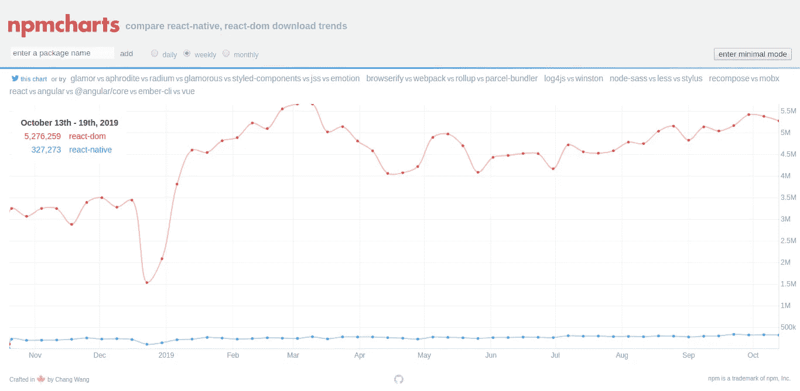
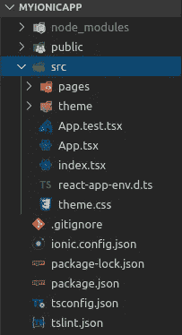
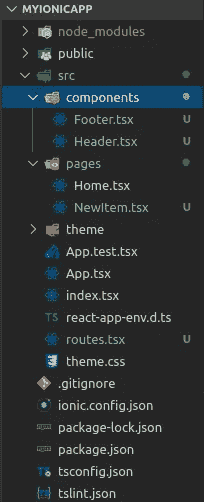
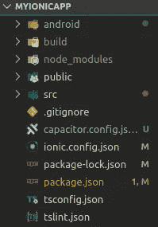

# Ionic React:一款随处运行的应用

> 原文：<https://javascript.plainenglish.io/ionic-react-one-app-that-runs-everywhere-7a36dc682c1c?source=collection_archive---------0----------------------->


## 本文帮助您开始使用 Ionic React，遵循一系列步骤来创建一个可以在任何地方运行的示例应用程序。

> Ionic React 是一个免费的开源组件库，可用于构建在 iOS、Android、电子(桌面)和网络上运行的应用程序，所有这些都使用一个代码库。

## 内容:

1.  介绍
2.  为什么爱奥尼亚会有反应？
3.  创建应用程序
4.  电容器不是科尔多瓦
5.  什么时候不用离子反应

## TL；速度三角形定位法(dead reckoning)

React Ionic 是一个很棒的新框架，可以同时使用 Ionic 和 React 的能力开发跨平台的应用程序。

[](https://github.com/underscoreanuj/ionic-react-starter-template) [## underscoreanuj/离子反应起始剂模板

### 此时您不能执行该操作。您已使用另一个标签页或窗口登录。您已在另一个选项卡中注销，或者…

github.com](https://github.com/underscoreanuj/ionic-react-starter-template) 

克隆存储库，并运行以下命令亲自查看:

```
ionic serve
```

# **简介**

Ionic 是一个开源 SDK，支持 Angular、JavaScript、React 和 Vue，用于开发可以在任何地方运行的混合渐进式 Web 应用程序，具有公共代码库，由 Drifty Co .的 Max Lynch、Ben Sperry 和 Adam Bradley 创建。

除了强大的 UI 组件库，Ionic 还提供了一个命令行工具，用于在各种支持的平台上创建和部署您的应用程序。2013 年推出时，Ionic 是在 AngularJS 和 Apache Cordova 的基础上构建的。

React 是一个用于构建用户界面的 JavaScript 库。

> Ionic React 代表了 Ionic Framework 历史上最重大的变化，并将 Ionic Framework 向全新的受众开放。— [麦克斯·林奇](https://twitter.com/maxlynch)

今天，应用程序开发人员可以从无限的前端框架选项中进行选择，包括非常受欢迎和成功的 React。

# **为什么离子会起反应？**

如果到目前为止你认为 Ionic React 是 React Native 的翻版，那你就大错特错了。


React Native 可以被认为是建立在 iOS 和 Android 原生 UI 控件之上的抽象之上，而 Ionic React 则是 DOM-native，使用标准的 react-dom。为了知道哪种方式更适合 React 开发，这里有一个 [npm 安装图](https://npmcharts.com/compare/react-native,react-dom?interval=7)



weekly installs (react-dom [red] vs react-native [blue])

> 我们很清楚，在浏览器和 DOM 之上发生的 React 开发比在原生 iOS 或 Android UI 系统之上发生的要多得多(事实上，多了 16 倍！)。这进一步证实了我们的信念
> 
> “网络开发人员想要网络开发”
> 
> 并利用他们的经验和他们在 DOM 上构建的现有功能库— [Max Lynch](https://twitter.com/maxlynch)

Ionic Framework 是开发渐进式 Web 应用程序(PWA)的领先解决方案之一。相对于其他可用的 PWA 开发框架，它也被认为具有更好的性能。

# **创建一个应用**

假设您已经安装了 nodejs、npm 和其他依赖项，如果没有，则:

```
[https://nodejs.org/en/download/](https://nodejs.org/en/download/)
```

成功安装后，通过运行以下命令验证安装:

```
node --version
npm --version
```

1.  安装 Ionic CLI

```
npm install -g ionic@latest
```

2.创建一个项目文件夹并运行以下命令来创建一个 Ionic 应用程序

```
ionic start MyIonicApp blank --type=react
cd MyIonicApp
```

您的目录结构应该如下所示:



Project folder opened in VSCode

运行以下命令在浏览器中运行您的应用程序:

```
ionic serve
```


Ionic App running on localhost:8100

你的代码文件都放在 **src** 文件夹里。在文件夹内移动并运行以下命令:

```
cd src
mkdir components
touch routes.tsx
touch pages/NewItem.tsx
touch components/Header.tsx
touch components/Footer.tsx
```

现在，您的目录结构应该如下所示:



Updated directory structure

现在，写入以下文件:

Header.tsx

Footer.tsx

NewItem.tsx

routes.tsx

最后，使用以下代码更新您的 App.tsx 和 Home.tsx:

App.tsx

Home.tsx

再次运行 **ionic serve** ，在 localhost:8100 的浏览器中查看您的应用程序。答对了。！！


现在，让我们试着在 android 设备上运行它。请遵循以下步骤:

## ***确保您安装并配置了 Android Studio(要在仿真设备或启用 USB 调试的 Android 手机上运行应用程序)。对于 iOS，你需要 Xcode。

1.  通过运行以下命令生成本机项目:

```
ionic capacitor add android
```

哎呀！！！该命令将失败，并出现以下错误，但这是必需的:

```
[error] Capacitor could not find the web assets directory “/home/…/…/…/MyIonicApp/build”
```

将创建一个名为 capacitor.config.json 的文件。该文件可用于设置应用程序名称和其他属性。如果你仔细观察，就会发现“webDir”的位置设置为:“build”

```
{
“appId”: “io.ionic.starter”,
“appName”: “MyIonicApp”,
“bundledWebRuntime”: false,
“npmClient”: “npm”,
“webDir”: “build”
}
```

因为我们没有构建我们的项目( **npm run build** )，所以到目前为止它缺少一个 Capacitor 正在寻找的构建目录*(因此出现了错误)*。无需惊慌，您只需按照以下步骤即可解决问题:

1.  将 capacitor.config.json 更新为以下内容(只需添加粗体部分):

```
{
.
.
.
“appId”: “io.ionic.starter”,
“appName”: “MyIonicApp”,
“bundledWebRuntime”: false,
“npmClient”: “npm”,
**“webDir”: “public”** .
.
.
}
```

2.更新 package.json 中的脚本字段，如下所示(只需添加粗体部分):

```
“scripts”: {
.
.
.
“start”: “react-scripts start”,
“build”: “react-scripts build”,
“test”: “react-scripts test”,
“eject”: “react-scripts eject”,
**“ionic:build”: “npm run build && ionic capacitor copy android”** .
.
.
},
```

现在，运行以下命令:

```
ionic build
```

这将首先调用 ***npm run build* 命令**(这将创建构建文件夹)，随后运行***ionic capacitor copy android**命令(这将添加 Android 目录并复制 capacitor.config.json 中的" **webDir** "参数所指向的构建文件夹[* * *目前为公共文件夹】)。*

*目录结构现在应该有一个 android 目录:*

**

*最后，将您的 capacitor.config.json 更改为将“webDir”指向“build”文件夹，如下所示:*

```
*{
.
.
.
“appId”: “io.ionic.starter”,
“appName”: “MyIonicApp”,
“bundledWebRuntime”: false,
“npmClient”: “npm”,
**“webDir”: “build”** .
.
.
}*
```

*现在，快跑*

```
*ionic build*
```

*就是这样。*

*你现在可以简单地在 android Studio 中打开新创建的 Android 目录，并在手机或模拟器上运行你的应用程序。*

*对于[io](https://ionicframework.com/docs/building/ios)，可以遵循类似的方法:*

# *电容器不是科尔多瓦*

*虽然 Ionic 支持[科尔多瓦](https://cordova.apache.org/)，但新的 Ionic 应用程序运行在一个名为[电容器](https://capacitor.ionicframework.com/)的最先进的跨平台引擎上。电容器是严格面向渐进式网络应用或更像“原生渐进式网络应用”，他们说这代表了混合应用以外的下一次演变。*

> *Capacitor 是 Apache Cordova 和 Adobe PhoneGap 的精神继承者，灵感来自其他流行的跨平台工具，如 React Native 和 Turbolinks，但它完全专注于使现代 web 应用程序能够在所有主要平台上轻松运行。电容器对许多现有的 [Cordova 插件](https://cordova.apache.org/plugins/)有向后兼容的支持。— [电容器文件](https://capacitor.ionicframework.com/docs/)*

*Capacitor 是一个更现代的框架，具有 API 和对相机、地理定位、共享、通知、文件管理的支持，所有这些都广泛支持 Java (Android)和 Swift (iOS)。*

# *什么时候不用离子反应*

*到目前为止，我们已经探索了 Ionic 框架的优点，例如:*

*1 .跨各种平台的单一代码库*

*2.流行技术和易学性*

*3.广泛的集成能力和插件*

*4.丰富的 UI 元素选择和快速原型制作*

*5.方便的测试*

*6.简明文档*

*7.强大的社区*

*8.开源*

*还有很多。*

*尽管如此，现在让我们来谈谈缺点:*

1.  *性能:如果你打算做一个资源密集型的应用程序，并且喜欢性能，比如游戏或增强现实的相机应用程序等，你不应该喜欢 Ionic。在大多数情况下，对于简单的应用程序，您将无法看出任何性能差异，尽管 Ionic 通过浏览器呈现其元素，这需要多个步骤才能呈现在屏幕上。如果性能是你的主要目标，那么使用更接近机器代码的语言可以帮助你实现这个目标。虽然可以在 Ionic React 中构建高性能的应用程序，但人们需要熟悉性能优化技术。*
2.  *依赖插件:它严重依赖插件来实现它的大部分原生功能。很明显，通用特性的插件是现成的(这很好)，但是如果你希望有一个非常特殊的特性(比如一个非标准的手机硬件)，那么很有可能你必须自己编写。*
3.  *大小:如果你正在做一个非常大的项目，有很多 HTML、JS 和 CSS 文件，以及其他节点模块、插件、依赖项等，项目的大小会很大，使应用程序更重。*
4.  *安全问题:Ionic 应用基本上是一个网站，容易受到网站可能面临的每一个可能的安全威胁。尽管如果从项目一开始就进行具体的考虑，任何缺点都是可以避免的。Ionic 4 引入了代码丑化，这有助于减少应用程序的大小，使别人很难对你的应用程序进行逆向工程。*

# *结论*

*在(时间、精力、预算)和(性能、安全性)之间总是有一个权衡。我相信，如果小心使用，加上正确的设计和方法，Ionic React 可以用来实现这两者之间的最佳平衡。*

*我的代码:*

*[](https://github.com/underscoreanuj/ionic-react-starter-template) [## underscoreanuj/离子反应起始剂模板

### 此时您不能执行该操作。您已使用另一个标签页或窗口登录。您已在另一个选项卡中注销，或者…

github.com](https://github.com/underscoreanuj/ionic-react-starter-template) 

参考资料:

[](https://ionicframework.com/docs/react/overview) [## 离子反应概述-离子文件

### Ionic 是面向网络开发者的应用平台。使用一个共享代码库构建令人惊叹的移动、web 和桌面应用程序…

ionicframework.com](https://ionicframework.com/docs/react/overview) [](https://ionicframework.com/blog/announcing-ionic-react/) [## 宣布离子反应

### 今天，我们激动地宣布 Ionic React 的正式上市，这是 Ionic 框架的本地 React 版本…

ionicframework.com](https://ionicframework.com/blog/announcing-ionic-react/) [](https://ionicframework.com/docs/building/android) [## Android 开发- Ionic 文档

### 本指南涵盖了如何使用或将 Ionic 应用部署到 Android 模拟器和设备。要在上部署和调试应用程序…

ionicframework.com](https://ionicframework.com/docs/building/android)*