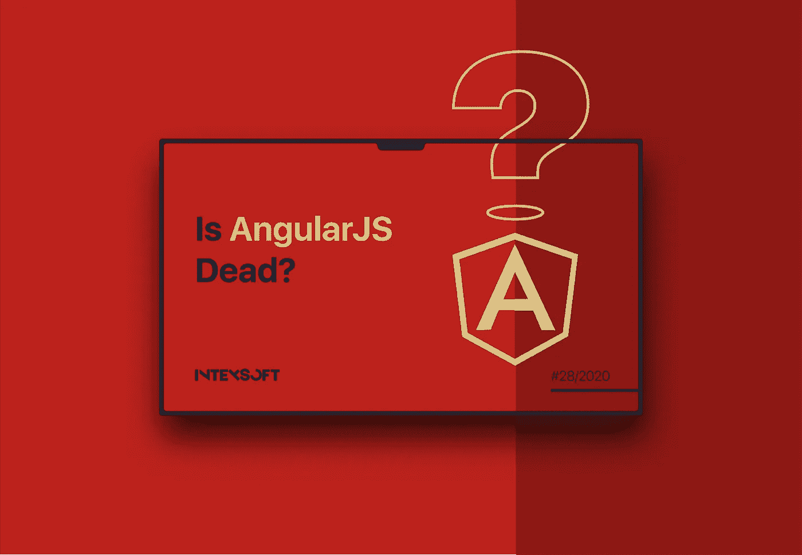

# 安古拉吉斯死了吗？

> 原文：<https://javascript.plainenglish.io/is-angularjs-dead-6ab0fbe788b3?source=collection_archive---------6----------------------->

2018 年初，Angular 代表在其官方博客中宣布，他们正在计划 AngularJS 的最后一个重要版本，1.7 版本。2018 年 7 月进入为期三年的[长期支持](https://docs.angularjs.org/misc/version-support-status)期。

现在我们处于 2020 年中期，这意味着在他们停止支持之前还有不到一年的时间。根据[的公告](https://blog.angular.io/stable-angularjs-and-long-term-support-7e077635ee9c)，它将在 2021 年 6 月 30 日发生。

如果您想知道接下来会发生什么，或者如果您的产品在 AngularJS 上，您应该采取什么措施，欢迎光临。

# AngularJS 历史

Angular 的故事始于 2008-2009 年。一位来自 Google 的开发人员和他的朋友在从事一个必须简化 web 应用程序开发的副业项目。这是为那些对 web 开发一无所知或知之甚少的 web 设计者准备的。这个项目叫做 AngularJS。

2010 年，它开始开源。社区开始用它构建令人惊叹的应用程序，甚至一些最大的品牌也开始将 AngularJS 整合到他们的 web 和移动应用程序开发核心工具集中。

几年后，web 开发有了显著的进步，所以 AngularJS 必须重写才能跟上这些变化。于是他们从头开始重建框架，Angular 2.0 就这样诞生了。从那一刻起，所有有角版本都不包括那个 JS 结尾。

> **棱角分明是对今天和明天的棱角的称呼。AngularJS 是** [**Angular**](https://angular.io/guide/upgrade) **所有 1.x 版本的名称。**

关于 AngularJS，正如我们上面提到的，它的版本升级到了 1.7，然后进入了长期支持阶段。

# AngularJS 长期支持

AngularJS 开发人员继续解决与以下标准之一相关的一些关键问题:

*   在框架的 1.7.x 分支中检测到一个安全缺陷；
*   一个主要浏览器发布了一个版本，该版本将导致当前使用 AngularJS 1.7.x 的生产应用程序停止工作；
*   jQuery 库发布的版本将导致当前使用 AngularJS 1.7.x 的生产应用程序停止工作。

还有一些更好的消息:所有 AngularJS 版本将继续独立工作，这意味着如果你的产品在 AngularJS 上，它不会就这样消失。然而，如果你什么都不做，只是坚持你已经得到的，它会导致许多问题。

# 如果产品停留在 AngularJS 上会发生什么

安全支持的终止可能会产生许多后果。比如你的店铺极有可能被黑，造成财务损失，诉讼，甚至生意的损失。支持的结束也意味着如果一个主要的浏览器发布了与 AngularJS 不兼容的版本，你的应用很可能就会停止工作。

为了避免此类问题，我们强烈建议进行迁移。但是，在某些情况下，这可能并不必要:

*   如果你不再主动开发你的 app
*   如果你打算在最近的时间内停止它；
*   如果 AngularJS 有一些对你的产品至关重要的特性。

如果你不打算停下来，想要开发和升级你的应用，有两个选择——切换到其他一些 JS 框架(Vue.js，React 等)。)或者升级到[角度](https://angular.io/)。

# 升级到 Angular

如果出现以下情况，我们强烈建议您选择此选项:

*   你没有太多时间从头开始重写整个应用程序；
*   你想逐步升级；
*   你想利用 Angular 特性(比如 CLI、TypeScript、ngRX 等。).

如果您选择升级到 Angular，有一个好消息:这个过程已经被很好地定义了。甚至有一些工具和资源会对升级有很大的帮助——花点时间查阅一下[官方文档](https://angular.io/guide/upgrade)。

# 角度优势

在接受或拒绝这个选项之前，你可能想了解一些关于角度的关键优势。

1.  Angular 为您提供了开箱即用的所有所需功能，这意味着您不必使用第三方服务来构建基本的应用程序功能。这确保了更好的代码质量和更高的安全性。
2.  Angular 基于 TypeScript，这有助于保持代码的整洁和可读性。因此，更容易检测和修复错误。维护大型代码库也更容易，这对企业项目来说是极好的。
3.  Angular 是一个成熟的响应式 web 框架。它提供了一种创建服务、模块或组件的方法。这有助于避免关于某个东西是如何构建的问题，因此新开发人员更容易掌握。

如果你不是技术人员，这可能对你来说毫无意义。您应该知道的最重要的事情是，所有这些特性都节省了大量时间，并使项目更容易扩展。

# 成角迁移

现在，让我们进入另一个选项——迁移到 React、Vue 或其他一些 JavaScript 框架。

在什么情况下你可以考虑这个选择:

*   你想尝试一些全新的东西；
*   你认为其他特定的框架更好，会让你的产品更有效率；
*   你有时间和预算从头重写你的产品；
*   您的团队精通另一个框架。

如果你对以上任何一点有共鸣，你可能需要尝试一下。如果你想了解更多关于不同的 JavaScript 框架及其细节，我们有[文章可以帮助你](https://intexsoft.com/blog/best-javascript-frameworks-and-libraries-what-to-use-in-2020/)。

# 结论

从信息中可以看出，如果你的 app 在 AngularJS 上，你就不能让它保持原样，尤其是如果你打算继续你的产品的开发和稳定运行。迟早需要迁移。

祝您迁移愉快、安全！

*原载于 2020 年 8 月 19 日*[*【https://intexsoft.com】*](https://intexsoft.com/blog/is-angularjs-dead/)*。*