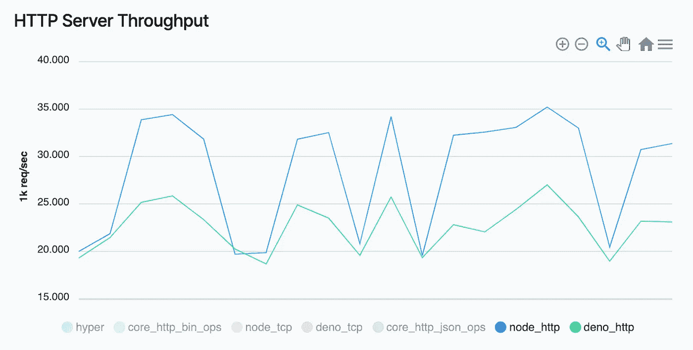

# 德诺已经死了吗？

> 原文：<https://javascript.plainenglish.io/is-deno-already-dead-661ce807338a?source=collection_archive---------0----------------------->

## 发展意见

## 炒作消失的一些原因

Source: the author

今年 5 月，不仅冠状病毒成为关注的焦点，在 JavaScript 和后端开发社区，Deno 也在传播。第一个稳定的版本出现了，并且已经爆发了巨大的宣传。我也很快喜欢上了 Deno，并期待着尝试一些新的东西。

我写的一篇关于它的文章仅通过谷歌就获得了成千上万的点击量——所以人们的兴趣真的很大。

但是它还剩下什么呢？甚至认为 Deno 可以取代 Node.js 的声音在哪里？显然已经没有太多宣传了——谷歌证实了这一点:

Source: [Google Trends](https://trends.google.com/trends/explore?q=deno)

正如你从 Google Trends 看到的，搜索术语 Deno 不再像在春末夏初的最初宣传中那样多——还应该注意的是，Google Trends for Deno 不包括类别主题或编程语言。其他谷歌搜索 Deno，与技术无关，仍然包括在统计中。

# 其他技术的兴起

今年已经有很多东西可以提供了——在前端领域，它是苗条的，在后端领域。此外，一般来说，许多编程语言已经获得了很多关注。Rust 和 Julia 就是很好的例子——而 JavaScript 的受欢迎程度却没有增长。

新技术总是带来新的可能性，以及新的框架和库。当然，他们都想尝试——因此，例如，Rust 的 Actix Web 获得了关注，即使只是在 Rust 社区和对它感兴趣的人中。

在我看来，Deno 没有更多炒作的空间——但这也是因为它从未有过颠覆网络世界的野心——这一点很快就变得清晰起来。

# 没有什么惊天动地的新闻

在我关于 Deno 和 Node.js 的区别的文章中，我已经提到了这一点。这些是 Deno 提供的基本的特殊功能:

*   没有 NPM 的支持
*   许可
*   顶级-等待
*   对窗口对象的支持
*   现成的 TypeScript 支持

这是《与德诺同呼吸的空气》中提到的基本特征。

经过大量的试验和错误之后，大多数开发人员可能意识到并不是这些特性颠覆了他们的世界。尤其是对于现有的后端，没有改变一切的巨大动力。

这也体现在 Deno 的专业使用上——据 [StackShare.io，](https://stackshare.io/deno) 7 家公司使用 Deno。

# 搬家很贵——而且在某种程度上毫无意义

当然，Deno 和 Node.js 非常相似。在 Deno 中，你不仅仅依赖于 TypeScript。JavaScript 也支持开箱即用。

但是当 JavaScript 这个词出现时，您必须考虑 JS 社区中散布的许多库和框架。
其中一些在 Node.js 世界也有。
想想 Express.js、Koa、Sails、Axios、Lodash 或 Sequelize 就知道了。所有这些库都经常在 Node.js 项目中使用，并且可以通过 NPM 轻松安装。

NPM 是不知何故让你想到 Deno 的关键词——因为使用 Deno 的 NPM 模块本质上不是有意的，因此相当麻烦。
这使得从 Node.js 迁移到 Deno 变得相当困难。
Deno 还因其安全性而闻名，因为事实上几乎所有事情都需要用户的许可。那也不错，绝对是敏感的做法。但在我看来，这并不是一个将现有 Node.js app 完全迁移到 Deno 的好论据。

# 没有额外的表演

在这一点上，我想明确一点，我个人并不认为 Node.js 仅仅因为性能就应该放在 Deno 之上。

当我们测量它时，性能通常是相当不现实的，可以完全忽略不计，特别是对于用户很少的小型应用程序。可扩展的服务提供商可以轻松满足您的性能需求，您不必在固定的根服务器上安装最快的 web 服务器和数据库。

然而，我们不能忽视许多开发人员对性能感兴趣——即使只是在纸面上有差异。但是在性能上，Deno 并不比 Node.js 做得更好。

这并不奇怪。毕竟 Deno 在性能上一直没有取代 Node.js 的野心。它更多的是关于安全和诸如此类的事情。

你可以在 Deno 官方网站上找到它——证明 Deno 不是最快框架的基准。甚至比不上 Node.js。

Source: [Deno Land — Benchmarks](https://deno.land/benchmarks)

Node.js 和 Deno 的标准 HTTP 请求和响应模块在上面显示的基准中进行了比较。基准测试表明 Node.js 提供了更高的性能。

我自己也在两个平台之间做了一个基准测试——结果是一样的。Node.js 的表现明显更好。
尽管 Deno 看起来并不差，但许多人主要是在寻找性能。

当然，在选择技术时，性能不应该是唯一的决定性因素。像 Fastify 这样的框架和技术，或者 Go 和 Rust 的 HTTP 库，通过它们的性能大放异彩，引起了人们极大的兴趣。因此，你可以明确地说，许多开发人员对良好的性能感兴趣，与 Node.js 相比，Deno 并不能完全提供这种性能。

# 太早了

新技术总是迅速制造炒作。每个人都想尝试新事物，现在是为它制作内容的最佳时机。结果，话题膨胀到了极点，而大多数人并没有试图认真对待。

随着 Deno 的发布，有些人甚至看到了 Node.js 的终结——当然，这是吸引了很多注意力的内容，因此对创作者来说是有价值的——但当然，这完全是夸大其词。

结果是一个与现实无关的浮夸叙事，每个人都想自己检查一下 Deno 是否意味着 Node.js.
的结束，其他一切都将是不合逻辑的。在我尝试之前，我没有决定用 Deno 重写我现有的 Node.js 应用程序。

2010 年 Node.js 宣布发布的时候，人们的兴趣并不是很高。项目的早期版本似乎总是有点血腥和令人生畏。

一些技术可能领先于他们的时代——在 2 年内，在 Node.js 发生这样或那样的丑闻后，世界可能会变得非常不同。在过去，NPM 软件包曾出现过严重的安全问题。但在危机中，总有一些人会获利——也许德诺会是大赢家。

# 总结

德诺不坏，有其正当性。

Node.js 在第一个版本中并没有被大肆宣传，仍然有时间进行改进。所以 Deno 很可能会继续进化。

特别是关于 node.js 的性能和功能，我们还不知道，很多事情都可以改变。所以我很好奇 Deno 会发生什么，我会经常回来看看新版本会发布什么。

**如果你想加入 Medium 同时支持我:
你可以在这里** ***购买订阅** [**。**](https://louispetrik.medium.com/membership)

**附属链接。如果你使用这些链接购买东西，我会赚取佣金，但没有额外的费用给你。非常感谢！*