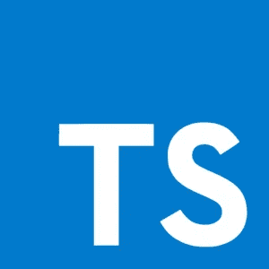
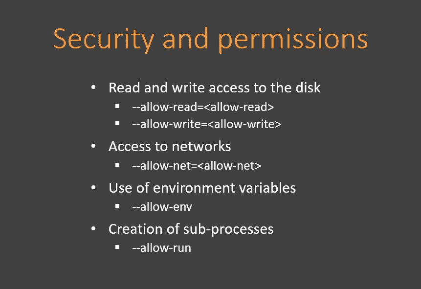
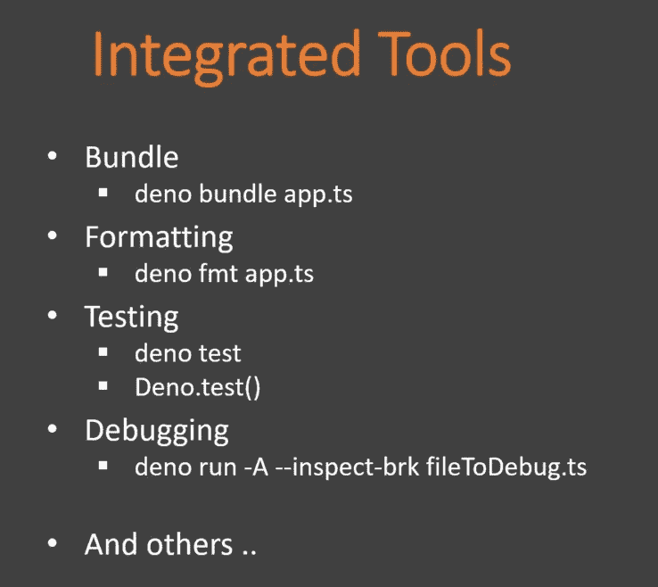

# 是 Deno 节点。JS 杀手？

> 原文：<https://javascript.plainenglish.io/is-deno-the-nodejs-killer-5fdf903191f7?source=collection_archive---------10----------------------->

## **为 **JavaScript** 和**类型脚本**提供安全的**运行时

[From Deno.land](https://deno.land/)

# **简介**

2018 年 6 月 2 日，NodeJS **的创作者 Ryan Dahl** 以最大压力登陆 JSConf 现场。他不再支持 NodeJS，开始谈论 Deno。但是 NodeJS 怎么了？为什么德诺会是我们的救世主？今天我要告诉你这个决定背后的原因。

# 什么是 NodeJS 问题？

*   **不遵守承诺:**在 NodeJS 诞生时，Ryan 引入了承诺，代替回调，并在回调后立即删除它们。所以我们最终在 NodeJS 的基本 API 中到处都有回调，并且它老化得很严重。特别是为了克服这一点，后来做了很多抽象层。
*   **弱安全性:**即使 NodeJS (V8)使用的 Javascript 引擎是安全的，但 NodeJS 本身并不安全。事实上，当您启动 NodeJS 应用程序时，您可以自动访问文件、系统调用，并有可能启动脚本。NodeJS 中使用的运行时不应该有这样不受限制的权限。
*   **构建系统(GYP):** GYP 是一个工具，它将编译用 C 或 C ++编写的附加组件，以便它们可以与`require()` **一起使用。这对于 NodeJS 的正常运行至关重要。但是健身房是地狱。太地狱了，Chrome 都不用了。NodeJS 是今天唯一的 GYP 用户。**
*   **package . JSON 和 NPM 是必不可少的:**package . JSON 文件是任何 NodeJS 应用程序操作的核心。**`require()`可以直接访问 package.json，这使得它变得更加重要。通过在等式中包括 NPM，瑞安通过同时减少开发人员的自由使这个文件和 NPM 变得更加重要。**
*   ****著名节点 _ 模块文件夹:****

****

**这个通过 package.json 下载模块的操作通过`require()`带来了一个更大的问题。当您键入 npm install 时，解决模块的极端复杂性。这是一种巨大的算法，它将进行 10 亿次调用来下载尽可能多的模块和模块依赖项，就像你要存储在一个无底的文件夹中一样。**

**幸运的是，那天 NodeJS 的创造者没有在所有人面前自我鞭笞。不，他带着解决方案在那里！而这个方案叫做 **Deno** 。**

# ****什么是 Deno？****

**Deno 是用于执行 Javascript 和 Typescript 的安全运行时。和 NodeJS 一样，Deno 也是建立在 Chrome 的 Javascript 引擎:V8 之上的。它完全是用 Rust 编写的(Nodejs 是用 C 和 C ++编写的),保证了很高的性能。**

# **德诺解决方案**

*   ****无包管理器:** Deno 立即启动，清除 NPM，package.json **，**和 node_modules 文件夹的大乱。不再有依赖性，不再有分辨率，为 es 模块让路，ES 模块现在是唯一被接受的模块系统。模块现在可以通过 HTTP URL 来调用，它们可以被无限下载和缓存。**

*   **Typescript 内置于 Deno: TypeScript 是 JavaScript 的超集，它通过在运行代码之前捕捉错误并提供修复来加速开发。在 Deno 之前，你的 TypeScript 代码要编译成 JavaScript 才能运行，而现在你什么都不需要做，Deno 会帮你做。**

****

**TypeScript Logo**

*   ****安全性增强:**与 NodeJS 相比，Deno 在默认情况下是安全的。当我们在 NodeJS 下时，我们有权做任何事情，对磁盘进行读写访问，访问网络，使用环境变量，以及创建子进程。对于 Deno，默认情况下所有这些都是不允许的。它必须在运行时通过标志明确指出。**

****

**请注意，添加这些不带值的标志意味着您授予了对应用程序的完全访问权限。**

*   ****Deno 在可能的地方使用 web 标准:**创建一个 web 标准需要一些时间，一旦完成，离开它是不明智的。虽然框架来来去去，但 web 标准将会一直存在。这就是为什么 Deno 提供了许多 web 兼容的 API。例如，`fetch` web API 提供了获取资源的接口。浏览器中提供了一个 JavaScript `fetch()`方法。如果你想在 NodeJS 中使用这个标准，你需要到达第三方库[节点获取](https://github.com/node-fetch/node-fetch)。但是使用 Deno 我们不需要这个。**

****

**[W3C](https://www.w3.org/)**

*   ****集成工具:** Deno 提供了许多集成工具，比如捆绑包、代码格式化工具、测试工具、调试工具等等。这将消除 javascript 工具的混乱，与 NodeJS 相比，这使开发人员的生活更容易。**

****

# **结论**

**Deno 是一个简单、现代、安全的 JavaScript 和 TypeScript 运行时，它使用 V8 并内置于 Rust 中。默认情况下，它是安全的，支持现成的 TypeScript，只提供一个可执行文件，以及许多其他特性。**

**Deno today 已经正式提供给[使用](https://deno.land/)，它成功地消除了 JavaScript 开发中的许多缺点，并修复了许多 NodeJS 问题。**

**它可能还不能完全取代 NodeJS，但是它已经是一个非常棒的日常使用的编程环境，并且有着光明的未来。**

# ****用简单英语写的便条****

**你知道我们推出了一个 YouTube 频道吗？我们制作的每个视频都旨在教给你一些新的东西。点击 点击 [**查看我们，并确保订阅该频道😎**](https://www.youtube.com/channel/UCtipWUghju290NWcn8jhyAw)**