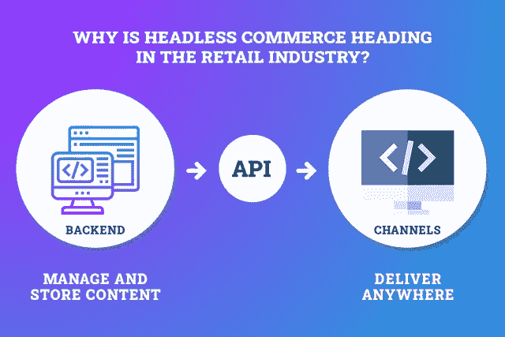
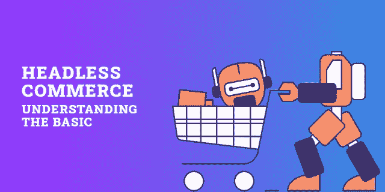
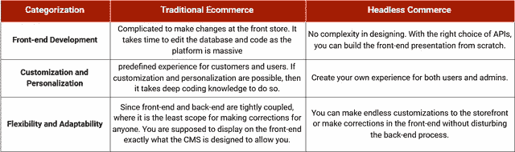

# 去 Headless 是你的在线零售应用的正确选择吗？

> 原文：<https://javascript.plainenglish.io/is-going-headless-the-right-choice-for-your-online-retail-app-e57c1f555435?source=collection_archive---------10----------------------->

## 将无头商务称为网上销售的未来是正确的吗？是的，当然！

> **你不必相信我的话，让我们举个例子。**

无头商务并不是一个新概念，但随着新冠肺炎·疫情迅速革新了购物旅程的每一个部分，无头商务正在大胆地为电子商务铺平道路。

*“无头商务”的基本概念是将店面的后端系统解耦，以简化在线商店的全渠道战略。*

*“亚马逊是电子商务的领先品牌，通过多种渠道销售产品，包括浏览器、应用程序、虚拟助手、智能手表等，这是零售行业了解亚马逊如何通过采用这一战略来加强其电子商务努力的一个绝佳例子。”*

***根据*** [***离合调查***](https://clutch.co/web-developers/resources/how-headless-commerce-transform-retail-industry) ***，电子商务行业受到无头商业的影响已经注意到:***

*   在线市场的迅速崛起。
*   *将用户购物的焦点从桌面转移到手机屏幕上。*
*   在线营销和广告的巨大增长。

大多数企业电子商务平台是在桌面屏幕运行 web 浏览器的时代创建的，因此桌面用户将是商业的主要目标用户。但现在，用户正在使用移动应用程序、没有屏幕的可穿戴设备、Instagram、Snapchat 等社交媒体订阅源从任何尺寸的屏幕上进行购买。

因此，随着时间的推移，越来越多的数字化和网络化设备被添加到环境中。因此，我们可以做出的唯一安全的假设是不断改变电子商务商店，以满足市场不断增长的需求。如果你认为不需要 [**雇佣电子商务开发者**](https://www.xicom.biz/offerings/hire-ecommerce-developers/) ，你就可以轻松应对新出现的变化，并为未来市场做好准备，那你就大错特错了。

> ***据统计，全球零售电子商务销售额达 3.53 万亿美元，预计 2022 年将增长至*** [***6.54 万亿美元。***](https://www.statista.com/statistics/379046/worldwide-retail-e-commerce-sales/)

虽然利用每一项新技术是一项挑战，但通过利用无头商务为您的在线商店，在未来竞争激烈的电子商务市场中有更好的生存机会。

借助 headless commerce，您可以对您的店面进行超快速的更改，而不会影响您的商店的后端功能。此外，通过集成 headless commerce，您可以快速优化您的店面，并为用户提供无缝的购物体验。无论他们通过哪种渠道购买，无头商务都可以减少装载时间，让事情以闪电般的速度运行。

***所以在这篇文章中，我们已经涵盖了帮助你理解无头电子商务的一切，它如何影响你的在线商店和这一战略的未来……***

*   *无头商业:了解基础*
*   无头电子商务与传统电子商务有何不同？
*   *无头商业的利与弊*
*   *无头电子商务如何影响您的客户？*
*   *你如何开始无头电子商务？*
*   无头商业会留在未来吗？

> 听起来不错！让我们开始吧…

# **无头商业:了解基础**

毫无疑问，无头商务正在提升其在电子商务领域的地位，并使零售商能够为客户提供卓越的体验。但无头商业到底是什么？

这是一种将后台和店面分开的电子商务策略。它为你提供了用任何 CMS (WordPress，Drupal 等)设计网站前端的自由，并将其连接到 Magento，Shopify，BigCommerce 等电子商务后端。这样，您可以轻松地对前端(访问者看到并与之交互的部分)进行更改，而不会干扰后端(处理站点的幕后管理功能)的功能。

简而言之，headless commerce system 是一个独立的电子商务管理系统，允许企业完全定制商店的前端，并确保用户获得出色的体验。

换个说法；headless commerce setup 可以确保简化的全渠道销售、更快的测试和实施，以及跨渠道用户的无缝购物体验。此外，headless commerce 旨在支持一系列前端系统，包括桌面、移动网站、第三方平台、语音助手等。

> 由于 headless commerce 允许零售商从单一平台管理所有库存和订单，因此减少了多渠道更新所需的时间。因此，许多品牌在提供卓越的客户体验方面处于领先地位。

很少有受欢迎的无头商店；大绿蛋，布雷维尔，年轻部落等等。

# 无头商务与传统电子商务有何不同？

随着用户主要从多种设备和屏幕尺寸购买的心理不断变化，可以说无头商务正在以多种方式稳步超越传统电子商务。

过去，顾客仅仅依靠桌面网站进行购买，但现在他们可以使用从语音助手、Instagram 页面到亚马逊和移动应用程序的任何东西。通过多种渠道管理库存和订单是店主的另一大难题。使用 legacy 提供一致的体验变得很有挑战性。

> **这就是它与传统电子商务的不同之处:**

从客户体验的角度来看，利用无头商务至关重要，因为它简化了全渠道方法，并允许客户通过任何设备或屏幕将产品添加到购物车中。

# **无头商业的利与弊**

如果你打算加入无头的商业潮流，那么现在你需要知道以下几件事…

*   **无头商务让你以光速移动**

借助 headless commerce，开发人员可以轻松地在前端进行更改，而无需考虑后端登录。您可以对内容进行快速更新和更改，而无需重新部署整个电子商务平台。大多数电子商务平台每周更新一次，但亚马逊每 11.7 秒更新一次内容，最终最大限度地减少了宕机的次数和持续时间。

*   **Headless Commerce 为转换优化提供了更好的 A/B 测试**

通常，一家电子商务应用开发公司需要几周或几个月的时间来发布一款应用，因此这意味着对客户行为变化做出反应并进行测试以实现更大优化的能力需要更长的时间。因此，优化受到损害。

但是有了无头商务，您可以尝试许多模板和测试不同的方法。这种策略使您能够在一个地方跨不同的渠道收集所有的测试基础设施。为了使这个任务更容易，并为你的网站排序，你可以选择雇佣一个 [**网络开发公司**](https://www.xicom.biz/offerings/web-development/) 。因为质量测试和内容优化技术是成功的关键，能让你赢得客户。

这就是亚马逊如何通过进行无止境的实验、不断做出改变、衡量这些改变对客户的影响并优化结果来如此了解其客户行为的原因。由于无头商务使它变得如此快速和容易，因此，测试速度将比普通零售商快 10 到 100 倍。

*   **无头商务使您能够创建有效的全渠道战略**

在线购买体验比以往任何时候都更加全渠道化。根据调查，很久以前就证实了消费者正在通过各种平台购物，包括亚马逊、易贝、Snapchat、app 等等。

这就是无头商务带来高度灵活性的地方，使用传统的全栈解决方案是不可能的。

*   **扩大你的品牌覆盖面**

借助 headless commerce 解决方案，您可以轻松地让您的品牌适合任何屏幕尺寸和设备。通过前端的快速更新和更改，您可以让用户从任何设备访问您的品牌。有了无头商务，建立新的受众网络和探索新的机会对于 [**软件开发公司**](https://www.xicom.biz/) 来说并不是一个遥不可及的任务。

## ***无头商务对运营和技术改进的主要好处***

*   向所有接触点提供最新数据，并以独特的功能提供个性化的客户旅程。
*   通过允许专业后端开发人员和提高他们的生产速度来增强移动应用程序开发人员的体验；而前端开发人员将能够通过简单地操作他们需要的数据来创造新的体验。
*   为应用程序开发人员实施更舒适的新服务，并将其与包括 PIM、ERP 或 CRM 在内的 it 系统集成。

***但是，你可能会超出预算去设置无头商店***

通过将网站的前端与电子商务平台分离，你将失去一些功能。从页面构建、预览到表示层(账户信息、结账流程、内容)的内容更改，需要更多的开发，并增加前端所有权的成本。

***而且，无头商务设置的初始成本很高！***

要建立无头商务，你需要 [**雇佣电子商务开发者**](https://www.xicom.biz/offerings/hire-ecommerce-developers/) 前端 UI 设计专家。一般来说，这是一个耗时的过程，会导致更高的成本，所以让事情变得更复杂的是，要确保你的团队有足够的能力自己解决错误。

# 无头商务如何影响你的顾客？

对于任何零售商来说，无论是初创企业还是领先品牌，只有一件事永远重要——如何扩大他们的覆盖范围或满足新客户并满足他们的期望。

虽然很少有品牌使用电子商务开发解决方案直接面向客户，但其他公司正在像 Michaels 一样改变他们的运营，在一周内推出新内容。

由于客户总是努力拥抱与品牌互动的新方式，因此无头应用程序和网站将以这种方式影响客户:

*   **即时变化和优化**

当您的企业通过 headless Commerce 向其前端引入新内容时，它会立即反映给客户。在页面上增加新的东西，会让用户更长时间地粘在屏幕上。这就是社交媒体让用户对他们的账户上瘾的真正原因。而使用传统商务架构构建的网站需要几分钟才能反映出那些实际影响用户体验的变化。

*   **确保丰富的用户体验和界面**

由于 headless commerce 提供了定制用户与之交互的网站的每一个元素的能力和灵活性，因此，这是一个更好的机会来为内容带来更多的创造力，并用模板设计进行实验。

此外，headless commerce 的兼容性确保您的网站可以在所有设备和格式上无缝运行。然而，对于传统的电子商务网站，你必须进行响应性设计，以最小化元素在不同设备上消失的风险。

# **如何开始无头电子商务？**

现在你知道什么是无头商务，它的利与弊，以及它将如何影响你的用户。如果您已经准备好开始无头商务，那么以下是您需要考虑的一些要点:

1.  **所需的专用编码技能**

要开始无头商务，你需要寻找一家电子商务 [**应用程序开发公司**](https://www.xicom.biz/offerings/mobile-app-development/) ，由专门的前端开发人员提供支持，并使你能够定制完全符合需求的结构。无头商务需要专门的开发和设计技能，所以要确保你有一个合适的团队，拥有过渡所需的所有专业知识。

**2。发现目标频道**

虽然用户正在利用多种渠道购买产品，但你需要决定你将针对哪个渠道以及你自己的店面 *—语音助手、移动应用程序、亚马逊、社交媒体等等。*

*同样，您还需要了解是否有可能与您现有的 ERP、CRM、OMS 和金融基础设施集成？*

因此，了解您的目标渠道以及您需要连接的核心系统非常重要。

**3。挑选一个无头商务平台**

有几种无头商务平台可供选择，每一种都有其独特的优势。领先的服务提供商 Magento、BigCommerce 和 Shopify 为您提供无头功能。

虽然 Shopify 是拥有大量预算的企业的最佳选择，但 BigCommerce 可以在其企业包中提供定制的解决方案，其中包括无限制的 API 调用、高级帐户服务等。Magento 提供了性能卓越、安全性更高的解决方案。

**4。最终过渡到无头结构**

在你的站点上实现一个无头商务系统实际上需要付出很大的努力，因为你需要将不同系统的数据(库存)转移并整理到一个中央数据库中。这样做的唯一目的是使您的核心系统兼容，以便与您的新平台进行通信。

但是在将所有核心系统迁移到新平台之前，请确保您对架构有一个清晰的概述。为了实现这一点，您还需要选择 API 来使其发挥作用。

**5。建立持续的流程并进行测试**

许多流程将需要在内部进行，以使其顺利运行。将前端和后端分开是一项艰巨的工作，因为开发人员负责定期更新信息，还需要检查各个渠道，以避免长期的灾难性后果。

## **无头解决方案适合您，如果……**

您有兴趣创建:

*   移动应用:Android、iOS、Flutter、React Native、NativeScript、跨平台
*   动态应用程序:JavaScript、HTML、CSS
*   单页应用(SPA): React、Angular、Ember 和 Vue
    物联网应用
*   基于 Jekyll、Hexo、Hugo 的静态网站
*   适合您的服务和产品类型的定制前端页面
*   内容驱动的品牌
*   您已投资的现有 CMS 的商务
*   跨多种设备的流畅无故障的数字体验。

# **无头商业会留在未来吗？**

随着智能手机用户数量的增加，这些年来顾客的购物心理也在发生变化。因此，坚持任何独立的技术不会帮助你在这个蓬勃发展的在线零售业中生存。

由于网上销售行业在不断变化，但只有少数技术取得了长足的进步， [**电子商务开发公司**](https://www.xicom.biz/offerings/ecommerce-development/) 已经明白了这一点。根据过去几年的谷歌搜索数据，无头商务正在为其进入在线销售平台铺平道路，并已成为该行业的主要产品。

[Image Source](https://trends.google.com/trends/explore?date=today%205-y&q=headless%20commerce)

从简化库存/订单管理到快速测试，无头商务肯定会在未来继续存在。事实上，对于在线零售商来说，如果他们真的想在这个蓬勃发展的竞争市场中保持稳固的立足点，将这项技术集成到他们的商店中就变得非常重要，因为在线购物就是要提供无障碍的用户体验。

# 结论:准备开始

随着技术的不断创新，购买之旅现在不仅仅局限于在网站上创造巨大的流量。而且增强了买家对灵活性、个性化和速度的其他接触点。由于前端和后端系统相互耦合，一些全栈解决方案无法提供这些优势。

> **这就是无头商业发挥作用的地方。**

无头商务方法不仅将前端商店从后端分离，还为您提供了定制内容的完全灵活性。它使您能够满足客户日益增长的需求，并通过多种渠道为客户提供令人惊叹的购物体验。

因此，如果你已经准备好欢迎无头商务进入你的零售业务，那么是时候寻找一家由专门的前端开发人员支持的**软件开发公司，并确保你获得优质服务**