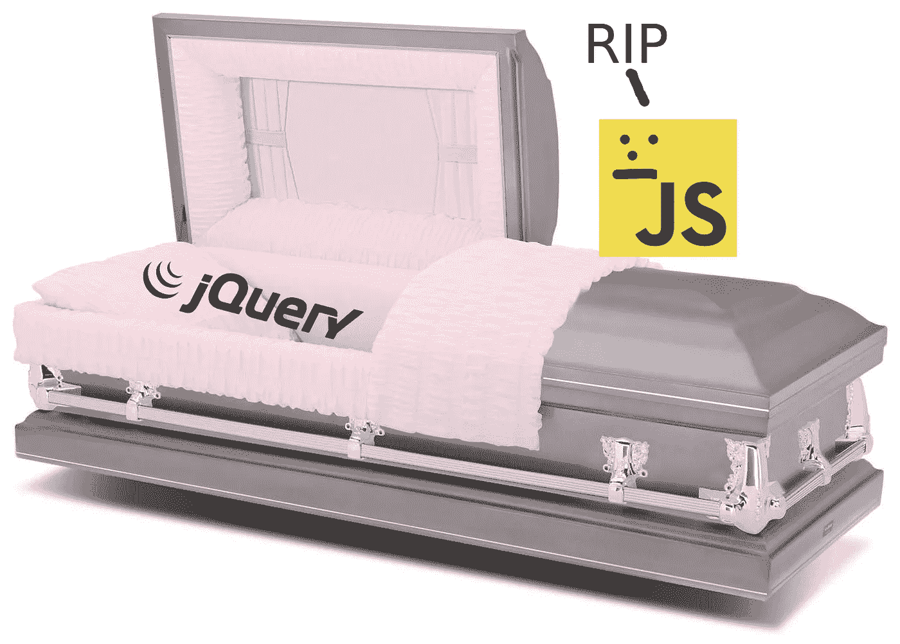

# 是时候结束 jQuery 了吗？

> 原文：<https://javascript.plainenglish.io/is-it-time-to-kill-off-jquery-cf0db0c9288e?source=collection_archive---------10----------------------->

前几天，我在 Stack Overflow 浏览 JavaScript 问题，意识到很多问题都是关于 jQuery 的。这些问题不是关于需要维护的旧的遗留系统，而是关于可能学习使用 jQuery 的教程的新程序员。

# **在**之前

很多年前的某个时候，浏览器对 JavaScript 的解释存在巨大的差异。2008 年之前，互联网浏览器是最受欢迎的网站浏览器，他们确实喜欢做一些与众不同的事情。

jQuery 于 2006 年发布，它解决的一个问题就是浏览器的差异。不必为特定的网络浏览器编写部分代码，您可以只编写 jQuery，jQuery 会在幕后处理所有这些事情。互联网浏览器尤其如此，它因与其他浏览器不同而臭名昭著。

早在 21 世纪初中期，JavaScript 也不是一种很好的工作语言。jQuery 也解决了这个问题，给出了遍历 dom 的简单方法。简单的 ajax 请求，等等。

# 今天

我们应该非常感谢 jQuery，以及它对前端世界的意义。但是我们应该向新的前端开发人员推荐 jQuery 吗？老实说，我不这么认为。有了新的 JavaScript 版本，大多数浏览器都以类似的方式处理 JavaScript 代码。浏览器可以自由地为 JavaScript 函数实现自己的算法，但是它们都应该给出相同的结果。

许多大型的基于 JavaScript 的库正在远离 jQuery。以推特自举为例。他们的库总是附带 jQuery，但是现在，在第 5 版中，他们正在用普通的 JavaScript 对其进行修改。包括我在内，这让很多开发者都很开心。

jQuery 并没有真正让 JavaScript 变得更好。以前是这样，但现在不是了。这并没有让 JavaScript 更容易编写。这只是让它变得不同。JavaScript 在今天是一种非常好的语言，老实说，您不再需要 jQuery 了。

Internet Explorer 的死亡可能是停止使用 jQuery 的最大原因。微软的新浏览器——Edge，建立在 Chromium 的基础上，可以很好地处理 JavaScript。我们最终不需要一个庞大的 JavaScript 库来处理一个浏览器的缺陷。尺寸为什么重要？因为你的网站访问者不得不从你的网站下载额外的兆字节来使用它。今天，大多数现代网站都使用某种 JavaScript 前端框架。他们自己也可能很大。让我们不要把 jQuery 也加入进来。

# 结束语

如果你正在学习 JavaScript 或者开始一个新的 JavaScript 项目，帮你自己一个忙，选择纯普通的 JavaScript。以后维护起来会容易得多，也更容易获得帮助和与他人合作。https://developer.mozilla.org/en-US/docs/Web/JavaScript 的官方文档令人难以置信，包括你学习 JavaScript 所需的一切。

我可能会触动 jQuery 粉丝的神经，但尽管如此，我还是要再说一遍。帮你自己一个忙。为你的新项目选择纯 JavaScript。

你不再需要它了。是时候淘汰 jQuery 了。

下次再见
斯蒂芬·巴克伦德·瓦卢瓦