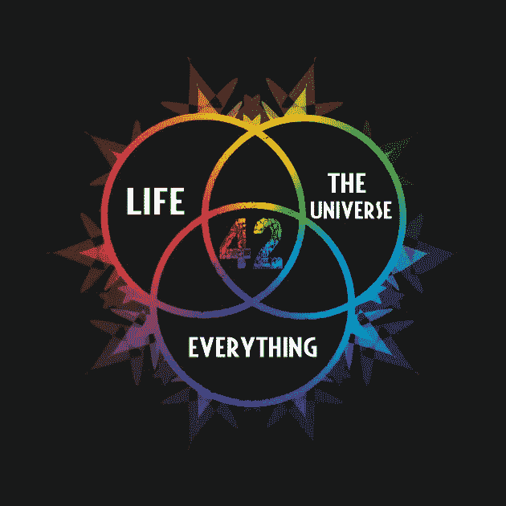

# 编程中幻数总是幻的吗？

> 原文：<https://javascript.plainenglish.io/is-magic-number-always-a-magic-number-c3b340b3f6cd?source=collection_archive---------4----------------------->

## 钝角值的重构如何让我们的代码更干净，更容易理解。



什么实际上是一个神奇的数字？基本上，幻数是一种代码、密码或数字，具有某种“*幻*”，晦涩难懂但*重要的*意义。然而，仅仅从阅读源代码来看，并不清楚这是什么意思。

这就像找到了生命、宇宙和一切终极问题的答案。答案是:42。为什么是 42？\_(ツ)_/

让我们回到计算机编程，想象我们得到一些`code`:

```
const response = await API.request();if (response.code === 5) {
    // DO SOMETHING
}
```

这里我们可以看到一个神奇的数字。`5`意味着一些东西，但是看着源代码，我们真的不能说出那个特定值背后的秘密是什么。

这可以很容易地重构为使用常量，这将使我们更好地理解正在发生什么以及逻辑是如何工作的:

```
const ALL_OK = 5;
const response = await API.request();if (response.code === ALL_OK) {
    // DO SOMETHING
}
```

突然，代码清晰多了！

其他例子可以是:

```
const total = price * 1.22;
```

同样，`1.22`有一些意思，我们通常可以猜测它的意思，但是我们应该*知道*到底是什么意思。此外，相同的值可以出现在多个位置。如果我们需要改变它，那么我们只改变一行而不是许多行:

```
const BASE_TAX = 1.22;const total = price * BASE_TAX;
...
const itemPriceWithTax = itemPrice * BASE_TAX;
```

如果我们知道什么是幻数，我们就可以重构所有代码，使之更加简洁。然而，我们不应该盲目地遵循[不允许幻数](https://eslint.org/docs/rules/no-magic-numbers)的规则！

我们可以说不是所有的数字都是神奇的。例如，HTTP 状态代码被很好地定义，并且假设所有代码维护者都有相同的理解，我们可以简单地直接使用这些代码:

```
throw new HttpError(400, 'Something went wrong! Check your request');
```

在这种情况下,`400`可以转换成常数，但实际上，我们真的觉得这很难理解吗？

另一个不成熟的解决方案是用常量代替 id。不好:

```
const stations = [{id: 123}, {id: 456}];const openStation = stations.filter(station => station.id !== 456);
```

这里我们可以看到我们想要排除 id 为`456`的某个站点，但是为什么这个站点被排除了呢？源代码不会给我们需要的答案。

稍微好一点:

```
const EXCLUDED_STATIONS = [456];const openStation = stations.filter(station => !EXCLUDED_STATIONS.includes(station.id));
```

我们正确地去掉了幻数，但是，我们仍然可以说，一两年后，如果有人进来负责代码维护，他们会发现很难理解为什么这个特定的站被排除在外？

在这种情况下，简单的注释会有所帮助。显然，如果有另一个我们可以使用的属性会有很大的帮助:

```
const stations = [{id: 123, isOpen: true}, {id: 456, isOpen: false}];const openStation = stations.filter(station => station.isOpen);
```

然而，这是数据质量问题的一个例子。如果程序员不能依赖输入的数据，并且没有办法在第一时间纠正数据(例如，没有`isOpen`属性)，那么不幸的是，我们需要引入一些黑客技术来解决这个问题。

# 结论

一般来说，代码应该是干净的(说起来容易！)且自明。省略、幻数和用人类可读的常数代替是一个容易的胜利。

你总是不允许在代码中使用幻数吗？或者你认为这个规则有例外吗？请在下面的评论中告诉我！