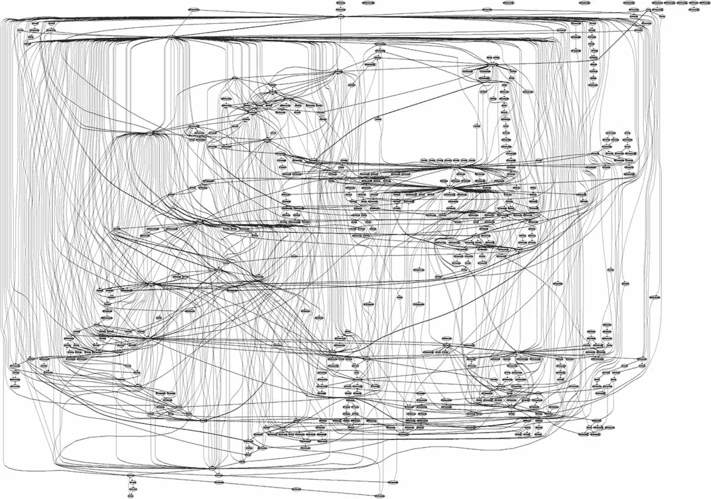

# mapStateToProps 会导致不必要的重新渲染吗？

> 原文：<https://javascript.plainenglish.io/is-mapstatetoprops-causing-needless-re-renders-6d14346b3cb8?source=collection_archive---------6----------------------->



Pictured: simple redux flow between connected components 😫

如果您是一名 React 开发人员，从事的项目并不简单，那么您可能会使用 Redux 进行状态管理。简单地说，你连接的组件都在监听应用程序的全局状态`store`的任何更新，你的`mapStateToProps`函数获取这个状态的一部分，并将其作为道具返回给你连接的组件。

我最近在处理一个奇怪的 bug，它涉及一个 redux-connected 组件:一个用户将鼠标悬停在我们饼图组件的一部分上，有时饼图中心的标签会恢复到默认标签…嗯。出于某种原因，我们的饼图被重新呈现，即使它的状态没有更新。双 hmmm…


这种间歇性的错误很难重现，但一旦它与使用实时套接字更新的小部件共享商店，我注意到每次我们的商店收到实时更新时都会发生这种情况。

组件应该在每次存储收到更新时重新呈现吗——即使它对状态的特定部分不感兴趣？不，那不可能是对的。那么我们的`mapStateToProps`函数如何理解何时应该触发重新渲染呢？嗯，在引擎盖下，redux 通过实现`shouldComponentUpdate`方法对从`mapStateToProps`返回的状态做了一个简单的比较。有意思。但还是不能解释为什么我们的派会变得怪异。

下面是我们的饼状图代码的简化版本:

```
import React from 'react';
import { connect } from 'react-redux';

import PieChartWidget from './components/PieChartWidget';

const mergeProps = (stateProps, dispatchProps, ownProps) => {
  return {...ownProps, ...dispatchProps, ...stateProps};
};

const mapStateToProps = (state, ownProps) => {
  const data = state.widgetData;
  const apiArgs = { ...ownProps.apiArgs }; //OOPS!!!! return {
    data,
    apiArgs
  };
};

const IssuesPieChart = ({
  apiArgs,
  data,
}) => (
  <DataLoader
    apiArgs={apiArgs}
    {...others}
  >
    <PieChartWidget
      data={data}
    />
  </Widget>
);

export default connect(mapStateToProps, mapWidgetDispatchToProps, mergeProps)(IssuesPieChart);
```

事实证明，我们在`mapStateToProps`函数中犯了一个诚实的错误，使用 spread `...`操作符复制状态。哦。像`slice, concat, filter`或`...`这样的常见数组操作创建一个对对象或数组的新引用，当 redux 在内部比较新旧状态时，它将触发组件更新。

这里的快速解决方法是简单地像这样分配我们的状态:

```
const mapStateToProps = (state, ownProps) => {
  const data = state.widgetData;
  const apiArgs = ownProps.apiArgs; return {
    data,
    apiArgs
  };
};
```

如果您的用例比较复杂，并且对您关心的状态树的一部分进行了一些过滤或选择，您可能想要检查内存化的选择器函数，以避免昂贵的比较和不必要的重新呈现:[https://redux . js . org/recipes/computing-derived-data # creating-a-memo ized-selector](https://redux.js.org/recipes/computing-derived-data#creating-a-memoized-selector)

## **简单英语的 JavaScript**

喜欢这篇文章吗？如果有，通过 [**订阅我们的 YouTube 频道**](https://www.youtube.com/channel/UCtipWUghju290NWcn8jhyAw) **获取更多类似内容！**