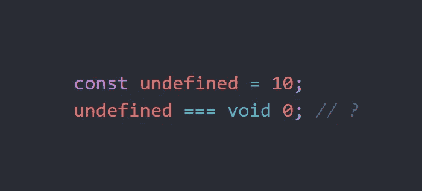
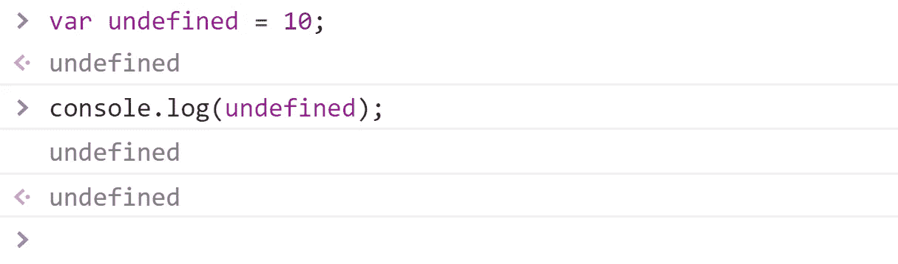
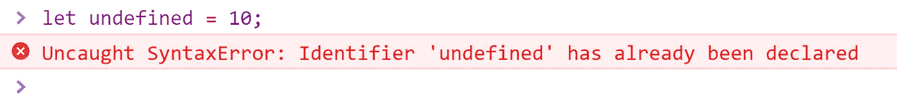
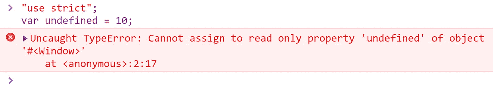
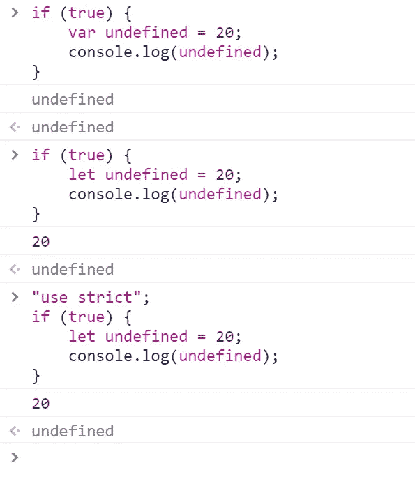

# 在 JavaScript 中，undefined 实际上是未定义的吗？

> 原文：<https://javascript.plainenglish.io/is-undefined-actually-undefined-e836e4bde871?source=collection_archive---------3----------------------->

## 如果我们给它设定一个值会发生什么？

应该是，但原来“*未定义”*是一个变量。那么如果我们给它设置一个值会发生什么呢？JavaScript 的怪异世界…



*TL；DR undefined 不是一个受限制的关键字，所以我们可能会错误地将变量命名为“undefined ”,并为其设置一个值，这将在运行时导致错误。使用棉绒来防止它发生。*

在你的 *if* 语句中使用 *void* 关键字而不是 *undefined* 有一个很好的理由，这是因为未定义的变量实际上可能被定义。背后的原因并不是一个受限制的关键词。Undefined 是全局对象的一个属性，所以它是全局范围内的一个变量。继续在你的浏览器控制台中键入*窗口*——你会在*窗口*对象中找到*未定义的*属性。所以:

```
window.undefined === undefined; // returns true
```

# JavaScript 中的“void”是什么？

简单来说:JS 中的 void 是一个用来返回“未定义”值的运算符。

```
void 0 == void(0); //true because void 0 is equal to void(0)
void 1 == void(0); //true
void 0 == undefined; //true
void 0 === undefined; //true
void 1241 === void "everything can go here" //true
```

上面的代码表明，在检查变量的未定义值时，void 关键字是最佳选择。

> **免责声明:**在文章开头我写了未定义的可能被定义。这意味着在某些情况下“void 0 === undefined”可能会返回 false。我们将很快回到这个问题。

# 如果我定义了“未定义”会发生什么？

在支持 2009 年 ECMA-262 第五版(也称为 ES5)的现代浏览器(包括 IE11)中，这样的变量仍然是未定义的，因为它是只读的。

```
15.1 The Global Object
The unique global object is created before control enters any execution context.Unless otherwise specified, the standard built-in properties of the global object have attributes {[[Writable]]: true, [[Enumerable]]: false, [[Configurable]]: true}.[...]15.1.1.3 undefinedThe value of undefined is undefined (see 8.1). This property has the attributes { [[Writable]]: false, [[Enumerable]]: false, [[Configurable]]: false }.
```

**来源** : [ECMAScript 语言规范](https://www.ecma-international.org/publications/files/ECMA-ST-ARCH/ECMA-262%205th%20edition%20December%202009.pdf)



Defining the “undefined” variable using the “var” keyword.

如果你像我一样习惯用*让*，你会得到不一样的东西:



Defining the “undefined” variable using the “let” keyword.

我们得到“标识符‘undefined’已经被声明”,因为它是在窗口对象中定义的。但是无论如何我们使用 *var* 的时候不应该得到一个错误吗？我们应该！这就是为什么在每一个的开头输入是好的。js 文件:

```
"use strict";
```

严格模式将阻止我们定义*未定义:*



Way better :)

# 不管怎样，我想把我的变量命名为“未定义的”。

有一个窍门。15.1.1.3**中指定的上述规则仅适用于全局对象。**局部范围不同:

```
function someFunction() {
   let undefined = 10;
   console.log(undefined);
}someFunction(); //logs 10
```

ES6 标准引入了新的 *let* 和 *const* 关键字。由`var`关键字声明的变量的作用域是直接函数体(因此是函数作用域),而`let`变量的作用域是直接*包围由`{ }`表示的*块。来源:[用“let”和“var”有什么区别？但是有一个小缺点:](https://stackoverflow.com/questions/762011/whats-the-difference-between-using-let-and-var)



In this example, we can see that strict mode won’t prevent us from setting the undefined variable!

**编辑**:设置一个值为未定义是有原因的。在 jQuery *中，未定义的*被指定为一个参数，以确保它之前没有被定义，例如在其他包含在项目脚本中:

[](https://github.com/jquery-boilerplate/jquery-boilerplate/blob/a270f97ba531ecf52de280bdb3ea56d3c8c0122b/src/jquery.boilerplate.js) [## jquery-样板/jquery-样板

### jQuery 插件开发的起点。通过…为 jquery-boilerplate/jquery-boilerplate 开发做出贡献

github.com](https://github.com/jquery-boilerplate/jquery-boilerplate/blob/a270f97ba531ecf52de280bdb3ea56d3c8c0122b/src/jquery.boilerplate.js) 

```
;( function( $, window, document, undefined ) { ... }
```

> undefined 并没有真正被传入，所以我们可以确保它的值确实是 undefined。在 ES5 中，undefined 不能再被修改。

## Node.js 怎么样？

**原来我们也可以在 node.js 环境中为*未定义的*设置一个值。**但是 Node.js 支持 ES5 那么这是怎么回事呢？

答案可以在 Node.js 官方文档中找到:

```
In browsers, the top-level scope is the global scope. This means that within the browser var something will define a new global variable. In Node.js this is different. **The top-level scope is not the global scope;** var something inside a Node.js module will be local to that module.
```

**来源:** [Node.js v13.11.0 文档](https://nodejs.org/api/globals.html#globals_global_objects)

这是一个巨大的问题。当你像这样写 if 语句时:

```
if (myVariable === undefined) {...}
```

…你不能确定你的变量是否是未定义的，因为有人可能在几十行之前错误地命名了一个“未定义”的变量。

# 那么如何确定变量是否未定义呢？

有多种方法可以做到这一点:

1.  使用 null

```
var something;something == null; // true
something === null; // false
```

我不喜欢这种方式，因为 null 在 JavaScript 中不是 null，而是一个对象，你必须记住使用==，而不是===现在不推荐或不典型的。

2.类型 of

```
var something;typeof something === 'undefined'; // true
typeof something === undefined; // false
```

Typeof 总是返回一个字符串。回到我刚开始学习 JavaScript 的时候，在编写第一行代码时，我并不清楚为什么要用一个字符串来检查 undefined。出于这个原因，我不喜欢这样做，但 ESLint 推荐这样做，所以这也是一个选项。

3.检查变量是否有值

```
var something;if(something) console.log("is not undefined");
```

虽然它可以工作，但我不推荐它，因为变量 *something* 可能被设置为 false，这意味着它有一个值，不再是未定义的。

4.void 0

```
var something;void 0 == something; // true
void 0 === something; // true
```

我认为这是最好的方法。没有太多需要记住的，因为 void 0 总是未定义的。它看起来不寻常，但它的工作，很容易打字。

# ESLint 中无未定义/无阴影限制的名称

ESLinter 附带了无未定义和无阴影限制名称规则，这迫使我们不要在任何地方使用*未定义的*。由于这个原因(不仅仅是这个原因),使用代码棉条是有好处的。你可以在这里阅读更多关于这些规则的内容:

[](https://eslint.org/docs/rules/no-undefined) [## 无-未定义-规则

### JavaScript 中未定义的变量是全局对象的属性。因此，在 ECMAScript 3 中，它是…

eslint.org](https://eslint.org/docs/rules/no-undefined) [](https://eslint.org/docs/rules/no-shadow-restricted-names) [## 无阴影限制名称-规则

### 配置文件中的" extends": "eslint:recommended "属性启用此规则。ES5 15.1.1 价值属性…

eslint.org](https://eslint.org/docs/rules/no-shadow-restricted-names) 

# 摘要

1.  尽量不要使用*未定义的*关键字。不建议这么做。
2.  *Void 0* 很好，因为这是确定变量是否未定义的最可靠、最简单的方法。Typeof 也可以。你更喜欢哪个选项完全取决于你。
3.  使用 linters(例如 ESLint)将防止您将值设置为 undefined，所以您不必担心这一点。
4.  在边缘情况下，您可能需要设置 undefined 以确保它是未定义的。