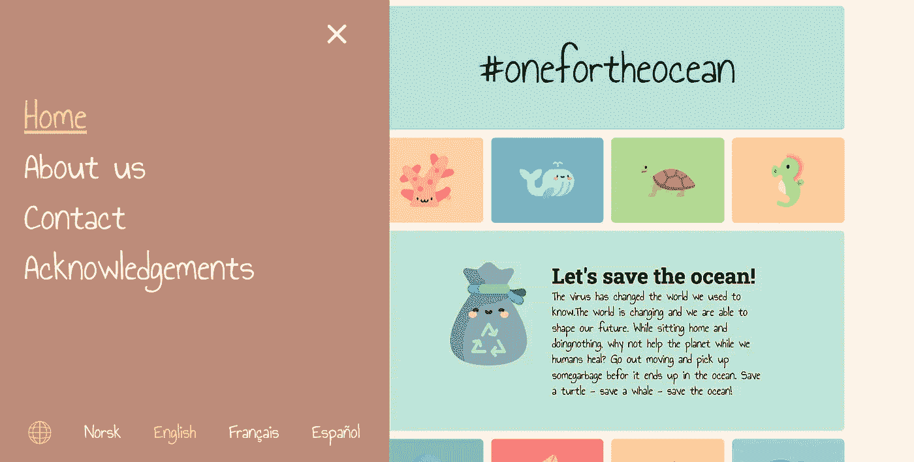
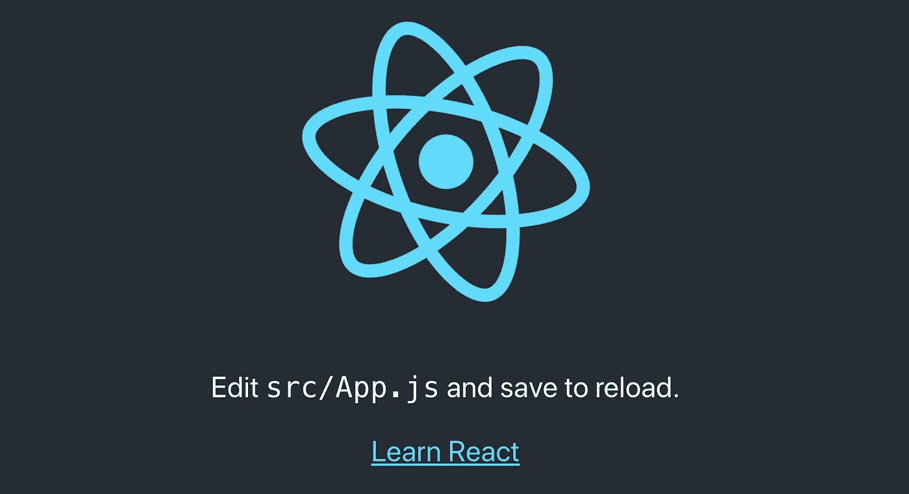
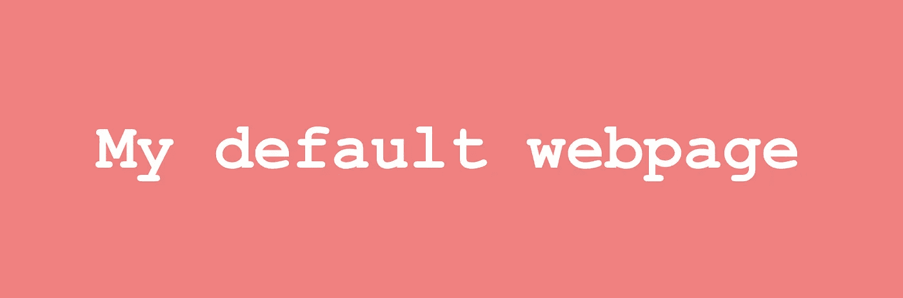

# 国际化您的 React 应用程序

> 原文：<https://javascript.plainenglish.io/is-your-app-discriminating-against-its-users-f61dbd1214d9?source=collection_archive---------10----------------------->

## App 翻译教程:

## 你知道英语不是世界上说得最多的语言吗？让我们使用 react-intl 创建一个支持多语言翻译的 react 应用程序。

我创建了一个名为 [#onefortheocean](http://www.onefortheocean.com) 的页面，试图让年轻人参与到收集垃圾的活动中来，以避免垃圾最终进入我们的海洋。世界各地的孩子说不同的语言，我想通过使用 i18n (react-intl)使我的页面对每个人都可用。



Just started translating the app I am working on

# 🌐I18N 是什么意思？

每当看关于翻译的内容时，你可能会遇到一个奇怪的词“i18n”。这是“国际化”的简称。“I”+18 个字母+“n”=**国际化**🤷‍♀

# 你应该翻译你的应用吗？

当开始一个项目时，很容易将任何文本直接硬编码到代码中。在继续走这条路之前，你可能想问自己的是——“非英语国家的人会访问我的页面吗？”。如果是——“他们能按原样使用我的页面吗？”。

> 网络遍及世界各地。国际化的 web 应用程序为世界各地的人们提供了出色的用户体验。— Format.js

如果你的用户、顾客和访问者依赖于你的页面被翻译成其他语言，你可以直接进入页面，开始用多种语言提供你的内容。就像我说的——英语不是世界上最常用的语言——它实际上是西班牙语！

# 💬翻译您的应用—基础知识

在本教程中，我们将使用 react-intl 创建一个 react 应用程序，以用户的首选语言向他们提供我们的内容。在这里是英语和西班牙语。在开始编码之前，我们将看一下 react-intl 的基础知识——我们需要习惯使用键而不是硬编码文本的想法:

**#1 我们使用按键代替硬编码文本**

```
import { FormattedMessage } from 'react-intl';<̶h̶1̶>̶M̶y̶ ̶we̶b̶p̶a̶g̶e̶<̶/̶h̶1̶>̶
<h1><FormattedMessage id="app.header" /></h1>
```

**#2 我们为每种语言创建一个对象，包含应用程序中的所有按键。**

```
const lang_en = {
  'app.header': 'My Webpage',
};
```

# 让您的应用程序正常运行

让我们创建一个 react 应用程序并开始吧！

```
~ npm install -g create-react-app
~ npx create-react-app my-translated-app
~ cd my-translated-app
~ npm install react-intl
~ npm start
```

此时，您的浏览器中应该有一个正在运行的 react 应用程序。我们的应用程序现在看起来像这样:



# **添加一些自定义样式**

通过添加下面提供的样式和代码，我们应该得到一个如下所示的应用程序:



# 翻译入门

好了——现在我们有了一个带有默认标题“我的默认网页”的基础页面。这并没有让我们有任何进展。让我们添加一些翻译对象——一个用于英语，一个用于西班牙语，以及一些获取首选翻译的代码:

现在我们有了我们的翻译——现在是时候把魔法加入到我们的应用程序中了。我们将把应用程序包装在一个`**IntlProvider**`组件中，并使用一个`useState`钩子来维护所选择的地区/语言。此时，我们将开始将语言默认为英语(“en”)。

现在——我们的应用程序不应该显示默认文本——它应该获取英语翻译并使用为`app.header`键提供的文本🙌我们的页面现在应该看起来像这样:


这么🎉翻译工作！我们还没有完成，但里程碑是值得庆祝的。在下一节中，我们将使用户能够更改语言。

# 改变语言

要更改地区/语言，我们可以使用我们创建的钩子中的`setLocale`方法。让我们为用户创建一些在语言之间切换的按钮:

```
//App.css...button {
  outline: none;
  border: 1px solid white;
  padding: 10px 20px;
  background: transparent;
  color: white;
  font-size: 14px;
  margin: 0 10px;
  cursor: pointer;
}//App.js...const App = () => {
  const [locale, **setLocale**] = useState("en");
  return (
    <IntlProvider locale={locale} messages={getMessages(locale)}
      <div className="app">
        <h1>
          <FormattedMessage
            id="app.header"
            defaultMessage="My default webpage"
          />
        </h1>
        **<div>
          <button onClick={() => setLocale("en")}>English</button>
          <button onClick={() => setLocale("es")}>Spanish</button>
        </div>**
      </div>
    </IntlProvider>
  );
};
```

当用户点击其中一个按钮时，应用程序会将翻译切换到选定的语言——干得好！现在，您的应用程序中已经实现了完整的翻译👏 🎉

(你也可以考虑为按钮使用 FormattedMessage，以避免在应用程序中使用硬编码文本，但这取决于你自己)

Change language

# 如果我重新访问该页面会发生什么？

此时，它会将自己重置为默认状态。对于任何西班牙用户来说，每次访问都必须按下按钮，这可能会很烦人？让我们将选定的语言存储在本地存储中！

为了解决这个问题，我们将创建一个名为`useLocalStorage`的本地存储挂钩来代替`useState`:

这就对了。我们的应用程序现在将选择的语言存储在本地存储中。如果本地存储中没有设置任何内容，我们的应用程序将使用默认设置。

我们现在完成了—伟大的工作！🎉#translateeverything

# 超越“不归点”

你可能会告诉自己，在应用程序中实现翻译为时已晚。不——不是的！幸运的是，硬编码文本和格式化消息可以并存。如果你正处于工作感觉难以承受的阶段，我会给你一个开始的建议——让我们一步一步来！

**第一步:**使用 react-intl 的 IntlProvider 包装你的应用。仅创建一种翻译，它是您应用程序中的当前语言。在这一点上，不是添加多种翻译，而是让你的应用程序准备好翻译。修复技术层面和翻译本身的工作太繁重了。
**第二步:**每次你触摸一个文件，你移动每个部分到语言对象，给它一个键。您移动的文本将替换为带有您刚刚创建的关键字的 FormattedMessage。第三步:当剩下更小的部分时，你可以清理一下，把最后的部分去掉。
**步骤#4:** 现在您已经删除了所有硬编码的文本——是时候制作语言对象的副本并实际翻译文本了。你还需要在你的应用程序中的某个地方进行切换。

# 旁注:

您只能使用有效的语言代码！网络浏览器使用特定的语言识别码。例如，“en”是英语的有效代码，“pp”不是任何语言的有效代码。看看这里的[有效语言识别码](https://www.metamodpro.com/browser-language-codes)。
**【2】**在我的应用 [#onefortheocean](https://github.com/marteloge/onefortheocean) 中，我使用 Typescript 创建了一些更详细的翻译实现(确保你只能翻译成有效的语言等。)
**#3** 将语言对象分割成单独的文件可能是明智的，因为这些对象在更大的应用程序中会变得很大。国际化不仅仅包括将文本从英语翻译成西班牙语，还包括格式化数字、日期、时间和复数形式。看看`format.js` [文档](https://formatjs.io/docs/basic-internationalization-principles)。

# 所有代码放在一起

🙏希望你喜欢这个小教程！
👩‍💻如果你需要联系，我在 Linkedin 和 Github 上。
🐳这里的工作是通过在我的页面 [#onefortheocean](https://github.com/marteloge/onefortheocean)
上工作学到的🙌感谢 [format.js](https://formatjs.io/docs/basic-internationalization-principles) 在我们的 react 应用中让 i18n 的工作变得更加容易！

## **用简单英语写的 JavaScript 笔记**

我们已经推出了三种新的出版物！请关注我们的新出版物:[**AI in Plain English**](https://medium.com/ai-in-plain-english)[**UX in Plain English**](https://medium.com/ux-in-plain-english)[**Python in Plain English**](https://medium.com/python-in-plain-english)**——谢谢，继续学习！**

**我们也一直有兴趣帮助推广高质量的内容。如果您有一篇文章想要提交给我们的任何出版物，请发送电子邮件至[**submissions @ plain English . io**](mailto:submissions@plainenglish.io)**，并附上您的 Medium 用户名，我们会将您添加为作者。另外，请让我们知道您想加入哪个/哪些出版物。****