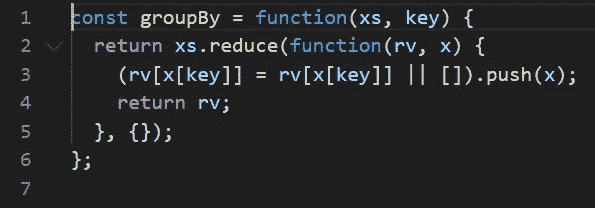
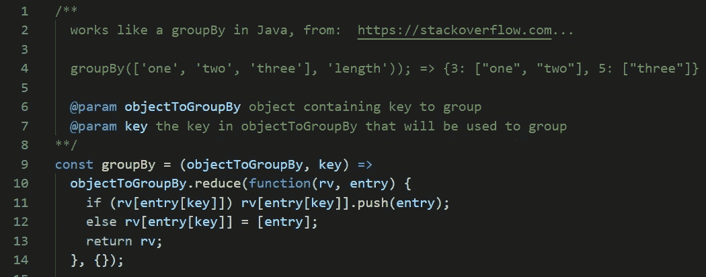

# 你的代码真的可读吗？

> 原文：<https://javascript.plainenglish.io/is-your-code-actually-readable-5cd31ba81461?source=collection_archive---------7----------------------->

## 可读代码的 3 个简单标准

Photo by [Road Trip with Raj](https://unsplash.com/@roadtripwithraj?utm_source=unsplash&utm_medium=referral&utm_content=creditCopyText) on [Unsplash](https://unsplash.com/s/photos/reading?utm_source=unsplash&utm_medium=referral&utm_content=creditCopyText)

干净的代码是一个被广泛讨论的话题。整本书都是关于它的(也有非常好的书！).但这也是一个话题，有时被高估了，降低了开发人员的生产力。意识到编写可读的代码非常重要，这绝不是浪费时间。然而，永远怀疑你编写的代码会导致产出减少，降低你的自尊。如果不是这样，你的企业会感谢你的，所以这里有三个简单的标准，你可以用它们来定义可读的代码:

你的同事能看懂吗？

这一条可能看起来很简单，但是它经常被遗忘。我们之所以首先编写高质量的代码，是因为我们的同事可以阅读和扩展它。这个问题也可以适用于更详细的情况，例如，如果你想知道是否需要一条评论:这条评论会让我的同事受益吗？不要害怕简单地问。对拉请求的代码审查是一件非常重要的事情。但是你可以在那之前分享你的代码，并找一个同事给你一些快速的反馈。这也是向初级开发人员传播专业知识的一种非常有效的方式。例如，如果你对这个问题的回答是否定的，因为缺少一些基本原理，你可以提供一些链接，也许还有关于这个主题的介绍。

**你能读吗？**

你真的能读懂自己的代码吗？这是一个在写完代码后马上问自己的被低估的问题。如果连你自己都不能读懂你的代码，那么很可能其他人也不能！这个问题也将阻止你复制你不理解的代码，仅仅因为它有效(例如来自 StackOverflow)。假设你在[的 StackOverflow](https://stackoverflow.com/a/34890276/10168474) 上找到了下面的函数，它非常好用，但是你能读懂代码吗？

即使对你自己来说，你也可能不太清楚这个函数是做什么的。添加带有示例输入/输出的注释已经使它更加清晰了。除此之外，您还可以使用好的变量名，比如 objectToGroupBy 而不是 xs，或者 entry 而不是 x。

你和你的同事能在 6 个月内看完吗？

很明显，你不能穿越时空来弄清楚这个问题，但是花点时间来想象一下。想象一下六个月不碰仓库。突然有了一个新的小要求。对自己诚实:你会努力去接触代码库吗？你可能会，但是如果你确信你仍然能够阅读代码，而不需要直接参与项目，这是一个非常好的迹象。

**就这样**，如果你能问心无愧地回答这些问题，你就可以走了！

有一点要明白，阅读代码本来就比编写代码难。这就是为什么我们倾向于很快将代码标记为不可读，甚至是糟糕的。写代码时，我们把一个问题分解成更小的问题。这样，我们可以极其高效地解决大问题，而无需时刻保持头脑中的全局观念。但是当阅读代码时，尤其是在我们不知道的存储库中，这可能是相当具有挑战性的。你的代码可以是干净的，但是不容易阅读，这两者并不互相排斥。感谢阅读！