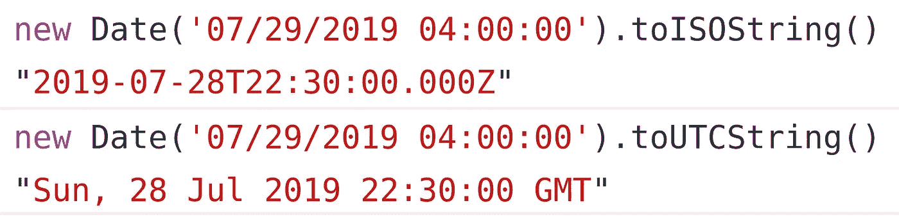

# 在 Javascript 中，将本地时间转换为 UTC 非常容易

> 原文：<https://javascript.plainenglish.io/it-is-really-easy-to-convert-local-time-to-utc-in-javascript-7e6a78460a7d?source=collection_archive---------0----------------------->


## 您是否觉得需要一个库，即使是一个像将本地日期转换为 UTC 格式这样的小任务？

当我第一次进入 Javascript 日期的世界时，我也有同样的感觉。今天我在这里告诉你，你试图用日期实现的大部分事情都可以用 Javascript 提供的原生日期构造函数来完成。所以让我们开始…

# **转换为 UTC/ISO**

也许在处理日期时，人们会寻找最常见的功能。

要将任何日期转换为 ISO 格式，您只需:

```
**new Date('07/29/2019 04:00:00').toISOString();**// "2019-07-28T22:30:00.000Z"
```

假设我们想要 ISO 格式的日期:2019 年 7 月 29 日 04:00 点

我们将调用新的日期构造函数，并将日期作为参数传递。支持的格式有:

1.  **新日期(年、月、日、时、分、秒、毫秒)**
2.  **新日期(" 2019 . 07 . 29 04:00:00 ")**//日期字符串
3.  **新日期(" 2019–07–29 ")**//YYYY-MM-DD
4.  **新日期(" 07/29/2019")** // MM/DD/YYYY
5.  **新日期(" 2019–07–29t 04:00:00Z ")**//ISO 日期

我可能会错过一些，但这些是最常用的格式，尤其是 1，3 和 4。

接下来，当我们的日期准备好了，我们可以链接各种方法来改变格式，其中一个方法是“toISOString”。

在数据库中存储数据时，ISO 格式非常流行。它确保所有使用此数据的其他应用程序获得相同的日期，而不是本地转换的日期。因为请记住，您的应用程序可以有位于不同时区的多台服务器。当您的服务器是跨国分布的时，您不希望以本地时区存储日期。

new Date 构造函数提供的另一个有用的方法是“toUTCString”。

所以当我们打电话时。toUTCString 它将日期转换为 UTC 格式，但以更易读的形式。

```
**new Date('07/29/2019 04:00:00').toUTCString();**// "Sun, 28 Jul 2019 22:30:00 GMT"
```

当您希望用户以更易读的格式显示 UTC 日期时，这个方法在前端会很有帮助。



现在，如果您想要 UTC 格式的当前时间，该怎么办呢？感谢 Javascript 日期构造函数。在调用 Date 函数时，只需将 arguments 字段留空即可。因此

```
**new Date();**// would essentially give you the current time**new Date().toISOString();**// would give you the current time in ISO format
```

# 结论

Javascript 中新的日期构造函数有很多方法，我们可以用它们来进行大部分的日期操作，并且不需要使用像 momentjs 这样的外部库来实现这个目的，除非您想要特殊的操作，比如计算两个日期之间的时间差等等。此外，这些库很重，除非在严格需要时有效使用，否则只会降低性能。