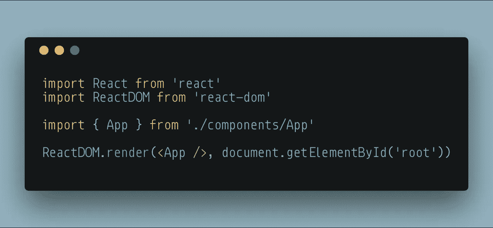

# 你该学习 Webpack 了。

> 原文：<https://javascript.plainenglish.io/its-time-for-you-to-learn-webpack-45d2b08ae754?source=collection_archive---------0----------------------->


Photo by [Mink Mingle](https://unsplash.com/@minkmingle?utm_source=medium&utm_medium=referral) on [Unsplash](https://unsplash.com?utm_source=medium&utm_medium=referral)

我用的是 **Webpack** 。

我已经在 **create-react-app (CRA)** 到 **react-scripts** 中使用过它，并且在我接触它们之前已经在其他项目中设置了自定义配置。但是我真的不知道它是如何工作的。我看了配置，我理解它背后的一些想法，但我从未编写过 **Webpack** 配置，或试图设置自己的配置。这就是本文将要讨论的内容。从没有配置，到将捆绑 **HTML** 、 **CSS** 和 **Javascript** 的基本功能设置。

我的目标是尽可能地揭开这个过程的神秘面纱，以便 Webpack 对新开发人员来说更容易理解和友好。

如果你正在使用 **React** 或另一个需要构建过程的库或框架，并且你想打破对 **CRA** 的依赖，或者只是对正在进行的魔法感到更舒服，我们将直接开始创建一个项目。因为我是在这个项目的同时写这篇文章的，所以我会一步一步地解释我是如何解决每个问题和研究秘密的。

随意跟随或使用我建立的 github repo 。如果你选择跟随，我特别使用了某些文件的图像，所以它们不能只是复制粘贴。把这些东西打出来将有助于你舒适地犯错误，发现错误，并改正错误。

首先，把项目安排好-

```
mkdir webpack-in-plain-english
cd webpack-in-plain-english
npm init -y
mkdir src
touch src/index.js
mkdir src/components
touch src/components/App.js
npm i react react-dom
```

现在，我们需要一些开发依赖来使这一切工作。对我来说，这就是事情变得混乱的地方，因为这些东西的许多功能开始混淆在一起。我们需要 **Webpack** ，以及它的朋友 **CLI** 和**开发服务器**。为了在浏览器中实现这一点，我们需要将 **es6** 和后面的部分代码转换成 **es5** 标准。**网袋**不**传送**，那是 **babel** 和**装载机**和**预设**包裹的工作。

```
npm i -D webpack webpack-cli webpack-dev-server html-webpack-pluginnpm i -D babel-core babel-loader@7 babel-preset-env babel-preset-react
```

Webpack 本身作为一个包我们不会直接接触，它只是通过我们已经安装的 **webpack-cli** 包来完成工作，这样我们就可以连接和配置 **Webpack** 。Webpack **dev server** 包是一个漂亮的工具，它将运行我们的构建过程，并将其提供给浏览器。至于**巴别塔**项目，他们真的值得他们自己写，我可能会写这方面的延续，以获得更多关于这些如何工作和不同配置的可能性。

我们刚刚安装的所有东西都需要一些配置。


webpack.config.js

入口是 **Webpack** 开始抓取文件的地方。本质上，它加载 **index.js** ，查看它由什么组成，如果它看到 **index.js** 正在导入其他文件，它将根据它拥有的配置处理这些文件。

输出让我们定义捆绑的 js 文件的位置。在这种情况下，我们将使用 **node.js** ' **path** 模块来定义我们的路径。对象中的第二个键就是文件名。

模块是我们定义如何处理 Webpack 遇到的每个文件的地方。**‘rules’**数组包含定义文件类型以及如何处理它们的对象。对于每个规则，您可以指定扩展名的外观、要排除的任何文件夹或文件，以及准备这些文件时要使用的内容。在这个例子中，我们告诉 **Webpack** 它需要寻找**。js** 文件扩展名，排除任何在 **node_modules** 文件夹中的，并使用 babel-preset 作为其加载程序。

目前，配置已经完成。我们需要给我们的 **package.json** 添加一些脚本，所以我们实际上已经利用了这个配置和 **Webpack** 的能力。


package.json

我们的启动脚本将运行 **Webpack** dev 服务器，它服务于我们项目的构建，但不将其写入磁盘，而是在内存中执行。我们还指定了我们处于开发模式，我们希望在运行该命令时打开一个浏览器，并且我们希望 **Webpack** 查看我们的文件，并在有更改时**‘热’重新加载**它们。

> 注意:对于那些没有意识到的人，**热重载**指的是每当发生变化时，代码自动重新编译并在浏览器中重载页面的能力。

build 命令会将项目写入磁盘，因为我们使用了 production 标志，所以它会针对最终用户的使用进行优化。

既然我们将 js 加载器定义为' **babel-loader** ，我们需要给它一个自己的配置。使用预置让告诉 babel 如何处理 **Javascript** 变得如此简单:


.babelrc

由于这是关于 webpack，而不是实际上关于构建一个应用程序，因此 **index.js** 和 **App.js** 文件应该分别如下所示:

**index.js**

```
import React from 'react'import ReactDOM from 'react-dom'import { App } from './components/App'ReactDOM.render(<App />, document.getElementById('root'))
```

**App.js**

```
import React, { Component } from 'react'export class App extends Component { render() { return <p>Hi, I've been packed, and transpiled</p> }}
```

玛丽娜·切尔尼亚夫斯卡让我注意到我遗漏了 index.html 的文件。给你，谢谢玛丽娜。

```
<!DOCTYPE html>
<html lang="en"> 
 <head>  
  <meta charset="UTF-8">  
  <meta name="viewport" content="width=device-width, initial-  scale=1.0">  
  <meta http-equiv="X-UA-Compatible" content="ie=edge">     <title>Webpack React</title>
</head> 
<body>  
  <div id="root"></div>
</body> 
</html>
```

简单到足以看到我们的脚本和配置是否工作。此时，如果您运行`**npm start**`，您应该很快打开一个浏览器弹出窗口，向您显示 **Webpack** 与此配置放在一起的结果。让我们看看 **Webpack** 是如何处理 **index.js** (我们定义的条目)的。



index.js webpack entry

第一行是导入 **React** ，它在 **node_modules** 中，属于我们的排除范围，并且 **Webpack** 知道不要对该导入做任何事情，第二行也是如此。导入**应用**后， **Webpack** 将继续抓取该文件。将它的内容添加到包中，并逐步通过应用程序，直到所有代码都包含在包中。

我们现在拥有的是一个工作的基本 **Webpack** 配置。但是等等，这不包括款式。继续在 components 文件夹中创建一个 **styles.css** ，并将您对' **p** '标记的修改导入到 **App.js** 中，如下所示:

`import './styles.css'`


好吧，现在它坏了。太好了。所有这些设置和我只能显示无风格的垃圾！

这就把我们带到了使用 **Webpack** 的最重要的部分。研究装载机并寻找解决问题的方法。这个问题很容易解决，因为很多人都处理过这个问题。一个简单的谷歌搜索会引导你找到一个名为“ **css-loader** ”或“ **style-loader** ”的 **npm** 包。您将看到您必须通过 **npm** 来安装它们，然后用另一个测试来修改您的 **Webpack** config，以包含 css 文件并告诉它如何处理它们。这些加载器让我们设置了另一个规则，这次是针对 css 的。这不会输出包含您的样式的 css 文件，而是将它们添加到您的 Javascript 中，如下所示:


Inline styles in webpack output

通过一个快速的`npm i style-loader css-loader`，然后向 **Webpack** 配置添加一个规则，如下所示:

```
{test: /\.css$/,use: ['style-loader', 'css-loader']}
```

现在，您可以将样式导入到您的 **React** 组件中，并使某些东西不仅实用，而且美观。😁

所以现在我们有了一些工作和如何配置 **Webpack** 的基础，一些关于 **Babel** 的想法(它是自己需要驯服的野兽)，以及如何添加加载器以增加功能。

这是一段美好关系的开始。构建过程可能令人生畏，但如果你有一个坚实的基础，并知道如何扩展，你可以相处得很好。

如果你有额外的资源或者看到这个指南有问题，请在评论中给我留言。我也在推特上 [@GrantGlidewell](https://twitter.com/GrantGlidewell) 。