# 如何用 Netlify，Gatsby.js 和 Mailgun 创建联系人表单

> 原文：<https://javascript.plainenglish.io/jamstack-how-to-do-a-contact-form-step-by-step-with-gatsby-js-netlify-and-mailgun-52d26432a5c4?source=collection_archive---------1----------------------->


Photo by [NeONBRAND](https://unsplash.com/@neonbrand?utm_source=unsplash&utm_medium=referral&utm_content=creditCopyText) on [Unsplash](https://unsplash.com/s/photos/email?utm_source=unsplash&utm_medium=referral&utm_content=creditCopyText)

今年，作为一名初级开发人员，我决定写两篇文章，介绍如何一步一步地用 Gatsby.js 建立一个经典的登录页面。今天的文章是关于联系方式的。

由于 JAMstack 不是关于特定的技术，我们将使用的 JAMstack 的解释是:

*   盖茨比前端(即。联系方式)
*   Netlify 静态托管
*   网络云功能

我们希望通过这个表单从 Gatsby 页面的前端获取一些基本数据，将其发送到由 Netlify 生成的 API 端点，然后在将使用 Mailgun 的 Netlify 云函数中处理它。

给你一个快速剧透，我们将遵循这个逻辑:

*   #1.创建一个 Gatsby.js starter &在 GitHub 上推送。
*   [#2](https://github.com/marieqg/contact-form-medium/tree/STEP%232) 。开始使用 Netlify 功能&在 Netlify 上部署我们的网站。
*   [#3](https://github.com/marieqg/contact-form-medium/tree/STEP%233) 。向 MailGun 注册，编写 Netlify 函数，测试它，并部署它。
*   [#4](https://github.com/marieqg/contact-form-medium/tree/STEP%234) 。使用材质 UI 创建前视图，并将其连接到我们的 API 端点。

我的 GitHub 库是公开的，如果你在某个时候迷路了，可以在这里[找到。此外，每一步都是一个分支，这样你就可以保持跟踪。](https://github.com/marieqg/contact-form-medium)

# **第一步:创建一个 Gatsby.js starter &在 GitHub 上推送**


我们要从设置 Gatsby.js 开始，如果你还没有设置好你的开发环境，你可以按照[这个过程](https://www.gatsbyjs.org/tutorial/part-zero/)。

完成后，我们将创建一个新的 gatsby 站点，并使用以下命令进行第一次运行。

```
gatsby new gatsby-site
gatsby develop 
```

一旦你到了这里，你就可以打开浏览器，进入 [http://localhost:8000/](http://localhost:8000/) 查看你的网站运行情况。

然后，我们将在 Github 上发布我们的代码。创建存储库后，Github 会给出发布存储库的说明。如果您选择在命令行上创建一个新的存储库，那么您不需要添加一个 read me，因为 Gatsby.js starter 已经提供了一个。

# **第二步:从网络功能开始&在网络上部署我们的网站**

Netlify 是托管静态网站的一个很好的选择。它们提供了额外的功能，如[认证管理](https://www.netlify.com/docs/identity/)、[表单处理](https://www.netlify.com/docs/form-handling/)，最重要的是:[连续部署](https://www.netlify.com/docs/continuous-deployment/)和 AWS lambda [功能](https://www.netlify.com/docs/functions/)。

启动计划是完全免费的，将为一个基本的网站提供完整的功能。Netlify 的 lambda 函数是一种计算服务，可以让您运行代码，而无需提供或管理服务器。免费层为一个功能提供 125，000 个请求。

运行一个函数很容易，但是你需要使用`netlify-lambda`来模拟它。要启动并运行您的第一个 Netlify 函数，您可以遵循以下步骤:

## **1。安装依赖关系**:

在终端运行中:

`npm install -D http-proxy-middleware netlify-lambda npm-run-all`

## **2。和盖茨比一起运行函数仿真**:

当您要部署您的 Gatsby 站点时，它将使用脚本来知道如何构建它以及以什么顺序来构建它。所以，把你的`scripts`换成你的`package.json`:

```
"scripts": {
    "develop": "gatsby develop",
    "start": "run-p start:**",
    "start:app": "npm run develop",
    "start:lambda": "netlify-lambda serve src/lambda",
    "build": "gatsby build && netlify-lambda build src/lambda",
    "build:app": "gatsby build",
    "build:lambda": "netlify-lambda build src/lambda",
  },
```

## 3.**为你的功能创建一个文件夹**

Netlify 函数接收请求上下文或事件数据，并将数据返回到您的前端。基本上，它将使您的网站从完全静态变为动态，因为它将按需运行服务器端代码，而不必管理专用服务器。

现在`netlify-lambda`将在你的`src/lambda`文件夹中建立每个文件作为一个独立的功能。要创建文件夹，请在终端中运行:

```
cd src 
mkdir lambda
```

我们不希望这个文件夹出现在 GitHub 上，所以我们将下面的内容添加到我们的`.gitignore`中。反斜杠“/”很重要，因为它告诉 GitHub 忽略我们文件夹根目录下的“lambda”文件夹，而不是另一个。

```
/lambda 
```

## 4.配置您的网络版本:

为了确保 Netlify 找到我们的函数的路径，在你的文件夹的根目录(即与你的`package.json` package.json 在同一层)，我们将创建一个名为`netlify.toml`的文件，并编写如下内容:

```
[build]
  command = "npm run build"
  functions = "lambda"
  publish = "public"
```

## **5。代理本地开发的仿真功能**:

转到您的`gatsby-config.js`并将其添加到您的`module.exports`:

```
var proxy = require("http-proxy-middleware")module.exports = {
  // for avoiding CORS while developing Netlify Functions locally
  // read more: [https://www.gatsbyjs.org/docs/api-proxy/#advanced-proxying](https://www.gatsbyjs.org/docs/api-proxy/#advanced-proxying)
  developMiddleware: app => {
    app.use(
      "/.netlify/functions/",
      proxy({
        target: "[http://localhost:9000](http://localhost:9000)",
        pathRewrite: {
          "/.netlify/functions/": "",
        },
      })
    )
  },
  // ...
}
```

*2004 年 19 月更新:代理现在被 createProxyMiddleware 取代。现在导入需要:*

```
const { createProxyMiddleware } = require("http-proxy-middleware")
```

*另外，代码中需要用 createProxyMiddleware 替换代理。*

## **6。用 MVP 函数测试它**

您可以编写任意多的函数，只要每个函数都导出一个处理程序。它可以接受 3 个参数:

*   **事件**:它是一个包含请求细节的对象。例如，您可以检索已过帐的数据或页眉。
*   **上下文**:这是关于调用函数的上下文的信息，比如某些用户信息。
*   **回调:**是一个函数，我们调用这个函数向用户返回一个响应。应该调用它来返回错误或响应对象。在下面的例子中，回调的第一个参数为空。

如果你想了解更多关于函数的知识，文档在这里。

调用无服务器功能时，Netlify 将提供`event`和`context`参数。您提供了`callback`参数，这是可选的，但是推荐使用。

现在，我们可以通过编写一个小函数来测试它。您可以在`src/lambda`文件夹中创建一个新文件，并将其命名为`hello.js`:

```
// For more info, check [https://www.netlify.com/docs/functions/#javascript-lambda-functions](https://www.netlify.com/docs/functions/#javascript-lambda-functions)
export function handler(event, context, callback) {
  callback(null, {
    statusCode: 200, 
// That's the status code which will be returned when the function is executed to indicates that everything is OK
    body: JSON.stringify({
      msg: "Hello, World! ",
    }),
  })
}
```

为了测试我们的功能，在终端中运行以创建一个生产版本:

```
**npm run start** 
```

然后去[http://localhost:9000/hello](http://localhost:9000/hello)

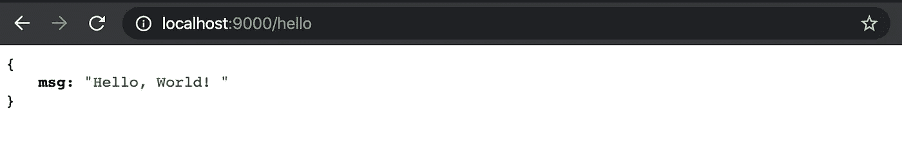

现在我们的函数工作了，我们需要把它提交给 Github。

如果你在路上迷路了，我们就在这里。如果您还没有创建 Netlify 帐户，请在此注册并点击右上角的按钮“从 Git 创建新网站”。然后，您将被重定向到一个新的屏幕，在这里您可以选择 GitHub 作为您的 Git 提供者。一旦它链接到 GitHub，选择您之前创建的存储库，然后点击“部署”。

## 7.在网络上部署

您的部署可能需要几分钟时间。完成后，您可以在 Netlify 仪表板中查看您的功能:

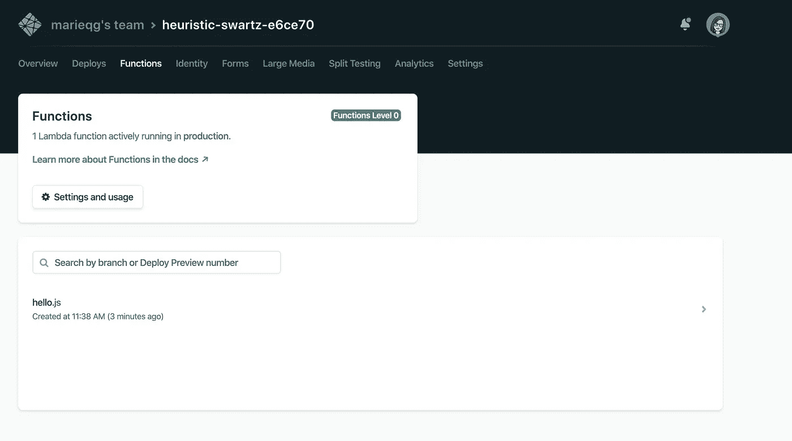

您可以通过以下 URL 模式在浏览器中测试它:

```
[https://[YOUR_URL]/.netlify/functions/[YOUR_FUNCTION_NAME]](https://heuristic-swartz-e6ce70.netlify.com/.netlify/functions/hello)
```

# 步骤 3:向 Mailgun 注册，编写 Netlify 函数，测试并部署它

现在我们有了一个运行良好的功能，让我们从电子邮件开始。

## **1。设置电子枪:**

首先，你需要一个邮箱账号。你必须使用信用卡/借记卡，但 Mailgun 有一个慷慨的免费账户，因为他们允许你每月免费发送 10 000 封电子邮件。此外，他们有一个令人难以置信的支持团队，如果你有困难，他们会帮助你度过难关。

我们现在将使用 Mailgun 的沙箱，但是当你有了自己的域名，你就可以使用它了。

一旦你有你的 Mailgun 帐户，你将到达仪表板。然后，转到发送>概述(红色方块)，并确保您所在的域是“沙箱”(蓝色方块)。之后，点击 API，然后选择 Node.js

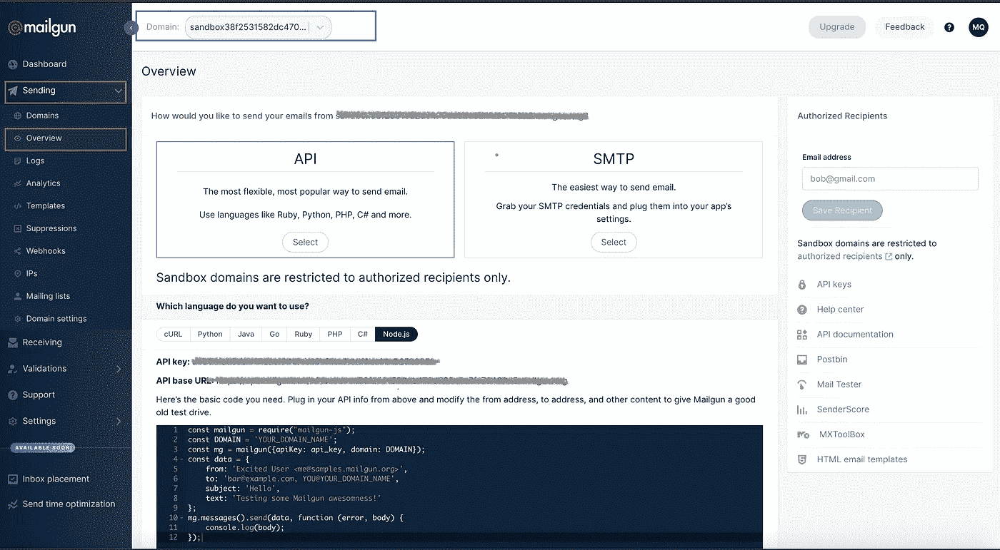

## **2。设置环境变量**

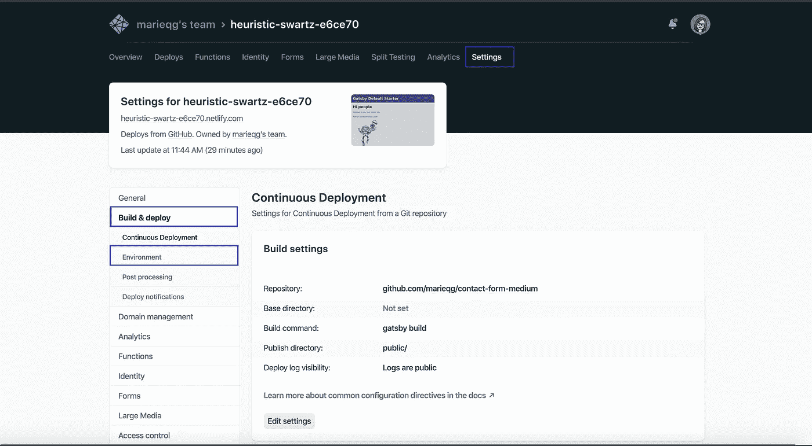

您的 Mailgun API 密钥是私有的，如果您不小心，它很容易被窃取。它不应该被公开。所以比如**不要在 GitHub 上推**。这就是为什么我们要将它们保存在 Netlify 的设置中。

进入设置后，单击构建和部署以及环境。然后，在“编辑变量”中，您将能够为以后需要的每个变量输入一个键和值的组合。

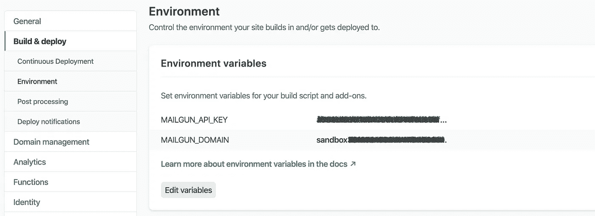

## **3。启用并设置 Postman 以测试功能**

我们函数的目的是向服务器发出请求。之前我们的请求是“GET ”,这意味着所有需要的数据都在 URL 中。在我们的例子中，我们的第一个函数不需要任何数据，它只需要 URL 中的函数名。

最后，我们要做的是通过表单向服务器发送数据。换句话说，我们的前端接口将检索数据并将其发送到服务器。这将通过一个“POST”请求来完成。POST 请求在消息体中从浏览器(即客户端)向服务器提供附加数据。

为了测试一个 POST 请求，我们需要使用一个软件(Postman)。它需要一个设置才能使用 Mailgun。[这篇伟大的文章](https://www.mailgun.com/blog/together-at-last-postman-meets-mailgun/)将解释一切。

## **4。POST 请求从邮递员那里取回数据**

让我们像创建 MVP 函数一样创建一个新函数。我们称之为`sendEmail.js`，从重用 MVP 函数的代码开始。我对 MVP 函数做了一个小改动，因为我想看看我的`event`是什么样子。

```
export function handler(event, context, callback) {
  callback(null, {
    statusCode: 200, 
    body: JSON.stringify({
      msg: "Hello, World! ",
      event: event
   }),
  })
}
```

在你开始用 Postman 测试它之前，不要忘记通过在你的终端中执行`ctrl + c` 和`npm start`来重启你的服务器。

现在，在 Postman 中，选择 POST 请求并添加 URL(蓝色方块)。发送的数据将放在“Body”中，选择“raw”和“JSON”(绿色方块)。在 body 字段中，您可以添加自己的数据(红色方块)。

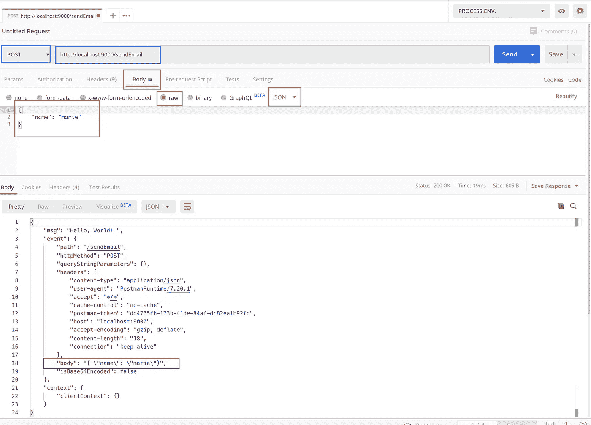

一旦我们点击“发送”，我们将看到服务器的回复。如您所见，我们发送的参数在`body`对象(紫色方块)内部，但是作为一个 JSON。因此，我们需要在对象之外创建一个字符串来使用它:

```
export function handler(event, context, callback) {
  let data = JSON.parse(event.body)
  callback(null, {
    statusCode: 200,
    body: JSON.stringify({
      msg: "Hello, World! ",
      event: event,
      context: context,
      data: data,
    }),
  })
}
```

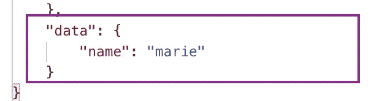

一旦解析完毕，就可以在 Postman 中直接看到结果。

## **5。函数:sendEmail.js**

现在，让我们回到 Mailgun 的仪表板，获取他们为我们预先编写的一段代码。我们现在可以定制它来满足我们自己的需求，并将其添加到我们的`sendEmail.js`函数文件中。

```
const mailgun = require("mailgun-js")
const mg = mailgun({
  apiKey: process.env.MAILGUN_API_KEY,
  domain: process.env.MAILGUN_DOMAIN,
})
const mailOptions = {
  from: `${name} <${email}>`,
  to: process.env.MY_EMAIL_ADDRESS,
  replyTo: email,
  text: `${message}`,
}
mg.messages().send(mailOptions, function(error, body) {
  console.log(body)
})
```

要让它发挥作用，还缺少三样东西:

*   如你所见，`mailgun`要求`mailgun-js`，这意味着我们必须做一个`npm install mailgun-js`
*   此外，为了保护我们的密钥，我们在`process.env`中使用了环境变量。 [Gatsby](https://www.gatsbyjs.org/docs/environment-variables/) 需要在我们的函数文件中安装(`npm install dotenv`)环境变量和几行代码:

```
// Gatsby settings for the environment variables
require("dotenv").config({
  path: `.env.${process.env.NODE_ENV}`,
})
```

*   为了便于以后定制，我将发送电子邮件地址设置为一个环境变量，并解构了`data`对象。但是，您需要在 Postman 中配置环境变量。点击螺母(粉色方框)并点击“处理”。ENV "(蓝框)能够编辑您的环境变量(邮件枪 _ 域，邮件枪 _ API _ 密钥，我的 _ 电子邮件 _ 地址):

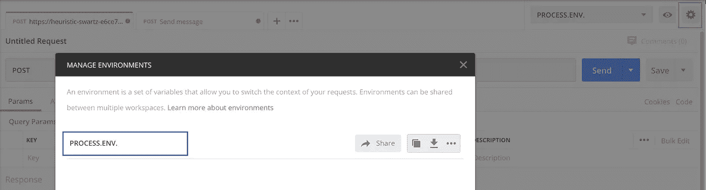

现在，我们的功能几乎可以工作了。出于安全原因，浏览器将禁止一个网站从另一个网站获取数据。我们需要通过指定一个标题来取消这个安全措施。

```
const headers = {
  "Access-Control-Allow-Origin": "*",
  "Access-Control-Allow-Headers": "Content-Type",
}
```

这也是一个很好的机会，通过指定在出错时如何工作来完成我们的功能:

```
(...)
const headers = {
  "Access-Control-Allow-Origin": "*",
  "Access-Control-Allow-Headers": "Content-Type",
}
const successCode = 200
const errorCode = 400(...) **// Our Netlify function**export function handler(event, context, callback) {
  let data = JSON.parse(event.body)
  let { name, email, message } = data
  let mailOptions = {
    from: `${name} <${email}>`,
    to: process.env.MY_EMAIL_ADDRESS,
    replyTo: email,
    text: `${message}`,
  }**// Our Mailgun code** mg.messages().send(mailOptions, function(error, body) {
    if (error) {
      callback(null, {
        errorCode,
        headers,
        body: JSON.stringify(error),
      })
    } else {
      callback(null, {
        successCode,
        headers,
        body: JSON.stringify(body),
      })
    }
  })
}
```

部署到 [GitHub](https://github.com/marieqg/contact-form-medium/tree/STEP%233) 后，会自动部署到 Netlify 上(如果设置了选项)。并且，我们对 PostMan 进行了最后的测试，看它是否工作🎉 🥳:

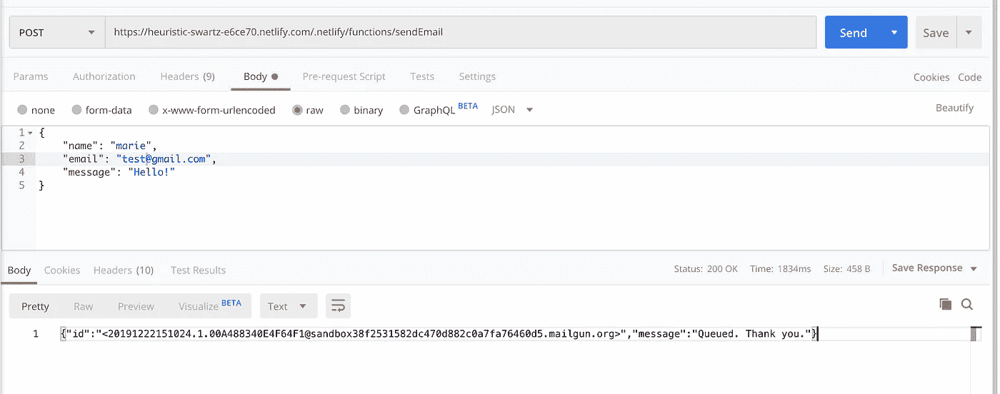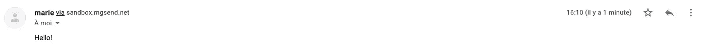

此外，如果您想走出 Mailgun 的沙盒，您将需要小心对待端点。API 端点是一个特定的数字位置，一个程序在这里发送信息请求，资源也在这里。沙箱默认使用美国端点。如果您在欧洲，当您初始化 Mailgun 对象时，您需要包括选项“host”并指定“EU”(即欧洲)端点。

请参见下面的示例:

```
const mg = mailgun({
  apiKey: process.env.MAILGUN_API_KEY,
  domain: process.env.MAILGUN_DOMAIN,
  host: “api.eu.mailgun.net”
})
```

# 第 4 步:创建前视图与材料用户界面，使接触形式的用户友好

现在，我们的最后一步:表单的前端部分。我们将使用它从客户端收集数据。

## **1。设置素材 UI 和前端**

为了更好地做到这一点，我们将安装 Material UI 及其 gatsby 插件:

```
npm install gatsby-plugin-material-ui @material-ui/styles [@material](http://twitter.com/material)-ui/core
```

并将其设置在我们的`gatsby-config.js`:

```
// gatsby-config.js module.exports = {   plugins: [`gatsby-plugin-material-ui`], };
```

是时候布置前线了。我创建了一个名为`Contact`的组件。在我将从页面`index.js`调用的组件文件夹中:

```
**//Contact.js**import React from "react"export default class Contact extends React.Component {
  state = {}render() {
    return <div></div>
  }
}**//index.js**import React from "react"import Contact from "../components/Contact"const IndexPage = () => <Contact></Contact>export default IndexPage
```

## **2。创建表单的前端:**

作为一名 MVP，我们将创建一个在视觉上看起来像表单的表单，但这是行不通的。从材质 UI，我们将使用[文本字段](https://material-ui.com/components/text-fields/)和一个[按钮](https://material-ui.com/components/buttons/#button)。遵循材料 UI 编码指南，我们的 contact 组件将如下所示:

```
import React from "react"
import TextField from "[@material](http://twitter.com/material)-ui/core/TextField"
import Button from "[@material](http://twitter.com/material)-ui/core/Button"export default class Contact extends React.Component {
  state = {}render() {
    return (
      <div>
        <form noValidate autoComplete="off">
          <TextField id="standard-name" label="Name" />
          <TextField id="standard-email" label="Email" />
          <TextField id="standard-message" label="Message" />
          <Button variant="contained" color="primary">
            Submit
          </Button>
        </form>
      </div>
    )
  }
}
```

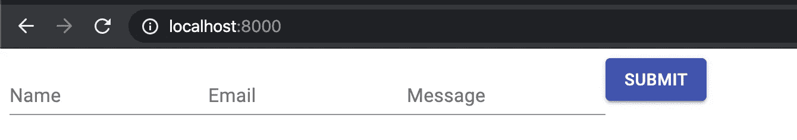

即使我们的形式在那里，没有什么工作。为了让它发挥作用，我们需要:

*   存储将要输入状态的内容，并创建一个函数来处理变量的变化
*   处理提交按钮上的点击
*   创建一个函数来处理表单中的成功和错误

## **3。存储用户将要输入的值**

让我们首先创建一个状态来存储将在表单中键入的值:

```
import React from "react"
import TextField from "[@material](http://twitter.com/material)-ui/core/TextField"
import Button from "[@material](http://twitter.com/material)-ui/core/Button"export default class Contact extends React.Component {
  state = {
    name: "",
    email: "",
    message: "",
  }render() {
    return (
      <div>
        <form noValidate autoComplete="off">
          <TextField
            id="standard-name"
            label="Name"
            value={this.state.name}
          />
          <TextField
            id="standard-email"
            label="Email"
            value={this.state.email}
          />
          <TextField
            id="standard-message"
            label="Message"
            value={this.state.message}
          />
          <Button variant="contained" color="primary">
            Submit
          </Button>
        </form>
      </div>
    )
  }
}
```

现在，文本字段中的值将是状态之一，但我们没有办法改变它。为此，我们需要一个新功能:

```
handleChange = event => {
    const name = event.target.name
    const value = event.target.value
    const statesToUpdate = {}
    statesToUpdate[name] = value
this.setState(statesToUpdate)
  }
```

如你所见，该函数将从文本字段中获取一个名为`event`的对象。在`event`对象中，它将使用一个`name`和一个`value`来创建一个新对象并设置状态。我们已经向每个文本字段传递了一个`value`，但是我们现在还需要向它传递一个名称和函数本身。每个文本字段应该如下所示:

```
<TextField
  id="standard-name"
  label="Name"
  value={this.state.name}
  onChange={this.handleChange}
  name="name"/>
```

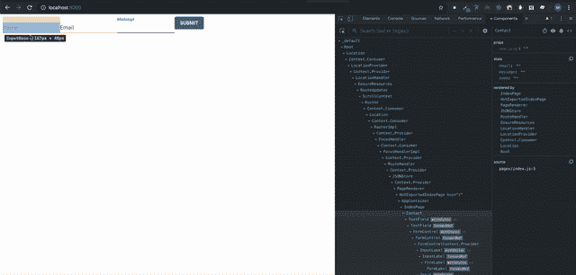

## **4。处理点击提交按钮，错误和成功**

当我们点击按钮时，我们希望按钮做的是通过它的端点向我们之前创建的函数发送一个 HTTP 请求。要发送 HTTP 请求，我们将使用 Axios。所以，我们先安装一下:

```
npm install axios
```

我们的函数将做以下事情:它将从状态中获取数据，并将其作为一个对象。然后，我们将向 Netlify 的端点发送一个带有数据的 HTTP 请求(已经被转换成一个`String`):

```
const axios = require("axios")handleSubmit = e => {
    let { name, email, message } = this.state
    let data = { name, email, message }
    axios.post(endpoints.contact,     JSON.stringify(data)).then(response => {
      if (response.status !== 200) {
        this.handleError()
      } else {
        this.handleSuccess()
      }
    })
    e.preventDefault()
  }
```

为了让这个函数工作，我们必须定义端点，并在我们的`Contact.js`中创建一个成功和错误函数。

```
const endpoints = { contact: "/.netlify/functions/sendEmail"}handleSuccess = () => {
    this.setState({
      name: "",
      email: "",
      message: "",
      loading: false,
      error: false,
    })
  }handleError = msg => {
    this.setState({
      loading: false,
      error: true,
      msg,
    })
  }
```

别忘了给我们的按钮添加一个提交类型:

```
<Button variant="contained" color="primary" type="submit">
 Submit
</Button>
```

最后，我们的组件将如下所示:

```
import React from "react"
import TextField from "[@material](http://twitter.com/material)-ui/core/TextField"
import Button from "[@material](http://twitter.com/material)-ui/core/Button"const endpoints = {
  contact: "/.netlify/functions/sendEmail",
}
const axios = require("axios")export default class Contact extends React.Component {
  state = {
    name: "",
    email: "",
    message: "",
  }handleChange = event => {
    const name = event.target.name
    const value = event.target.value
    const statesToUpdate = {}
    statesToUpdate[name] = valuethis.setState(statesToUpdate)
  }handleSubmit = e => {
    let { name, email, message } = this.state
    let data = { name, email, message }
    axios.post(endpoints.contact, JSON.stringify(data)).then(response => {
      if (response.status !== 200) {
        this.handleError()
      } else {
        this.handleSuccess()
      }
    })
    e.preventDefault()
  }handleSuccess = () => {
    this.setState({
      name: "",
      email: "",
      message: "",
      loading: false,
      error: false,
    })
  }handleError = msg => {
    this.setState({
      loading: false,
      error: true,
      msg,
    })
  }render() {
    return (
      <div>
        <form noValidate autoComplete="off" onSubmit= {this.handleSubmit}>
          <TextField
            id="standard-name"
            label="Name"
            value={this.state.name}
            onChange={this.handleChange}
            name="name"
          />
          <TextField
            id="standard-email"
            label="Email"
            value={this.state.email}
            onChange={this.handleChange}
            name="email"
          />
          <TextField
            id="standard-message"
            label="Message"
            value={this.state.message}
            onChange={this.handleChange}
            name="message"
          />
          <Button variant="contained" color="primary" type="submit">
            Submit
          </Button>
        </form>
      </div>
    )
  }
}
```

现在，我们可以在 Github 上添加、提交和推送。完成后，如果启用了 Netlify 上的自动部署，您只需等待几分钟，它就会联机并工作🎉 🥳 .如果您尝试发送电子邮件，您将会收到:

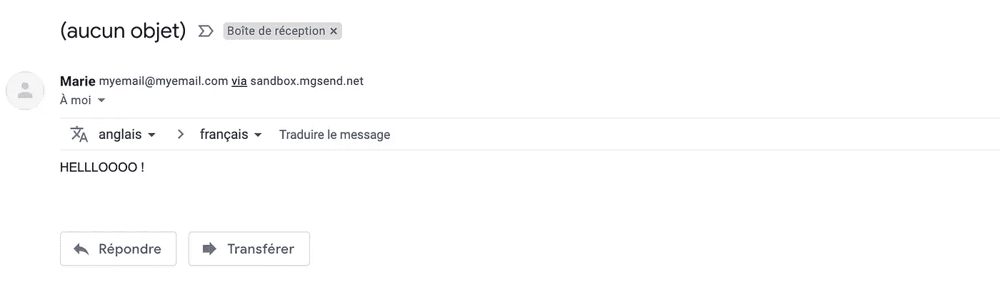

非常感谢你一直跟着我！如果你在这个过程中迷路了，最终版本可以在这里找到。如果有误导或者有任何问题，请随时发表评论。