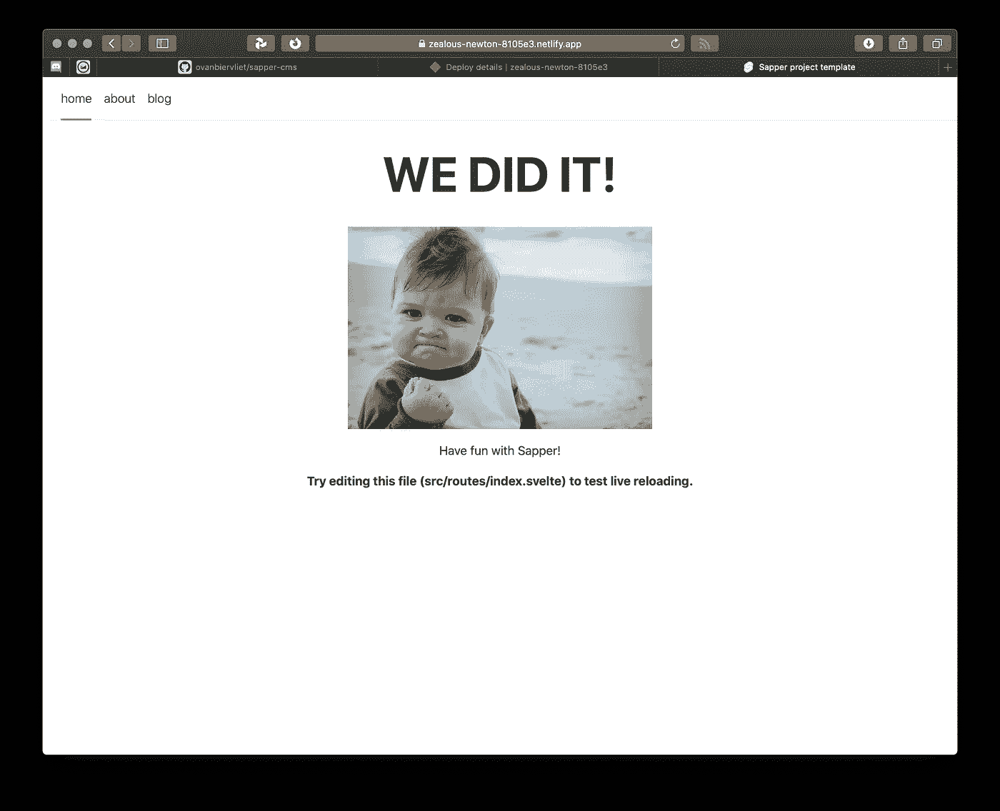

# Jamstacking 一个免费的 CMS 网站

> 原文：<https://javascript.plainenglish.io/jamstacking-a-free-cms-site-with-svelte-sapper-netlify-and-faunadb-part-1-7d4092922f57?source=collection_archive---------6----------------------->

## 与苗条/萨珀、Netlify 和 FaunaDB:第 1 部分

在本教程中，我们将基于来自 [Nicholas Christ](https://github.com/nhristov) 的 Sapper 模板构建一个小型内容网站，并将其修改为使用 FaunaDB 作为存储，Netlify 作为免费主机。它使用 Svelte 和 Tailwind CSS 来创建和设计网页非常干净和容易。

第一部分只是一个简单的开始，所以每个人都可以跟着做。您需要一些 git 知识(或者使用 git gui)。能否更上一层楼取决于你。

计划是这样的:

1.  克隆模板存储库
2.  构建/运行/回推
3.  部署到网络
4.  添加 FaunaDB 和帖子
5.  把它粘在一起

你可以在添加 FaunaDB 后进行第二步，但我很高兴看到它先在网上运行，然后再添加功能。

# 1.克隆存储库

我从 https://github.com/nhristov/sapper-template-rollup 的[开始，一个修改过的 Sapper 模板，它使用了 postcss、purgecss、cssnano、tailwindcss 和 svelite-preprocess。](https://github.com/nhristov/sapper-template-rollup)

The original sapper-template-rollup

Create a new repo from an existing one

一旦你在 GitHub 上设置了它，你就需要在你的机器上使用它。如果你熟悉的话，可以通过命令行克隆这个 repo，或者你可以从你的浏览器中拖动 url 到一个 gui 中，比如 [**塔**](https://www.git-tower.com/) 或者 [**源树**](https://www.sourcetreeapp.com/) 。

在您选择的编辑器中打开项目，我使用 [**WebStorm**](https://www.jetbrains.com/webstorm/) ，并在一个终端中键入 **npm install** 来安装任何需要的依赖项。如果您看到提到了漏洞，请键入 **npm audit** 来修复这些漏洞，然后继续。

# 2.构建、运行和推回

现在您可以构建您的项目并在本地运行它。你用 npm run dev 来做这件事，如果一切顺利，你会看到 http://localhost:3000 链接出现。在您的浏览器中测试它。

我在两台机器上尝试了这个示例项目，一台成功了，另一台失败了。起初，我不明白为什么…求助于 Hackages 的家伙们得到了解决方案:确保在你的机器上运行 [***最新节点***](https://nodejs.org/en/) *。在撰写本文时，这个版本是 14.2.0。问题解决了。*

Our project running locally

在顶部导航中点击，注意它有多快。在博客页面上，你会找到一个文章列表。这是我们将转换到 FaunaDB 在线数据存储的列表。

让我们在第一页上改变一些东西，只是为了确保我们的更新工作。在你的编辑器中打开 */src/routes/index.svelte* 文件，将主标题改为< h1 > **我们做到了！** < /h1 >或者类似的。

当您保存 index.svelte 文件时，您的浏览器应该会更新并显示您所做的更改。

Committed and pushed the change to the title

现在将更改提交给 git，并将其推送到 github 上的 repo 中。

# 3.部署到网络

我们可以通过拖放将我们的站点直接部署到 Netlify，但是每次更新我们都需要重复这个过程。从长远来看，那是没有效率的。

所以在本教程中，我们将关注 git 方法:我们让 Netlify 从那里自动导入它。这让我们可以免费控制现场的版本。

在[网上创建你的免费账户](https://app.netlify.com/signup)。您应该*使用您的 GitHub 凭证*来做这件事，这样 Netlify 将能够找到您的库。

接下来，单击[从 Git 新建站点]

按照 3 个步骤在 Netlify 中创建新站点。您将连接并授权 Netlify 使用 GitHub，您的库列表将会出现。选择我们刚刚创建的 sapper-cms(或者不管你叫它什么)。

注意:在步骤 3 中，您需要指定一个构建命令和一个发布目录。这对于你的网站在 Netlify 上工作是至关重要的。要查找这些值，请打开 package.json 文件并查找导出值。对于发布目录，您需要获取起始值，但是用导出替换构建。

大概就是这样。点击[部署站点],希望一切顺利。如果部署失败，您可以单击红色标签并查看构建日志。这应该会让你知道去哪里找。

Netlify build log with error

在这种情况下，这是同一个旧的 nodejs 版本问题。在我们的本地机器上，我们可以将 nodejs 更新到最新版本，但是 Netlify 默认使用一个更老的版本。

幸运的是，有一种方法可以指定我们需要一个更新的节点版本。转到站点设置，然后构建&部署，环境，添加一个名为 **NODE_VERSION** 的新变量，并赋予其值 **12** 。

Fixing Sapper build problem in Netlify with Node version 12

保存值，返回概览屏幕，部署设置并触发新的部署。现在一切应该都好了。单击[Preview deploy]链接从 Netlify 测试您的新站点。

因此，在这一点上，我们有一个 Svelte/Sapper 站点，我们可以在本地修改，提交和推送对 Git 的更改，它将被持续部署到 Netlify。

**在本教程的第二部分** [**中**](https://medium.com/p/628b4aea78d1/) **我们将设置 FaunaDB 并转换我们的站点以使用它。**

请随时给我留下问题或评论。你可以在这里找到我的仓库: [sapper-cms](https://github.com/ovanbiervliet/sapper-cms)

有趣的链接:

 [## 苗条的

### Svelte 是构建用户界面的一种全新方法。而像 React 和 Vue 这样的传统框架…

苗条的人](https://svelte.dev)  [## sapper * web 开发中的下一件小事

### 主页 web 开发中的下一个小东西 Sapper 是一个用于构建各种规模的 web 应用程序的框架，它带有一个…

sapper.svelte.dev](https://sapper.svelte.dev)  [## Netlify:自动化现代 web 项目的一体化平台

### 用 Netlify 部署现代静态网站。获得 CDN、持续部署、一键式 HTTPS 以及您需要的所有服务…

www.netlify.com](https://www.netlify.com)  [## tailwind CSS——一个实用的 CSS 框架，用于快速构建定制设计

### 它们带有各种预先设计的组件，如按钮、卡片和警报，可以帮助您快速移动…

tailwindcss.com](https://tailwindcss.com)  [## 为无服务器构建的数据库

### FaunaDB 是一个无服务器数据库，它通过 GraphQL 等现代 API 提供快速的全局数据访问，而无需…

fauna.com](https://fauna.com)  [## JAMstack WTF

### 以下提示将帮助您充分利用堆栈中的精华。内容交付网络，因为所有的标记和…

jamstack.wtf](https://jamstack.wtf) 

## **简明英语团队的笔记**

你知道我们有四种出版物吗？给他们一个关注来表达爱意:[**JavaScript in Plain English**](https://medium.com/javascript-in-plain-english)[**AI in Plain English**](https://medium.com/ai-in-plain-english)[**UX in Plain English**](https://medium.com/ux-in-plain-english)[**Python in Plain English**](https://medium.com/python-in-plain-english)**——谢谢，继续学习！**

**我们还推出了一个 YouTube，希望你能通过 [**订阅我们的英语频道**](https://www.youtube.com/channel/UCtipWUghju290NWcn8jhyAw) 来支持我们**

**一如既往,“简明英语”希望帮助推广好的内容。如果您有一篇文章想要提交给我们的任何出版物，请发送电子邮件至[**submissions @ plain English . io**](mailto:submissions@plainenglish.io)**，并附上您的媒体用户名和您感兴趣的内容，我们将会回复您！****