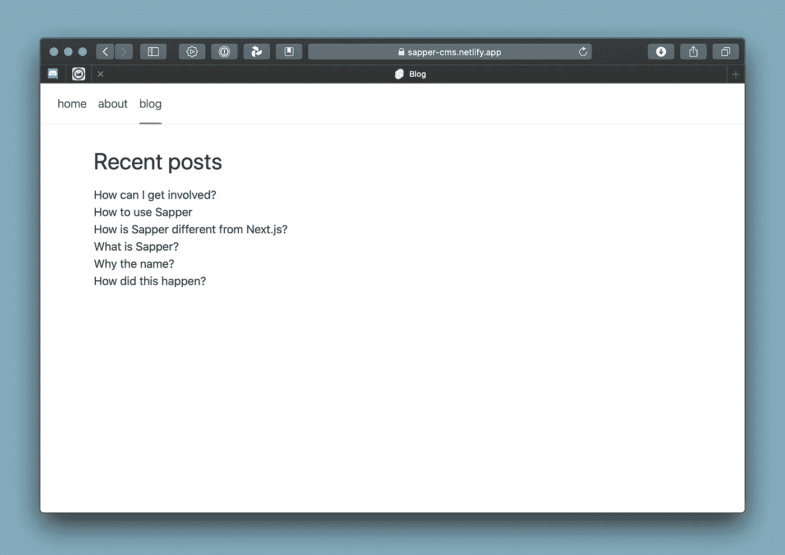

# Jamstacking 一个免费的 CMS 网站

> 原文：<https://javascript.plainenglish.io/jamstacking-a-free-cms-site-with-svelte-sapper-netlify-and-faunadb-part-2-628b4aea78d1?source=collection_archive---------5----------------------->

## 与苗条/萨珀、Netlify 和 FaunaDB——第 2 部分


在本教程的第二部分，也是最后一部分，我们将把 FaunaDB 添加到我们的堆栈中，并将其集成到 Svelte/Sapper 站点中。

如果你还记得第一部的话，计划是这样的:

1.  克隆模板存储库
2.  构建/运行/回推
3.  部署到网络
4.  添加 FaunaDB 和帖子
5.  把它粘在一起

我们已经解决了 1、2 和 3。我们走吧！

# 4.加入 FaunaDB

[Faunadb](https://fauna.com) 是一个无服务器数据库。它始于一个免费的账户，和非常慷慨的限制。它快速、全球化且易于实施。

免费注册，然后学习简短的入职培训，这是强烈推荐的。

准备好后，让我们创建一个新的数据库。对于本教程，我们将再次使用相同的名称(sapper-cms)。不要勾选演示数据框，我们不需要它。


Create new database in FaunaDB

接下来，我们需要一张桌子来存放我们的博客文章。表格在这里被称为集合，因此单击新集合并将其命名为**帖子**。不要改变历史天数和 TTL 选项，我们不需要它。


Adding a new collection (table) to our database

现在我们有了一个没有任何文档和索引的新集合。

要添加一个新文档，我们可以使用 FaunaDB 的 web 界面，但最终这并不是我们想要的。在某个时间点，我们希望这在幕后发生。

另一方面，添加索引通常只在建立数据库时才会发生，所以我们已经可以从这里开始做了。


在新索引对话框中，给文章起一个名字，如*文章标题*，并在第一个编辑框中填入标题为*的文章。当你保存它时，它会变成 data.title。*


现在是最困难的部分。以编程方式将 blogposts 中的数据添加到我们的新集合中。打开文件/src/routes/blog/_posts.js，您会看到来自我们站点的博客文章以某种 js 格式存储在那里。


不幸的是，我们需要对其稍加修改，直到我们可以将其用于 FaunaDB:在 FaunaDB 控制台的左侧，您可以点击 *Shell* 。这将在底部打开一个黑色的终端，在它的顶部打开一个蓝色的结果窗口。点击[运行查询]执行终端中的任何内容。


我花了一点时间在 FaunaDB 在线帮助中查找函数的正确用法，但这是如何在一个操作中添加带有多个字段的*多个文档的符号:*

```
***Map***(
    [
        [ **"title 1"**, **"slug-1"**, **"content 1\n"** ],
        [ **"title 2"**, **"slug-2"**, **"content 2\n"** ],
        [ **"title 3"**, **"slug-3"**, **"content 3\n"** ],
    ],
    Lambda(
        [**"post_title"**, **"post_slug"**, **"post_html"**],
        Create( Collection(**"posts"**),
            {
                **data**: {
                        **title**: Var(**"post_title"**),
                        **slug**: Var(**"post_slug"**),
                        **html**: Var(**"post_html"**)
                    }
            }
        )
    )
)
```


Added multiple documents via FaunaDB shell

我必须清理 js(从 blog post 内容中删除一些 html 代码，并将换行符改为\n)才能让它工作，所以您可能想先在 html 字段中放一些纯文本以避免任何问题。

注意:FaunaDB 并没有真正向您展示一切都很好。您必须滚动到输出窗口的末尾，才能看到经过的时间。如果出现任何问题，您将会看到一条错误消息。


The posts collection with our new data

# 5.把它们粘在一起

让我们从将 FaunaDB 包添加到我们的 web 项目开始。更新 package.json 文件以包含 FaunaDB，并通过运行 **npm install** 完成。


在 */src/routes/blog* 目录中，您会发现一个名为 _posts.js 的文件，其中保存了博文的静态版本。复制一份，将其命名为 **_faunaposts.js** ，然后修改文件 *index.json.js* ，这样它就可以从我们的 new _faunaposts.js 文件中导入文章。如果你用 npm run dev 测试，站点应该还能像以前一样工作。

要进入 FaunaDB，我们需要一把秘密钥匙。这些密钥与一个安全角色相关联。默认情况下，您只会看到可用的管理员和服务器角色。然而，我们将设置一个名为 *webreader* 的受限角色，它只能读取我们的索引和集合。转到“安全性”/“管理角色”/“添加角色”,授予它对文章集合和按标题排列的文章索引的读取权限。


Add new restricted security role in FaunaDB

定义了受限安全角色后，我们就可以创建我们的密钥了。选择数据库和 webreader 角色，并为密钥添加新名称。


> 请将此密钥保存在安全的地方，因为您将无法在 FaunaDB 界面中再次看到它。

让我们回到我们的代码:

**_faunaposts.js**

```
const faunadb = require('faunadb')
const q = faunadb.query
const client = new faunadb.Client({secret: 'your-secret-code-here'})

const *getFaunaposts* = async () => {
    try{
        const {data} = await client.query(
            q.*Map*(
                q.*Paginate*(q.*Documents*(q.*Collection*('posts'))),
                q.*Lambda*(x => q.*Select*(['data'], q.*Get*(x)))
            )
        )
        return data
    } catch(e){
        console.log(e)
    }
}

*// faunaposts* export default *getFaunaposts*;
```

首先，我们创建一个到 FaunaDB 数据库的连接，并设置一个带有秘密的查询和客户机。

与只返回静态数组的 original _posts.js 相反，我们需要从数据库异步获取。这就是带有 try/catch 的 async()函数声明的用武之地。

我们执行的查询是特定于 FaunaDB 的，但是很容易阅读:我们对来自 posts 集合的所有文档进行分页，并将它们映射到 Lambda 函数以获取它们的内容。默认情况下，FaunaDB 只返回一个文档的引用，这就是我们在这里使用 Get()的原因。

**index.json.js**

```
import *getFaunaposts* from "./_faunaposts.js";

export async function *get*(req, res) {

    const faunaposts = await *getFaunaposts*()

    const contents = JSON.stringify(
        faunaposts.map((post) => {
            console.log(post)
            return {
                title: post.title,
                slug: post.slug,
            };
        })
    );

    res.writeHead(200, {
        "Content-Type": "application/json",
    });

    res.end(contents);
}
```

索引文件只需要一个小的更新:我们不再导入文章，而是使用 *getFaunaposts* 异步获取文档。

**[slug].json.js**

```
import *getFaunaposts* from "./_faunaposts";

export async function *get*(req, res, next) {

    const lookup = new Map();
    let faunaposts = await *getFaunaposts*()
    faunaposts.forEach((post) => {
        lookup.set(post.slug, JSON.stringify(post));
    });

    *// the `slug` parameter is available because
    // this file is called [slug].json.js* const {slug} = req.params;
    if (lookup.has(slug)) {
        res.writeHead(200, {
            "Content-Type": "application/json",
        });
        res.end(lookup.get(slug));
    } else {
        res.writeHead(404, {
            "Content-Type": "application/json",
        });

        res.end(
            JSON.stringify({
                message: `Not found`,
            })
        );
    }
}
```

对[slug].json.js 文件的类似更改，该文件负责显示博客文章的正文。基于来自 url 地址的 slug，我们可以找到正确的文档并获得数据。



Sapper template running on Netlify with FaunaDB

如果一切顺利，您将看到博客文章重新出现在您的本地站点上。点击标题，检查内容是否也出现。之后，提交你的修改，推送到 GitHub，等待 Netlify 上的自动部署(或者强制部署)。

这只是课程的开始。现在该是你走得更远的时候了…你已经有了一个很好的入门工具包，包括 Tailwind CSS。

请随时给我留下问题或评论。你可以在这里找到我的仓库: [sapper-cms](https://github.com/ovanbiervliet/sapper-cms)

有趣的链接:

[](https://svelte.dev) [## 苗条的

### Svelte 是构建用户界面的一种全新方法。而传统的框架，如 React 和 Vue，则完成了…

svelte.dev](https://svelte.dev)  [## 网络开发的下一件小事

### 主页 web 开发的下一个小东西是一个用于构建各种规模的 web 应用程序的框架，带有一个…

sapper.svelte.dev](https://sapper.svelte.dev) [](https://www.netlify.com) [## Netlify:用于自动化现代网络项目的一体化平台

### 使用 Netlify 部署现代静态网站。获得 CDN、连续部署、一键式 HTTPS，以及您需要的所有服务……

www.netlify.com](https://www.netlify.com) [](https://tailwindcss.com) [## tail wind CSS——一个实用的第一个 CSS 框架，用于快速构建定制设计

### 它们附带了各种预先设计的组件，如按钮、卡和提醒，可以帮助您快速移动…

tailwindcss.com](https://tailwindcss.com) [](https://fauna.com) [## 为无服务器构建的数据库

### FaunaDB 是一个无服务器数据库，它通过像 GraphQL 这样的现代 API 提供了对数据的快速全局访问，而无需……

fauna.com](https://fauna.com) [](https://jamstack.wtf) [## JAMstack WTF

### 以下技巧将帮助您充分利用堆栈中的精华。内容交付网络由于所有的标记和…

jamstack.wtf](https://jamstack.wtf) 

# **简单明了的注释**

你知道我们有四个出版物和一个 YouTube 频道吗？你可以在我们的主页 [**找到这些。**](https://plainenglish.io/)——通过关注我们的出版物并订阅我们的 YouTube 频道 **来表达爱意！**