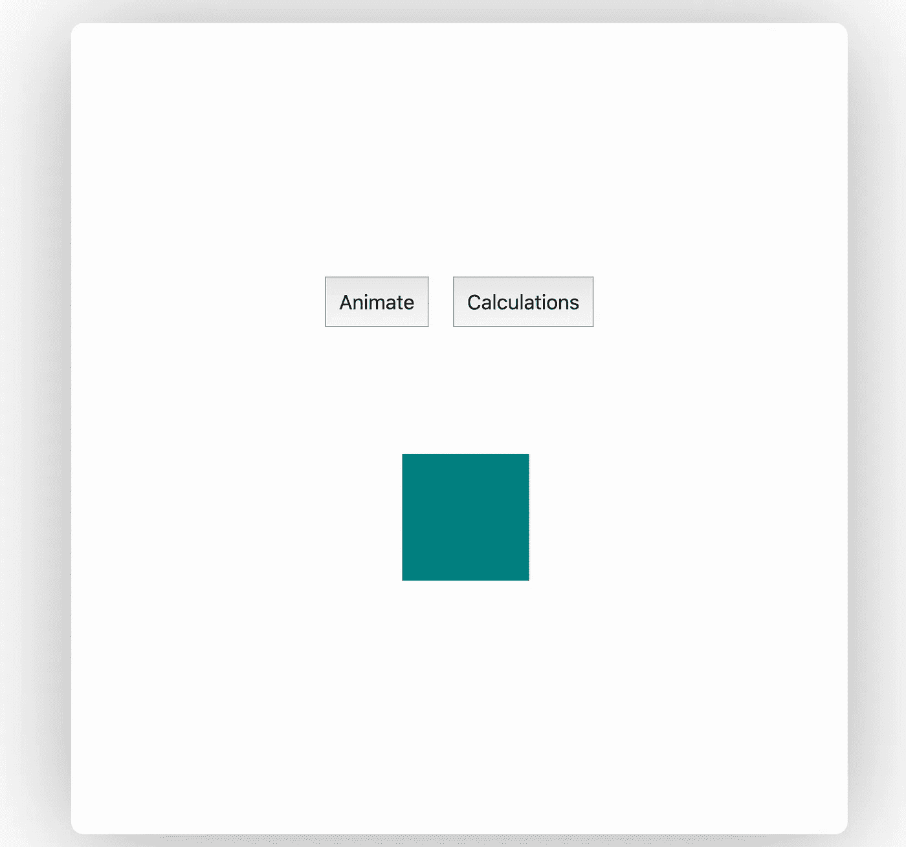
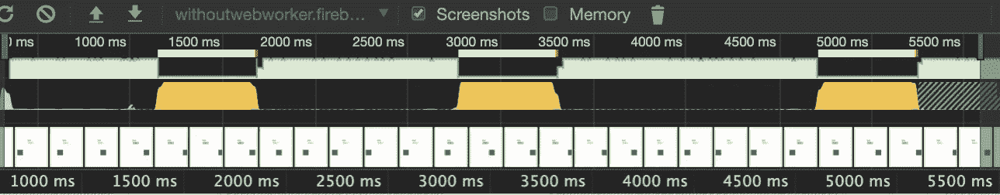
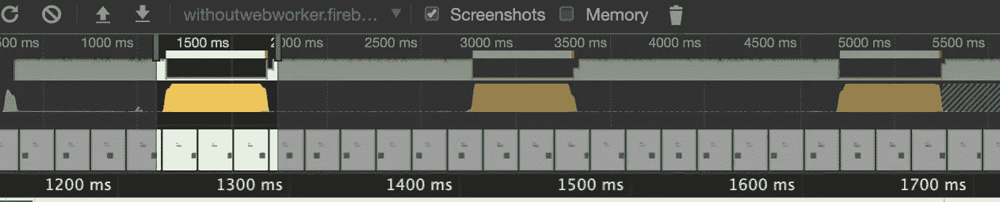
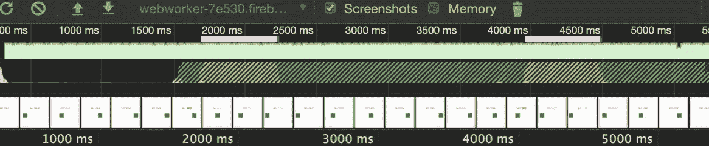
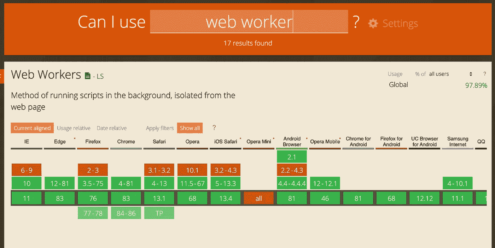

# Janky 动画公司？网络工作者来拯救

> 原文：<https://javascript.plainenglish.io/janky-animations-web-workers-to-the-rescue-b650d8f18db3?source=collection_archive---------11----------------------->

## 在单独的线程上运行繁重的计算

Photo by [Steve Johnson](https://unsplash.com/@steve_j?utm_source=medium&utm_medium=referral) on [Unsplash](https://unsplash.com?utm_source=medium&utm_medium=referral)

作为单线程语言，JavaScript 必须运行浏览器中的所有代码，并执行回流、绘制和垃圾收集。如果脚本包含 CPU 密集型任务，这可能会导致 UI 无响应。

在本文中，我们将使用一个例子，其中有一些繁重的计算，导致了一点点糟糕的性能，稍后提供一个 web worker 的解决方案。

# **问题**

让我们先来看看主线程的代码，这样你就能了解我们在做什么了:

上面的代码是怎么回事:

1.  点击“动画”按钮来制作盒子的动画
2.  通过点击“计算”按钮执行一些计算。

你可以参观[演示](https://withoutwebworker.firebaseapp.com/)来看看它是如何表现的。附上下面的用户界面图像:

您可以通过单击“动画”然后单击“计算”来测试性能问题，直到执行计算。起初它看起来并不重要，但实际上它干扰了动画，我将通过一些剖析展示给你看。

现在让我们用开发者工具来分析我们网站的性能(我用的是 Chrome)。让我们打开开发人员工具，前往性能选项卡。

我们将执行以下步骤来记录表演-

1.  点击**动画**。
2.  单击记录按钮开始分析。
3.  点击**计算**两到三次。
4.  单击“停止”按钮停止分析。

您将会注意到我们的用户界面的瀑布视图，如下所示:

Waterfall view

绿色条显示了在整个概要文件中运行的 CSS 动画。用黄色条显示的倾角是我们进行计算的地方。

我突出显示了显示帧速率下降的部分。我们可以看到，对于大部分录音来说，帧速率相当健康，但每当我们按下按钮时，它就会完全崩溃。

接下来让我们尝试用 web worker 来改善这个问题。

# **网络工作者**

Photo by [Christopher Burns](https://unsplash.com/@christopher__burns?utm_source=medium&utm_medium=referral) on [Unsplash](https://unsplash.com?utm_source=medium&utm_medium=referral)

Web worker 尝试在不干扰主线程的单独线程中运行脚本。主线程和工作线程不能直接相互调用，而是使用异步消息传递 API 进行通信。

下面是我们的主线程代码:

与原始版本相比，这里的主要区别在于我们需要:

*   创建一个工人
*   当我们准备好计算时，给它发一个消息
*   请听一个名为“done”的消息，该消息表示工作人员已经完成。

我们的工作线程的代码将如下所示:

在 worker 中，我们必须监听告诉我们开始的消息，并在我们完成时发送一个“done”消息。长时间运行的计算实际上是和我们之前一样的循环。

让我们对这个版本进行一些分析。您可以访问[此处](https://webworker-7e530.firebaseapp.com/)查看包含服务人员代码的新网站，并获取新的个人资料。

这是它的样子:

在这个配置文件中，我们按了两次按钮。每次按下按钮都会在概览中显示为两个黄色标记。

您可以注意到，在这种情况下没有任何帧速率下降，因为计算是在一个单独的线程上处理的。一旦完成，我们就与主线程通信。这大大减少了主线程的负载，提高了性能。

考虑使用 web workers 来处理这种密集型任务，因为主 JS 线程被阻塞会导致性能下降。

## 浏览器中的 Web Worker 支持:

# 资源

 [## 使用网络工作者

### Web Workers 是 Web 内容在后台线程中运行脚本的一种简单方式。工作线程可以执行…

developer.mozilla.org](https://developer.mozilla.org/en-US/docs/Web/API/Web_Workers_API/Using_web_workers)  [## 我能用吗...HTML5、CSS3 等的支持表

### “我可以使用吗”提供了最新的浏览器支持表，以支持桌面和移动设备上的前端 web 技术…

caniuse.com](https://caniuse.com/#search=web%20worker) 

## **一张用浅白英语写的便条**

你知道我们有四份出版物和一个 YouTube 频道吗？你可以在我们的主页 [**plainenglish.io**](https://plainenglish.io/) 上找到所有这些——关注我们的出版物并 [**订阅我们的 YouTube 频道**](https://www.youtube.com/channel/UCtipWUghju290NWcn8jhyAw) **来表达你的爱吧！**