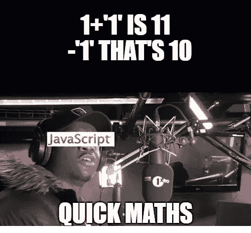

# JavaScript:需要注意的 6 种实践

> 原文：<https://javascript.plainenglish.io/javascript-4-weird-things-to-be-aware-of-18b8528b8ef7?source=collection_archive---------2----------------------->

## JS 可能很棘手——为了不弄乱您的代码，需要注意以下几点

是的，我们都知道 JavaScript 很奇怪。但是我们大多数人，包括我，都喜欢它。即使它的概念很奇怪。为了让我们都能继续热爱 JavaScript &将来不再为愚蠢的事情烦恼，我写了这篇文章来澄清其中的一些问题。



Oh no… it’s retarded!

# 1).你知道在 JavaScript 中可以用字符串计算吗？

起初，这对你来说并不奇怪，不是吗？

```
 11 + 1      // 12
'11' + 1;    *// 111* 11 – 1;     *// 10*
```

但是魔法来了:

```
 '11' — 1    // 10
```

是的，JavaScript 自动将字符串转换成数字，所以您可以将这里的 1 转换成字符串。这将导致同样的结果。
证明就是，如果你有两个包含字母的字符串，想把它们相减，JavaScript 只会输出 NaN，即“不是数字”。

**精髓:始终确保你使用正确的数据类型**

# 2).阻止事件循环

让我们从一个简单的问题开始。哪个名称将通过 console.log 打印出来？

```
let name = ‘Max’
setTimeout(function() {
  name = ‘Tom’}, 1000)console.log(name)
```

正确。**最大值**将被打印。setTimeout 不会阻止整个 JavaScript 的执行，因为 JavaScript 识别函数 console.log，即使它在代码中的 setTimeout 之后。
该函数将首先被执行，然后 JS 将运行那个 setTimeout。

下面是一个更复杂的例子:

```
let start = Date.now()let doWork = () => {console.log(‘doWork started’)for (let i = 0; i < 999999999; i++) {}
  console.log(‘doWork done after’, Date.now() — start)
}let clickme = () => {
  alert(‘clicked after’, Date.now() — start)
}doWork()setTimeout(function() {
  console.log(‘setTimeout done after’, Date.now() — start)
}, 1000)doWork()
```

请确保在您的浏览器中运行此程序。以下是结果，时代可能不同

> 道工作开始
> 道工作在 854 之后完成
> 道工作开始
> 道工作在 1429 之后完成
> 设置超时在 1858 之后完成

我们可以看到的是，再次设置超时将被延迟。但是您是否也注意到了代码中的“clickme”函数？创建一个简单的 HTML 按钮，当你点击它时执行，你会看到简单的**警告**也会被延迟，只要 doWork 函数被执行。再次，setTimeout 将被延迟。但是这一次不仅从 doWork 函数，而且从 clickme 函数。我们从中学到了什么？永远记住 JS 中的事件循环是如何工作的。这可以防止 HTTP 请求的许多问题，例如&确保永远不要阻塞事件循环，当用户应该能够执行一个功能时，就像在我们的例子中，通过一个按钮。想象一下，点击按钮应该会打开一个下拉菜单。这种延迟会杀死你的 UX。

# 3).奇怪的范围规则

在 JavaScript 中，我们必须限定范围。全局和局部范围。只有两个，但它们会导致很多混乱。

当我们在函数内部定义一个变量时，它只在局部范围内可用。这是我们大多数人的想法。但是在 JavaScript 中并不总是这样。

```
function hello() {
  message = ‘Hello!’
}console.log(message) // message is not definedhello()
```

但是一旦函数被执行，这个变量是全局可用的。即使函数在定义之前就在代码中被调用，这也是可行的。
(称为提升，但对箭头功能不起作用，详见:[箭头与常规功能](https://medium.com/javascript-in-plain-english/arrow-functions-vs-regular-functions-in-javascript-f98687f23a6d))

```
hello()console.log(message) *// Hello*function hello() {
  message = ‘Hello!’
}
```

# 4).0.1 + 0.2 等于 0.3？是的，但实际上不是。

而且说实话，这不仅仅是 JavaScript 的问题。例如，如果您在 Python 中执行相同的操作，将会得到相同的结果。

```
0.1 + 0.2   // 0.30000000000000004
```

*但用 JS 计算不完全准确的不仅仅是这里:*

```
2.3 * 100   // 229.99999999999997
```

# 5).在 JavaScript 中清理数组？有几种方法，但只有两种合适的方法

在这一节中，我参考了一个有趣的性能研究，从 5 种不同的方法来清空 JS 中的数组。
[http://jsben.ch/hyj65](http://jsben.ch/hyj65)

从这个实验可以看出，这是最快的方法:

```
var arr1 = [“a”, “b”, “c”, “d”, “e”, “f”];
var arr2 = arr1;   arr1 = [];
```

所以理论上你只需要重新初始化数组就可以清空了？**是**。
但这永远是最好的方式吗？**否**。
因为这里发生的事情:

```
var arr1 = [“a”, “b”, “c”, “d”, “e”, “f”];
var arr2 = arr1; *// Reference arr1 by another variable* arr1 = [];
console.log(arr2); // [“a”, “b”, “c”, “d”, “e”, “f”]
```

正如我们看到的，实际的数组是空的，但是 *arr2* 仍然包含它的完整内容。
但是根据我们的实验，还有第二种方法，几乎一样快:只需将数组的**长度**设置为 0。

```
var arr1 = [“a”, “b”, “c”, “d”, “e”, “f”];
var arr2 = arr1;arr1.length = 0;
console.log(arr2); // [ ]
```

# 6).传递参数时危险的不准确性

让我们创建一个简单的函数来添加两个值:

```
function add(a, b) {
  return a + b;
}add(2, 2); *// 4**// one param missing — won’t work* add(2); *// NaN**// one param too much — doesn’t care* add(2, 2, 10); *// 4*
```

从逻辑上讲，如果我们正好传递两个参数，一切都会正常。但是，如果我们超过一个，或者少过一个，会发生什么呢？不同的东西。

如果我们移交的**太少**，就会导致错误。如果我们把太多的交给**，所有那些太多的都被忽略了。然而，JavaScript 在这两种情况下都没有给出确切的警告。**

## 变通办法

首先，您可以为您的参数使用默认值，如果没有为参数传递任何其他内容，就会应用默认值。

```
function add(a, b = 2) {
   return a + b;
}add(2);     // 4
add(2, 3);  // 5
```

另一种选择是将参数放入一个数组，其中包含传递给函数的所有内容。是的，正如你所看到的，你不需要在函数本身中定义，它所期望的参数。

```
function paramArray() {
   return Array.from(arguments);
}paramArray(2, 2, 2);   *// [2, 2, 2]*
```

## 目前为止就这些了

这篇文章一直在扩展，所以我们最终有了 JavaScript 中错误的最终列表。因此，请随时留下您的反馈&在评论中添加任何内容:)

# 感谢您的阅读！

嗨！非常感谢你阅读我的博客，我叫路易斯，是一名来自德国的 18 岁学生。我热爱 web 开发，包括后端和前端。我最喜欢的技术是 React、Vue、React Native 和 node . js。
请关注我，了解更多相关内容，并随时查看我的 IG @ Louis . jsx&@ codingcultureshop
祝您愉快&随时给我留下您的反馈:)