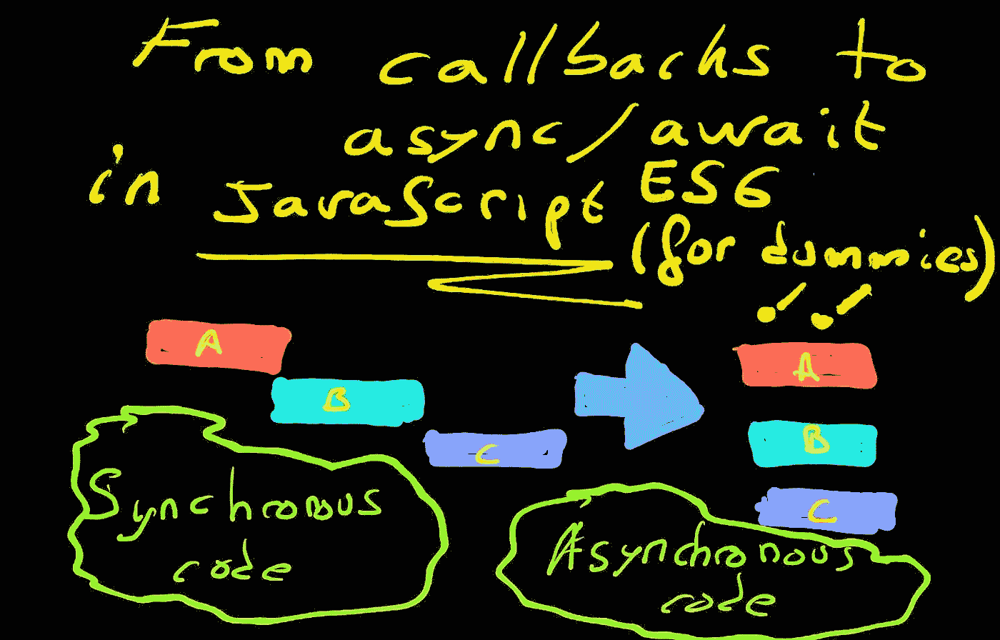
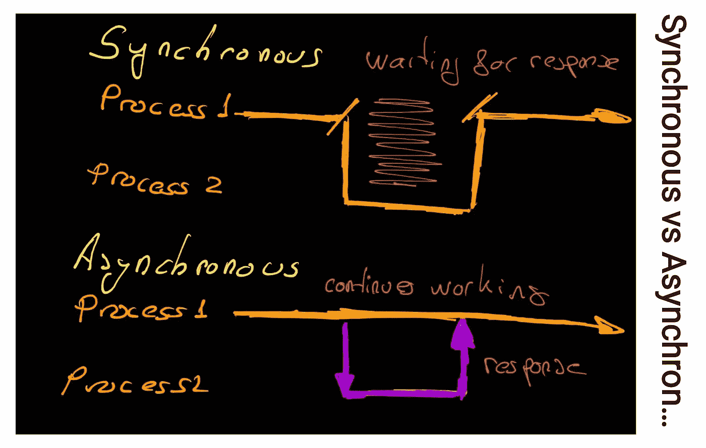
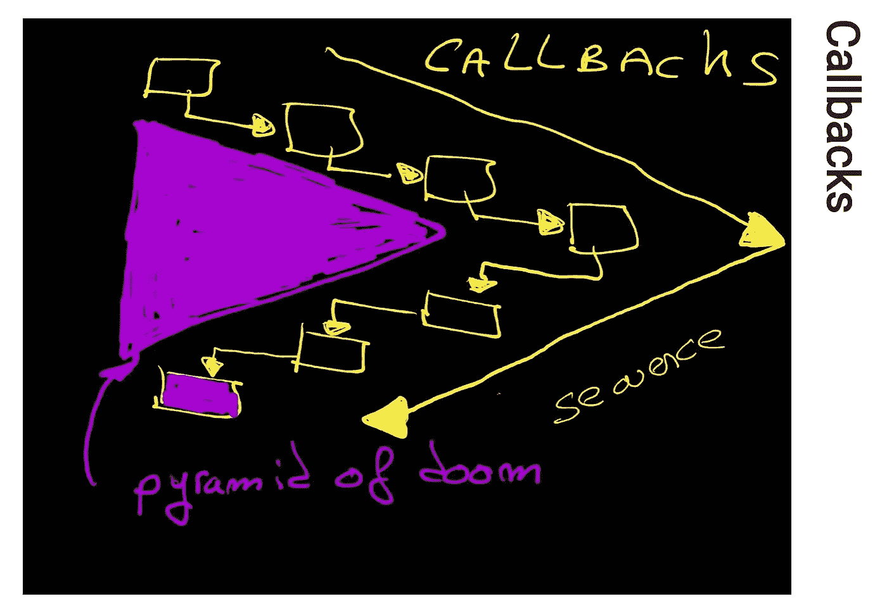
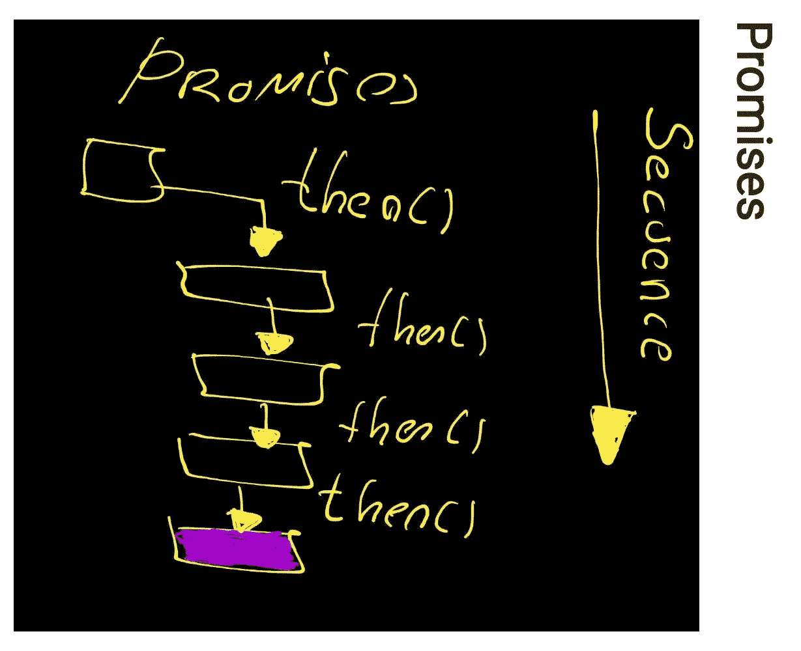
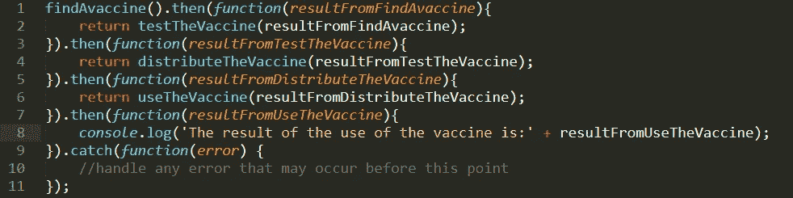
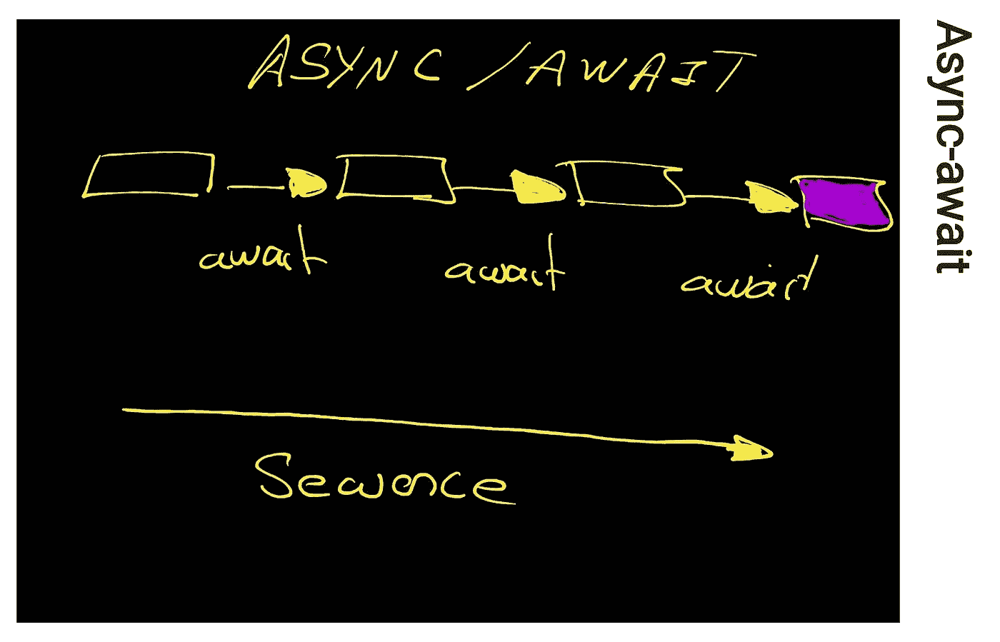
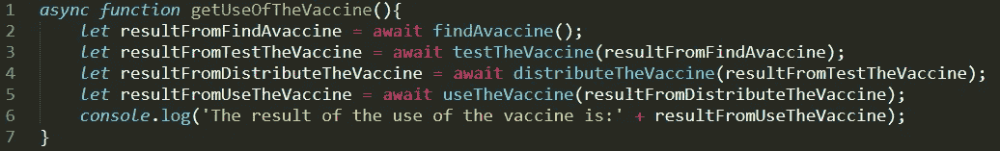

# JavaScript 中从回调到异步等待的旅程

> 原文：<https://javascript.plainenglish.io/javascript-a-fast-trip-for-dummies-from-callbacks-to-es6-async-await-a61b0a4b0bed?source=collection_archive---------7----------------------->

## 简明、有用的 JavaScript 课程——让它变得简单。



From callbacks to async/await in JavaScript ES6

# 历史

软件程序被定义为一组指令，它们按顺序一次运行一个。在代码执行期间，一个函数中的指令可能会调用另一个服务。当另一个服务完成时，它返回到我们的原始函数，并带有一些返回值，它可以继续执行另一个任务。在此期间，原始函数正在等待另一个服务完成，我们将此称为**同步**执行。

当你异步执行某个**的时候，你可以在它完成之前转移到另一个任务，而原来的函数**不会等待**另一个函数结束。**

**计算机在设计上是异步的。例如，当机器在磁盘上写入时，您可以继续浏览互联网。在目前的计算机中，每个程序运行一个特定的时间段，然后它停止执行，让另一个程序继续执行。**

**通常，编程语言是同步的，但是它们提供了管理异步的方法。**

**JavaScript 默认为**同步**，而**为单线程**。代码不能创建新的线程并并行运行。**

**起初，JavaScript 被创建为仅在浏览器中执行，其主要工作是运行用户动作，例如点击按钮或移动鼠标。这些动作是阻塞的，如果没有继续执行其他指令的机制，浏览器将被冻结。**

**同步与异步:**

****

**Synchronous v.s Asynchronous sketch**

# **复试**

****

**Callbacks pyramid of doom sketch**

**回调是在另一个任务执行完毕后运行**的函数。例如，这是一个两秒钟后运行的简单回调:****

```
...
...setTimeout( () => {
  console.log('Me second!');
}, 2000);console.log("Me first");//Me first//Me second!...
...
```

**当调用 setTimeout()时，这是对 API 的调用，这个函数从执行堆栈中移出，当超时完成时，回调被推入队列。一旦执行堆栈为空，事件循环将从队列中取出回调，并将其添加到执行堆栈中。**

**回调的问题是著名的回调地狱。如果代码有很多回调，很难直观地得到正确的结果。当多个函数需要来自其他函数的数据来完成它们的工作时，就会发生这种情况。对于回调，代码最终看起来如下例所示:**

****

**Callback hell image**

**现在，想象这种情况进一步发生，有 5 个或 10 个嵌套函数调用，试图理解代码在每一步做什么是疯狂的。**

**这些承诺是为了解决这些问题而产生的。**

# **承诺**

****

**Promises sketch**

**承诺在 ES6(2015)中引入。承诺是一个对象，它表示解决或拒绝的未来操作的结果。这是格式化异步函数的另一种方法。**

**主要区别是什么？**

**对我来说，最大的改进是格式。如果您正确地编写了代码，生成的代码将易于阅读。**

**承诺立即返回一个承诺对象。它们不需要函数参数，也不需要嵌套。您使用名为<then>的 Promise 方法给出异步函数完成时要采取的动作。</then>**

**当我们需要执行异步操作时，使用它们的<then>方法来链接承诺。每个链接的<then>函数返回一个新的承诺，表示链中另一个异步步骤的完成。类似于读:<do this="">然后做这个->然后做这个…></do></then></then>**

**上面使用承诺的同一个例子是:**

****

**Promises example image**

# **异步等待**

****

**Async/Await sketch**

**Async/Await 是 ES2017(ES8)的新增功能，它帮助我们甚至更多，允许我们在执行异步任务时编写完全同步的**外观的**代码。这仅仅是一种承诺。**

**与 promises 相比，它的主要优势在于，使用异步函数的代码的语法和结构更像使用标准同步函数，也更类似于我们顺序思考的方式。**

**一个异步函数可以包含<awaits>表达式，它暂停异步函数的执行并等待传递的承诺的解析。当承诺被解析后，将恢复异步函数的执行，并返回解析后的值。</awaits>**

**上面使用承诺的同一个例子是:**

**注意:要使用<await>，需要将包含它的函数定义为 async。</await>**

****

**Async/await example image**

# **结论**

**承诺和异步/等待完成同样的事情。它们使得处理异步代码更加自然。它们消除了回调的需要和著名的回调地狱。**

**有了新的 ES6 Async/Await 附加功能，管理异步代码更像使用标准同步函数，也更类似于我们顺序思考的方式。Async/await 是 promises 的语法糖，因为它仍然在幕后使用 Promises，但是结果代码更加明确。**

**感谢阅读。我希望这能帮助你们了解 JavaScript 中处理异步代码的不同方式。**

# **参考**

*   **[开发者 Mozilla 网站](https://developer.mozilla.org/en-US/)**
*   **[https://en.wikipedia.org/wiki/Async/await](https://en.wikipedia.org/wiki/Async/await)**