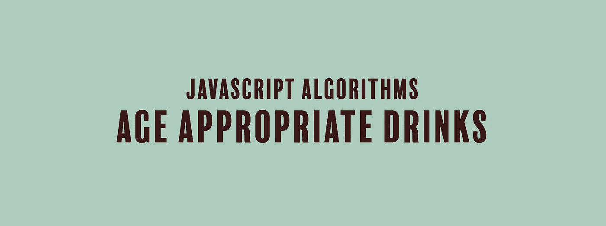

# JavaScript 算法:适合年龄的饮料

> 原文：<https://javascript.plainenglish.io/javascript-algorithm-age-appropriate-drinks-1912d2a09d9f?source=collection_archive---------9----------------------->

## 我们编写了一个函数，根据一个人的年龄返回他应该喝什么样的饮料。



我们将编写一个名为`ageAppropriateDrinks`的函数，它将接受一个整数`age`作为输入。

你有一些不同年龄的人和饮料，从苏打水到刺喉伏特加。该函数的目标是根据人们的年龄组返回他们可以喝的饮料。以下是根据这两个信息列出的年龄组、合适的饮料以及返回的内容:

*   14 岁以下儿童— `return "drink fruit juice"`
*   18 岁以下的青少年— `return "drink soda"`
*   21 岁以下的部分年轻人(但不是真正的年轻人)——`return "drink fruit-flavored beer"`
*   21 岁或以上的成年人— `return "drink throat-piercing vodka"`

因此，如果输入是 13，函数将返回`"drink fruit juice"`。如果给这个函数 62 作为输入，这个函数将返回`"drink throat-piercing vodka"`(这是一个强壮的长者)。

无论如何，这个函数将帮助你理解控制流和条件语句。我们开始吧。

我们从最年轻的年龄组开始，然后向下(或者向上，如果你在考虑年龄的话)。我们从给 14 岁以下的孩子写条件式开始。

```
if( age < 14 ){
    return "drink fruit juice";
}
```

然后，我们为 18 岁以下但 13 岁以上的青少年写一个 else-if 语句。

```
if( age < 14 ){
    return "drink fruit juice";
}else if( age < 18 ){
    return "drink soda";
}
```

另一个是-如果是 21 岁以下但 17 岁以上的未成年人。

```
if( age < 14 ){
    return "drink fruit juice";
}else if( age < 18 ){
    return "drink soda";
}else if ( age < 21 ){
    return "drink fruit-flavored beer";
}
```

然后，我们为其他所有人或 20 岁以上的成年人编写 else 语句。

```
if( age < 14 ){
    return "drink fruit juice";
}else if( age < 18 ){
    return "drink soda";
}else if ( age < 21 ){
    return "drink fruit-flavored beer";
}else{
    return "drink throat-piercing vodka";
}
```

这是我们函数的其余部分，

```
function ageAppropriateDrinks(age) {
    if (age < 14) {
        return "drink fruit juice";
    } else if (age < 18) {
        return "drink soda";
    } else if (age < 21) {
        return "drink fruit-flavored beer";
    } else {
        return "drink throat-piercing vodka";
    }
}
```

干杯！

如果你觉得这个算法有帮助，可以看看我最近的其他 JavaScript 算法解决方案:

[](https://medium.com/javascript-in-plain-english/javascript-algorithm-power-2cbedf59f40c) [## JavaScript 算法:Power

### 我们将编写一个函数，不使用任何内置的数学函数来返回一个数的幂。

medium.com](https://medium.com/javascript-in-plain-english/javascript-algorithm-power-2cbedf59f40c) [](https://medium.com/javascript-in-plain-english/javascript-algorithm-es6-string-addition-d9022d8f189c) [## JavaScript 算法:ES6 字符串添加

### 我们将在不使用任何 JavaScript 内置方法和+号的情况下连接两个字符串。

medium.com](https://medium.com/javascript-in-plain-english/javascript-algorithm-es6-string-addition-d9022d8f189c) [](https://levelup.gitconnected.com/javascript-algorithm-lonely-integer-4397cd8b6ffc) [## JavaScript 算法:孤独的整数

### 我们要写一个函数，输出数组中唯一没有重复的数字。

levelup.gitconnected.com](https://levelup.gitconnected.com/javascript-algorithm-lonely-integer-4397cd8b6ffc)