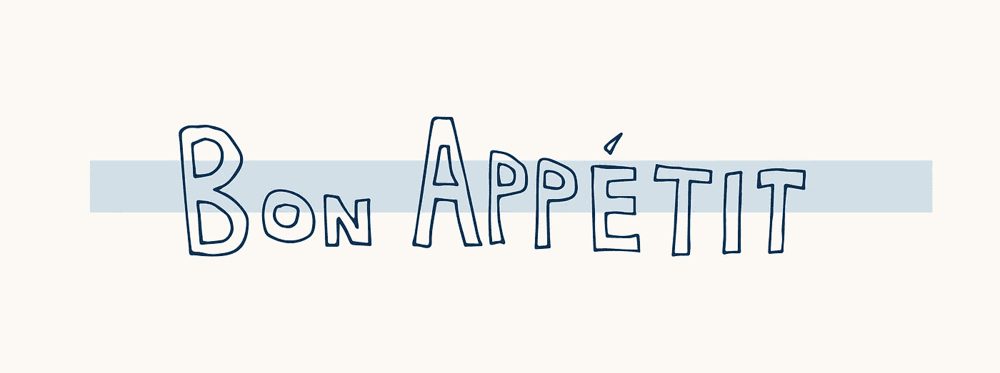

# JavaScript 算法:Bon Appé tit

> 原文：<https://javascript.plainenglish.io/javascript-algorithm-bon-app%C3%A9tit-209f59a85715?source=collection_archive---------5----------------------->



对于今天的算法，我们将编写一个名为`**bonAppetit**` 的函数，这个函数将接受三个输入。一个名为`bill`的数组和两个整数`k`和`b`。


我们有两个人，Anna 和 Brian，他们正在一家餐馆吃饭。他们同意平摊费用。尽管安娜和布莱恩共享一餐，但安娜对一些食物过敏，而且他们都同意她不会为她不能吃的食物付钱。

如果安娜分摊的账单多于她应该支付的金额，该函数将输出 Brian 将退还给安娜的金额。如果她的账单份额与她应该支付的相同，那么该函数将输出`Bon Appetit!`


让我们创建一个示例:

```
let bill = [2, 4, 6];
let k = bill[1];
let b = 6;
```

在上面的变量中:`bill`是包含 Anna 和 Brian 订购的所有商品的价格的数组。

`k`是安娜不付费的`bill`数组中的索引号。`k` = 1 所以在`bill`数组中，安娜不支付数组中的第二项。

`b`是安娜为她那份账单支付的金额。

当我们将数组中除第二项外的所有数字相加时，`2+6`总数为 8。安娜和布莱恩平摊账单，所以他们每人付了 4 美元。

因为`b`是 6，这意味着安娜为拆分支付了 6 美元，而她应该支付 4 美元，所以布莱恩退还了`(6-4)`2 美元给她。

现在，如果变量`b`是`4`(安娜应该支付的金额)，函数将输出`Bon Appetit`。

让我们创建我们的函数:

```
let total = 0;
```

首先，我们创建一个名为`**total**`的变量。这将是我们用来计算`bill`数组中所有值的变量，除了安娜不愿意支付的项目。

接下来我们将使用 for 循环遍历数组中的所有值，并将它们添加到`total`变量中。

```
for (let i = 0; i < bill.length; i++) {
    if (i !== k) {
        total += bill[i];
    }
}
```

在循环内的第一条语句中，我们检查数组索引是否不等于安娜没有付款的商品的索引。满足该条件的所有数字都被添加到`total`变量中。

我们使用 JavaScript 的数学赋值操作符将数字添加到`total`变量中。那句话和`total = total + bill[i]`一样。为了在这里了解更多关于 JavaScript 的数学运算符，我在这里写了一篇关于它的文章:

[](https://levelup.gitconnected.com/javascript-basics-mathematical-assignment-operators-e888e78fd391) [## JavaScript 基础:数学赋值运算符

### 在 JavaScript 中做数学运算时，您可能希望继续增加值。我们可以通过以下组合来实现这一点…

levelup.gitconnected.com](https://levelup.gitconnected.com/javascript-basics-mathematical-assignment-operators-e888e78fd391) 

循环结束后，我们创建另一个名为`annaPay`的变量来计算安娜应该支付的金额:

```
let annaPay = total / 2;
```

接下来，我们将编写一个条件来检查 Anna 是否为她应支付的部分支付了过多的费用:

```
if (b > annaPay) {
    console.log(b - refund)
} else {
    console.log("Bon Appetit");
}
```

在第一行，我们检查安娜支付的金额是否大于她应该支付的金额。如果是这样，打印出 Brian 退还给 Anna 的金额。如果不是，输出`Bon Appetit`。

这就是我们的代码，下面是完整的代码:

```
function bonAppetit(bill, k, b) {
    let total = 0;
    for (let i = 0; i < bill.length; i++) {
        if (i !== k) {
            total += bill[i];
        }
    } let annaPay = total / 2; if (b > annaPay) {
        console.log(b - annaPay);
    } else {
        return console.log("Bon Appetit");
    }}
```


如果您感兴趣，这里有一些最近的 JavaScript 算法文章:

[](https://medium.com/javascript-in-plain-english/javascript-algorithm-migratory-birds-848ad6a99ac3) [## JavaScript 算法:候鸟

### 对于今天的算法，我们将编写一个名为 migratoryBirds 的函数，在这个函数中，我们将接受一个…

medium.com](https://medium.com/javascript-in-plain-english/javascript-algorithm-migratory-birds-848ad6a99ac3) [](https://medium.com/javascript-in-plain-english/javascript-algorithm-grading-students-210a89c5496f) [## JavaScript 算法:给学生评分

### 对于今天的算法，我们将编写一个名为 gradingStudents 的函数，在这个函数中，我们将…

medium.com](https://medium.com/javascript-in-plain-english/javascript-algorithm-grading-students-210a89c5496f)