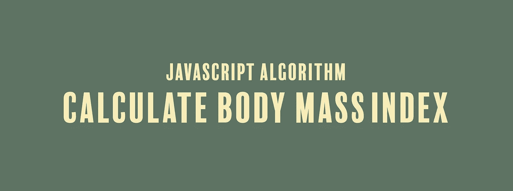

# JavaScript 算法:计算体重指数

> 原文：<https://javascript.plainenglish.io/javascript-algorithm-calculate-body-mass-index-6f14dce4075d?source=collection_archive---------2----------------------->

## 我们编写了一个函数来计算您的身体质量指数，并确定您是否超重、体重不足、肥胖或正常。



今天，我们将编写一个名为`bmi`的函数，它将接受两个整数`weight`和`height`作为输入。

好的，我们有一个人的随机体重和身高。我们该拿这些做什么？你用这两个输入来计算某人的身体质量指数(身体质量指数)。计算身体质量指数的公式是:

身体质量指数=体重/身高

使用该等式，我们将计算身体质量指数，并根据该数字的高低返回一个字符串，使用以下指导原则:

如果身体质量指数≤ 18.5，返回`"Underweight"`

如果身体质量指数≤ 25，返回`"Normal"`

如果身体质量指数≤ 30，返回`"Overweight"`

如果身体质量指数> 30，返回`"Obese"`

请注意，如果您知道自己的身高和体重，本计划的目的并不是计划您的下一次减肥冒险。担心你是否应该以后每天只喝大豆。相反，让我们开始为这个算法编写代码。

首先，我们将采用上面的身体质量指数方程，并将其分配给一个名为`bmi`的变量。

```
let bmi = weight / (height**2);
```

接下来，我们将使用一系列 if-else 语句，将我们计算的`bmi`与基于上述指导方针的数字进行比较:

```
if (bmi < 18.5) {
    return "Underweight";
} else if (bmi < 25) {
    return "Normal";
} else if (bmi < 30) {
    return "Overweight";
} else {
    return "Obese";
}
```

我们的代码到此结束。以下是该功能的其余部分:

```
function bmi(weight, height) {
  let bmi = weight / (height**2);

  if(bmi < 18.5){
    return "Underweight";
  }else if (bmi < 25){
    return "Normal";
  }else if (bmi < 30){
    return "Overweight";
  }else{
    return "Obese";
  }
}
```

如果您认为这个算法有帮助，请查看我最近的其他 JavaScript 算法解决方案:

[](https://medium.com/@endubueze00/javascript-algorithm-convert-a-boolean-to-a-string-d720ac34ecd5) [## JavaScript 算法:将布尔值转换为字符串

### 我们来看看将布尔值转换为字符串的多种方法

medium.com](https://medium.com/@endubueze00/javascript-algorithm-convert-a-boolean-to-a-string-d720ac34ecd5) [](https://medium.com/javascript-in-plain-english/javascript-algorithm-age-appropriate-drinks-1912d2a09d9f) [## JavaScript 算法:适合年龄的饮料

### 我们编写了一个函数，根据年龄返回一个人应该喝什么饮料。

medium.com](https://medium.com/javascript-in-plain-english/javascript-algorithm-age-appropriate-drinks-1912d2a09d9f) [](https://medium.com/javascript-in-plain-english/javascript-algorithm-power-2cbedf59f40c) [## JavaScript 算法:强大

### 我们要写一个函数，它返回一个数字的幂，而不使用任何内置的数学函数。

medium.com](https://medium.com/javascript-in-plain-english/javascript-algorithm-power-2cbedf59f40c)