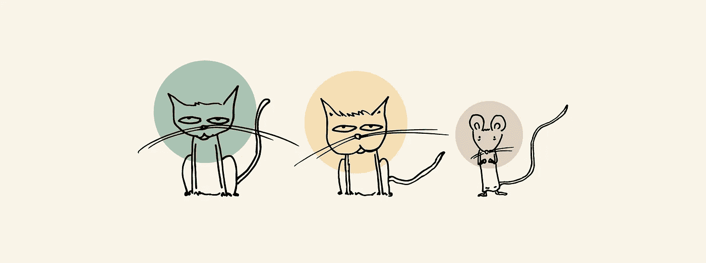
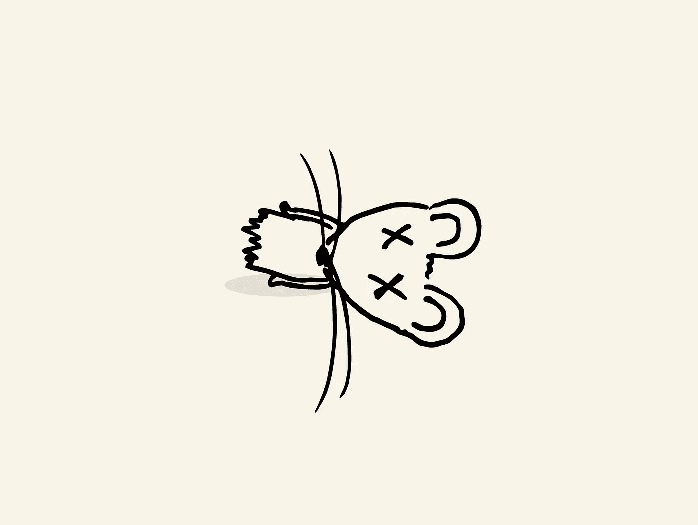
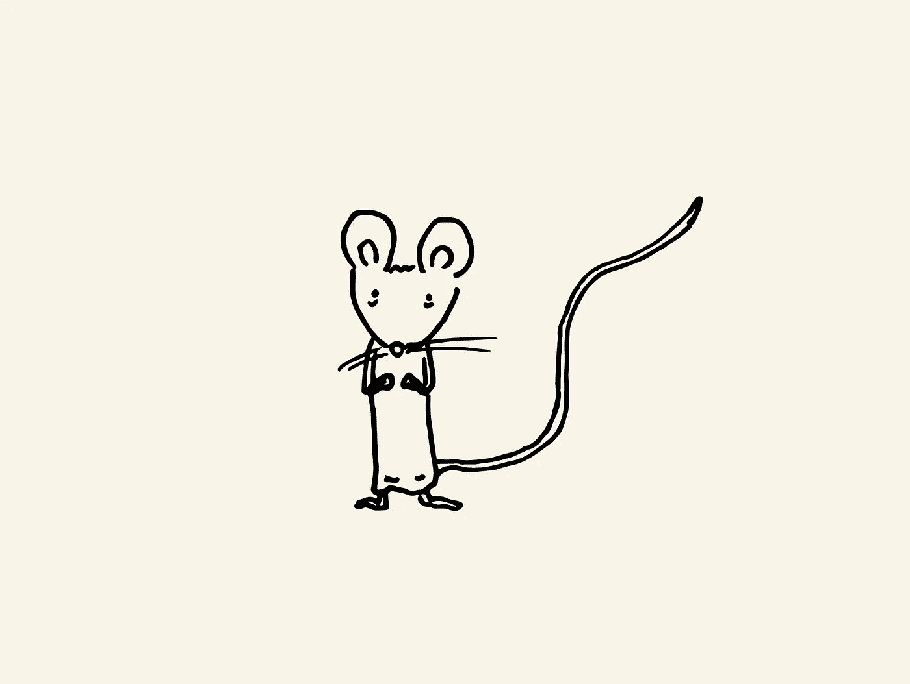

# JavaScript 算法:猫和老鼠

> 原文：<https://javascript.plainenglish.io/javascript-algorithm-cats-and-a-mouse-fd60fb1811ba?source=collection_archive---------5----------------------->



对于今天的算法，我们将创建一个名为`catAndMouse`的函数，它将接收三个整数:`x`、`y`和`z`作为输入。

有两只猫，一只猫 A 和一只猫 B，以及一只老鼠。他们在一条线上的不同位置。其中一只猫想要老鼠，所以它们都试图先找到老鼠。我们假设老鼠不动，猫也以同样的速度运动。给定鼠标和猫的起始位置，该函数的目的是输出哪只猫先到达鼠标。



如果猫 A 先到达鼠标，该功能将输出`Cat A`。如果 B 猫先到达鼠标，则输出`Cat B`。如果两只猫同时抓到老鼠，那么两只猫都不会抓到老鼠。该功能将输出`Mouse C`。两只猫互相争吵时，老鼠逃走了。

让我们举个例子:

```
let x = 2; // starting position of cat A
let y = 6; // starting position of cat B
let z = 3; // position of mouse
```

给定每只动物的位置，我们将关注猫 A 和老鼠之间以及猫 B 和老鼠之间的距离。

如果我们减去老鼠和猫 A 之间的距离`3 — 2 = 1`，我们会看到猫 A 离老鼠有 1 米的距离(测量单位在这里不重要)。

如果我们看一下老鼠和猫 B 之间的距离，`3 — 6 = -3`，如果我们忽略否定句，我们会看到猫 B 离老鼠有 3 倍的距离。

有了这些信息，我们看到猫 A 离老鼠更近了。猫 A 会先碰到老鼠。因此，该功能将输出`cat A`。

让我们用另一个例子:

```
let x = 2; // starting position of cat A
let y = 4; // starting position of cat B
let z = 3; // position of mouse
```

本示例与上一个示例相同，但我更改的唯一值是猫 b 的起始位置。从上一个示例中，我们知道猫 A 与鼠标相距 1 距离。如果计算 B 猫与小鼠的距离，`3 — 4 = -1`。将答案视为绝对值，距离也是 1。由于 A 猫和 B 猫同时到达鼠标，鼠标逃逸，功能输出`Mouse C`。

让我们把它变成代码:

```
let catAPos = Math.abs(z - x);
let catBPos = Math.abs(z - y);
```

`catAPos`变量表示猫 A 和老鼠之间的距离。我们从鼠标的位置`z`减去猫 A 的位置`x`。我们使用输出答案绝对值的 Math.abs()方法。

`catBPos`变量与`catAPos`变量相同，但不同之处在于该变量保存了猫 B、`y`和老鼠`z`之间的距离。

现在我们比较一下价值观:

```
if (catAPos < catBPos) {
    return "Cat A";
} else if (catBPos < catAPos) {
    return "Cat B";
} else {
    return "Mouse C";
}
```

在 if 语句中，我们的第一个条件检查猫 A 和老鼠之间的距离是否小于猫 B 和老鼠之间的距离。如果那是真的，猫 A 先抓住了老鼠。该功能将输出`Cat A`。

如果猫 B 和老鼠之间的距离小于猫 A 和老鼠之间的距离，那就意味着猫 B 先抓住了老鼠。该功能将输出`Cat B`。

如果都不是真的，那就意味着两只猫同时抓到了老鼠。猫碰到了对方，老鼠逃走了。该函数将输出`Mouse C`。

这就结束了我们的算法和功能。以下是剩余的代码:

```
function catAndMouse(x, y, z) {
    let catAPos = Math.abs(z - x);
    let catBPos = Math.abs(z - y); if (catAPos < catBPos) {
        return "Cat A";
    } else if (catBPos < catAPos) {
        return "Cat B";
    } else {
        return "Mouse C";
    }
}
```



这里是我的其他一些 JavaScript 算法问题，你可以检查一下。

[](https://medium.com/javascript-in-plain-english/javascript-algorithm-electronics-shop-240a4fcb0e85) [## JavaScript 算法:电子商店

### 对于今天的算法，我们将编写一个名为 getMoneySpent 的函数，它将接受三个输入:两个数组…

medium.com](https://medium.com/javascript-in-plain-english/javascript-algorithm-electronics-shop-240a4fcb0e85) [](https://medium.com/javascript-in-plain-english/javascript-algorithm-sock-merchant-de9ffa754dfc) [## JavaScript 算法:袜子商人

### 对于今天的算法，我们将编写一个名为 sockMerchantthat 的函数，它将接受两个输入，一个整数 n…

medium.com](https://medium.com/javascript-in-plain-english/javascript-algorithm-sock-merchant-de9ffa754dfc)