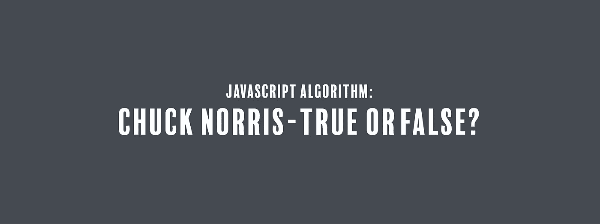

# JavaScript 算法:Chuck Norris——对还是错？

> 原文：<https://javascript.plainenglish.io/javascript-algorithm-chuck-norris-true-or-false-52d5cd8c1fc7?source=collection_archive---------5----------------------->

## 我们要写一个不使用关键字 false 就返回 false 的函数。



我们将编写一个名为`ifChuckSaysSo`的函数，它接受 no 作为输入。

虽然我对查克·诺里斯了解不多，但我听说他是个坏蛋之类的，所有人都害怕他。从树木、昆虫，到戴着金链拿着枪的壮汉，一切都惧怕他。他也能移动山…不，真的，山真的从他身边跑开了。

丘奇·诺里斯和这个函数有什么关系？好问题。如果某个东西是真值，而恰克在最后一分钟决定不希望这个值变成真值，他所要做的就是出现，真值很快就会变成假值。该函数的目标是在不使用关键字`false`的情况下返回 false。

我们如何做到这一点？好吧，如果我们不能用一个`false`，我们可以用一个`true`，伪装成一个假的。换句话说，我们可以用一个感叹号，`!`，或者一个霹雳。爆炸是布尔否定或逻辑非运算符。当放在一个布尔值前面时，它将返回与没有爆炸的布尔值相反的值。

我们可以使用 bang，通过在函数中返回`!true`将 true 值转换为 false。该函数现在可以砰的一声返回 false(请原谅这个双关语)。

```
return !true;
```

下面是该函数的其余部分:

```
function ifChuckSaysSo(){
  return !true;
}
```

如果你觉得这个算法有帮助，可以看看我最近的其他 JavaScript 算法解决方案:

[](https://levelup.gitconnected.com/javascript-algorithm-marcs-cakewalk-98ad0c699348) [## JavaScript 算法:Marc 的 Cakewalk

### 对于今天的算法，我们将编写一个名为 marcsCakewalk 的函数，它将接受一个数组，卡路里，作为…

levelup.gitconnected.com](https://levelup.gitconnected.com/javascript-algorithm-marcs-cakewalk-98ad0c699348) [](https://medium.com/javascript-in-plain-english/javascript-algorithm-viral-advertising-168a872cb557) [## JavaScript 算法:病毒式广告

### 对于今天的算法，我们要写一个叫做 viralAdvertising 的函数，它接受一个整数 n 作为…

medium.com](https://medium.com/javascript-in-plain-english/javascript-algorithm-viral-advertising-168a872cb557) [](https://codeburst.io/javascript-algorithm-designer-pdf-viewer-486c68638991) [## JavaScript 算法:设计器 PDF 查看器

### 对于今天的算法，我们将编写一个名为 designerPdfViewer 的函数，它将接受两个输入:一个…

codeburst.io](https://codeburst.io/javascript-algorithm-designer-pdf-viewer-486c68638991)