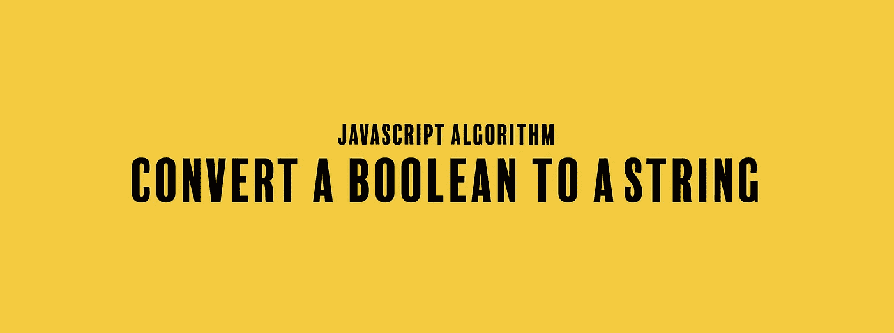

# JavaScript 算法:将布尔值转换为字符串

> 原文：<https://javascript.plainenglish.io/javascript-algorithm-convert-a-boolean-to-a-string-d720ac34ecd5?source=collection_archive---------6----------------------->

## 我们来看看将布尔值转换成字符串的许多方法



今天我们要写一个名为`booleanToString`的函数，它接受一个布尔值`b`作为输入。

给你一个布尔输入，要么是`true`，要么是`false`。该函数的目标是返回相同的值，但作为一个字符串。

虽然这个问题看起来很简单，但我们还是要看看解决这个算法的许多方法。第一个例子涉及使用 if 语句，但是我们会找到改进每个解决方案的方法。

这里，我们使用 if 语句。如果我们只提到 b，If 语句将计算出布尔值`b`是什么。如果是，返回`"true"`。如果没有，返回`"false"`。

```
function booleanToString(b){
  if(b){
    return "true";
  }else{
    return "false";
  }
}
```

不如我们把 if 语句完全去掉，只写一行程序。我们可以返回布尔值`b`并将其连接成一个空字符串。这将把布尔值转换成字符串。

```
function booleanToString(b){
  return b + "";
}
```

我们也可以忽略任何 JavaScript 数学运算符和连接，只使用内置方法`.toString()`。该方法返回给定输入的字符串版本。

```
function booleanToString(b){
  b.toString();
}
```

无论您是擅长编写代码还是喜欢一行程序，这些解决方案都展示了解决这个问题的许多方法。这些解决方案还有助于深入了解如何重构代码，展示如何从第一个解决方案到本段上方的最后两个解决方案。

如果你觉得这个算法有帮助，可以看看我最近的其他 JavaScript 算法解决方案:

[](https://medium.com/javascript-in-plain-english/javascript-algorithm-age-appropriate-drinks-1912d2a09d9f) [## JavaScript 算法:适合年龄的饮料

### 我们编写了一个函数，根据一个人的年龄返回他应该喝什么样的饮料。

medium.com](https://medium.com/javascript-in-plain-english/javascript-algorithm-age-appropriate-drinks-1912d2a09d9f) [](https://medium.com/javascript-in-plain-english/javascript-algorithm-power-2cbedf59f40c) [## JavaScript 算法:Power

### 我们将编写一个函数，不使用任何内置的数学函数来返回一个数的幂。

medium.com](https://medium.com/javascript-in-plain-english/javascript-algorithm-power-2cbedf59f40c) [](https://medium.com/javascript-in-plain-english/javascript-algorithm-does-my-list-include-this-8a946b2c7839) [## JavaScript 算法:我的列表包括这个吗？

### 我们将编写一个函数来确定数组中是否存在某个值。

medium.com](https://medium.com/javascript-in-plain-english/javascript-algorithm-does-my-list-include-this-8a946b2c7839) 

## **用简单英语写的 JavaScript 笔记**

我们已经推出了三种新的出版物！请关注我们的新出版物，表达对它们的喜爱:[**AI in Plain English**](https://medium.com/ai-in-plain-english)，[**UX in Plain English**](https://medium.com/ux-in-plain-english)，[**Python in Plain English**](https://medium.com/python-in-plain-english)**——谢谢，继续学习！**

**我们也一直有兴趣帮助推广高质量的内容。如果您有一篇文章想要提交给我们的任何出版物，请发送电子邮件至[**submissions @ plain English . io**](mailto:submissions@plainenglish.io)**，使用您的 Medium 用户名，我们会将您添加为作者。另外，请让我们知道您想加入哪个/哪些出版物。****