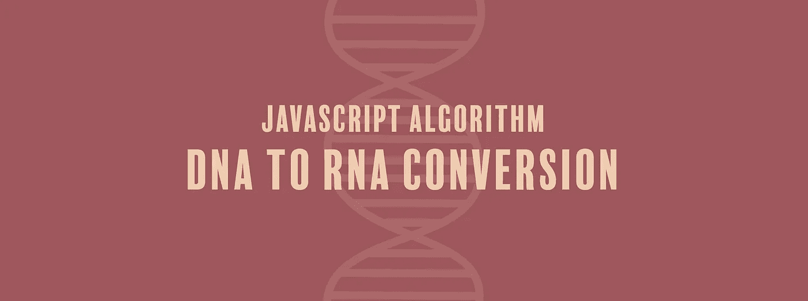

# JavaScript 算法:DNA 到 RNA 的转换

> 原文：<https://javascript.plainenglish.io/javascript-algorithm-dna-to-rna-conversion-cceb6abc1336?source=collection_archive---------4----------------------->

## 我们编写一个函数，给定一个 DNA 字符串序列，并将其转换成 RNA 序列。



我们将编写一个名为`DNAtoRNA`的函数，它将接受一个字符串(`dna`)作为参数。

如果你关注过生物学(没关注过也没关系)，你会知道脱氧核糖核酸(DNA)是生物系统中主要的信息存储分子。它由四个核酸碱基组成: **G** 鸟嘌呤、 **C** 胞嘧啶、 **A** 腺嘌呤、 **T** 腺嘌呤。

然后是核糖核酸或 RNA，作为细胞中的主要信使分子。DNA 和 RNA 的区别之一是 RNA 没有胸腺嘧啶。胸腺嘧啶被另一个核酸取代了。

现在你已经上了简短的生物课，这个函数的目标是把给定的 DNA 串翻译成 RNA。这里有一个例子:

```
let dna = "GCAT"; // GCAU
```

当将 DNA 转换成 RNA 时，我们唯一需要担心改变的是`T`。我们将在字符串输入中使用`replace()`方法。

当我们第一次使用 replace 方法时，我们希望替换 DNA 中的`T`，并用`U`替换它，使之成为 RNA。我们可以返回这个语句:

```
return dna.replace("T", "U");
```

但是有一个问题。如果只有一个字符串，replace 方法将替换字母 t 的第一个实例。因此，如果函数将`TTTT`作为输入，当答案应该是`UUUU`时，函数将返回`UTTT`。

因此，我们将使用正则表达式`/T/g`，它将全局替换`T`的每个实例，并用`U`替换它。

```
return dna.replace(/T/g, "U");
```

下面是我们函数的其余部分:

```
function DNAtoRNA(dna) {
  return dna.replace(/T/g, "U"); 
}
```

如果你觉得这个算法有帮助，看看我的其他 JavaScript 算法解决方案:

[](https://medium.com/@endubueze00/javascript-algorithm-hydration-count-9793a40e9a03) [## JavaScript 算法:水合计数

### 我们要写一个函数，返回一个叫阿奇的年轻人应该喝多少升水…

medium.com](https://medium.com/@endubueze00/javascript-algorithm-hydration-count-9793a40e9a03) [](https://levelup.gitconnected.com/javascript-algorithm-golf-code-c9547ba4f5e5) [## JavaScript 算法:高尔夫代码

### 我们将编写一个函数，它将根据您完成的击球次数返回您的得分项…

levelup.gitconnected.com](https://levelup.gitconnected.com/javascript-algorithm-golf-code-c9547ba4f5e5) [](https://medium.com/javascript-in-plain-english/javascript-algorithm-vowel-remover-c8808868ee55) [## JavaScript 算法:元音去除器

### 我们将创建一个函数来删除字符串中的所有元音

medium.com](https://medium.com/javascript-in-plain-english/javascript-algorithm-vowel-remover-c8808868ee55) 

【JavaScript 用简单的英语写的一句话:我们总是乐于帮助推广高质量的内容。如果你有一篇文章想用简单的英语提交给 JavaScript，用你的中级用户名发邮件到 submissions@javascriptinplainenglish.com[给我们，我们会把你添加为作者。](mailto:submissions@javascriptinplainenglish.com)