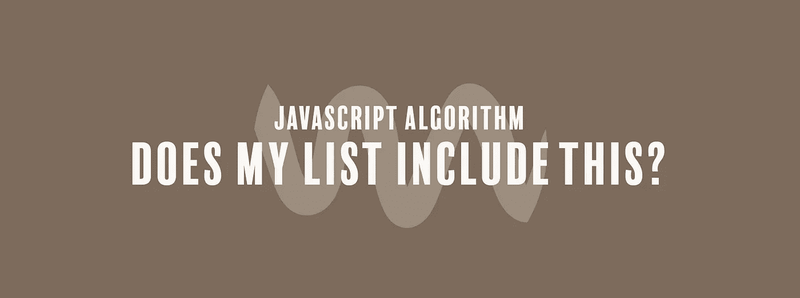

# JavaScript 算法:我的列表包括这个吗？

> 原文：<https://javascript.plainenglish.io/javascript-algorithm-does-my-list-include-this-8a946b2c7839?source=collection_archive---------6----------------------->

## 我们将编写一个函数来确定数组中是否存在某个值。



今天，我们将编写一个名为`include`的短函数，它将接受一个数组`arr`和一个整数`item`作为输入。

我们想知道一个数是否存在于一个数组中，但是如果我们没有东西来检查它，我们怎么知道它是否存在呢？哦，可怜的我们。

不要害怕，我们可以写一个函数来做这件事。我们需要做的就是写一个函数，如果`item`存在于`arr`中，它将返回`true`，如果不存在，它将返回`false`。

有两种方法可以解决这个问题。第一种结合使用了`indexOf`和 if 语句。

我们可以使用`indexOf`方法来查看该方法是否返回一个大于-1 的值。如果是，这意味着`item`存在于`arr`中，所以我们可以返回`true`。如果没有，我们返回`false`。

```
if(arr.indexOf(item) > -1){
   return true;
}else{
   return false;
}
```

这是完整的代码:

```
function include(arr, item){
  if(arr.indexOf(item) > -1){
     return true;
  }else{
     return false;
  }
}
```

您还可以使用条件三元运算符将其压缩为一行:

```
function include(arr, item){
  return arr.indexOf(item) > -1 ? true : false;
}
```

您可以做的另一件事是完全删除 if 语句，只使用`includes`方法。这个方法将返回`true`或`false`，这取决于输入是否存在于一个数组中。

```
function include(arr, item){
  return arr.includes(item);
}
```

如果你觉得这个算法有帮助，可以看看我最近的其他 JavaScript 算法解决方案:

[](https://medium.com/javascript-in-plain-english/javascript-algorithm-chuck-norris-true-or-false-52d5cd8c1fc7) [## JavaScript 算法:Chuck Norris——对还是错？

### 我们要写一个不使用关键字 false 就返回 false 的函数。

medium.com](https://medium.com/javascript-in-plain-english/javascript-algorithm-chuck-norris-true-or-false-52d5cd8c1fc7) [](https://levelup.gitconnected.com/javascript-algorithm-take-the-first-n-elements-31c971312ff2) [## JavaScript 算法:取前 N 个元素

### 我们将编写一个函数来返回数组中的前 n 个元素。

levelup.gitconnected.com](https://levelup.gitconnected.com/javascript-algorithm-take-the-first-n-elements-31c971312ff2) [](https://medium.com/javascript-in-plain-english/javascript-algorithm-es6-string-addition-d9022d8f189c) [## JavaScript 算法:ES6 字符串添加

### 我们将在不使用任何 JavaScript 内置方法和+号的情况下连接两个字符串。

medium.com](https://medium.com/javascript-in-plain-english/javascript-algorithm-es6-string-addition-d9022d8f189c)