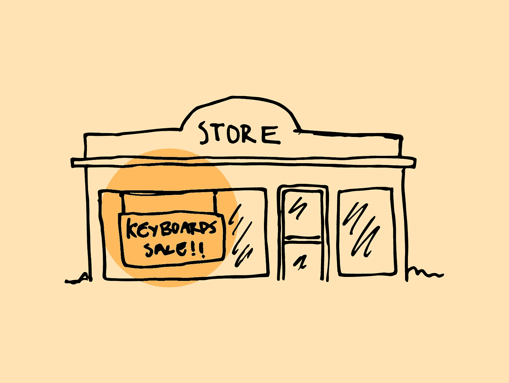
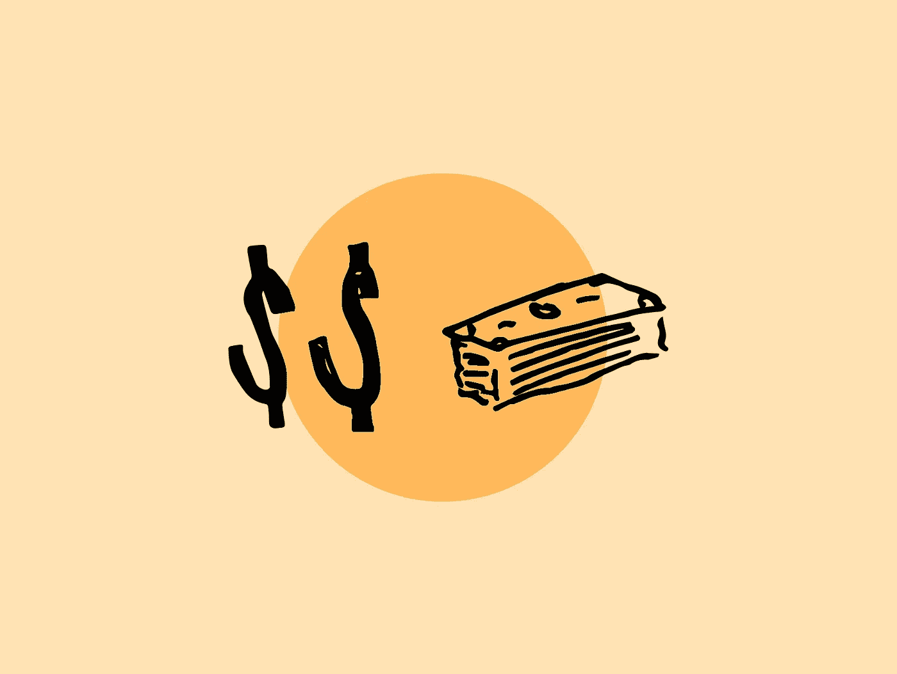

# JavaScript 算法:电子商店

> 原文：<https://javascript.plainenglish.io/javascript-algorithm-electronics-shop-240a4fcb0e85?source=collection_archive---------4----------------------->


对于今天的算法，我们将编写一个名为`getMoneySpent`的函数，它将接受三个输入:两个数组`keyboards`和`drives`以及一个整数`b`。



你想买一个键盘和一个 USB 驱动器，所以你去当地的电子商店买。该商店有几种型号的键盘和 USB 驱动器。你想把它们都买下来，但是太糟糕了，你有一个叫做预算的东西。您希望在预算范围内尽可能多地购买键盘和 USB 驱动器。

给定一组键盘价格和一组 USB 驱动器价格，该函数的目的是输出一起购买键盘和 USB 驱动器时可以花费的最大金额。如果你只能买得起一个键盘或一个 USB，但不能两者兼而有之，你输出`-1`。让我们看一个例子。

```
let b = 10;
let keyboards = [3, 1];
let drives = [5, 2, 8];
```

该函数将接受三个输入:

`b`是你的预算总额。

是保存两个键盘价格的数组。

`drives`是保存三个 USB 驱动器价格的数组。

我们将每个键盘的价格加到每个 USB 驱动器上:

```
// the first keyboard
3 + 5 = 8
3 + 2 = 5
3 + 8 = 11// second keyboard
1 + 5 = 6
1 + 2 = 3
1 + 8 = 9
```

通过查看计算，我们得到了`keyboard`数组中第一个键盘的价格，并将其添加到每个 USB 驱动器的价格中。我们对第二个键盘的价格做了同样的处理。预算是 10，所以任何大于 10 的数字都在预算之外。我们查看等于或小于 10 的最高数字，发现我们可以用 9 美元购买第二个键盘和第三个 USB 驱动器。该函数将输出`9`。

现在我们可以把它转化成代码。我们创造变量。

```
let priceCheck = 0;
```

`priceCheck`变量将包含我们在预算内可以花费的最大金额。这将是函数输出的变量。我们将该值设为 0。

接下来，我们使用一个 for 循环，但不仅仅是一个，我们使用两个 for 循环，一个在另一个里面。这被称为嵌套 for 循环

```
for (let i = 0; i < keyboards.length; i++) {
    for (let j = 0; j < drives.length; j++) {
        let priceTotal = keyboards[i] + drives[j]
        if ((priceTotal > priceCheck) && (priceTotal <= b)) {
            priceCheck = priceTotal;
        }
    }
}
```

现在我们使用一个 for 循环来遍历`keyboards`数组，在这个 for 循环中，我们嵌套了一个 for 循环。这个 for 循环将遍历`drives`数组。哪个循环是外循环，哪个循环是内循环并不重要。您可以让外循环遍历`drives`数组，内循环遍历`keyboards`数组。

嵌套循环所做的是，当我们遍历`keyboards`数组时，我们获取数组中的第一个数字，然后进入内部循环，开始将第一个键盘数组项添加到`drive`数组中的所有项。每次在重新开始下一个键盘数组项目之前都会发生这种情况。

我们将每个键盘和 USB 驱动器的成本添加到`priceTotal`变量中。我们使用 if 语句来检查键盘和 USB 驱动器的成本是否大于`priceCheck`,还可以查看它是否在预算范围内。如果是，更新`priceCheck`等于当前的`priceTotal`变量。随着 for 循环遍历每一项，`priceCheck`变量将继续更新。每个值会越来越大，直到在不超出预算的情况下无法再变大。

```
if (priceCheck === 0) {
    return -1;
} else {
    return priceCheck;
}
```

当 for 循环结束时，我们检查`priceCheck`是否保持为 0 或者是否有另一个值。如果仍然是 0，这意味着键盘和 USB 驱动器的价格组合都不在预算内，所以返回-1。如果有价值，那就意味着你实际上买得起东西。该函数输出您可以花费的最大金额。

我们的代码到此结束。下面是该函数的其余部分:

```
function getMoneySpent(keyboards, drives, b) {
    let priceCheck = 0; for (let i = 0; i < keyboards.length; i++) {
        for (let j = 0; j < drives.length; j++) {
            let priceTotal = keyboards[i] + drives[j]
            if ((priceTotal > priceCheck) && (priceTotal <= b)) {
                priceCheck = priceTotal;
            }
        }
    } if (priceCheck === 0) {
        return -1;
    } else {
        return priceCheck;
    }}
```



这里是我的其他一些 JavaScript 算法问题，你可以检查一下。

[](https://medium.com/javascript-in-plain-english/javascript-algorithm-sock-merchant-de9ffa754dfc) [## JavaScript 算法:袜子商人

### 对于今天的算法，我们将编写一个名为 sockMerchantthat 的函数，它将接受两个输入，一个整数 n…

medium.com](https://medium.com/javascript-in-plain-english/javascript-algorithm-sock-merchant-de9ffa754dfc) [](https://medium.com/javascript-in-plain-english/javascript-algorithm-bon-app%C3%A9tit-209f59a85715) [## JavaScript 算法:Bon Appé tit

### 对于今天的算法，我们将编写一个名为 bonAppetit 的函数，这个函数将接受三个输入…

medium.com](https://medium.com/javascript-in-plain-english/javascript-algorithm-bon-app%C3%A9tit-209f59a85715)