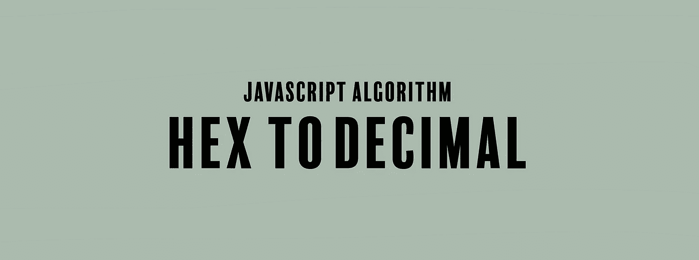

# JavaScript 算法:十六进制到十进制

> 原文：<https://javascript.plainenglish.io/javascript-algorithm-hex-to-decimal-3400f3742d1e?source=collection_archive---------1----------------------->

## 写一个将十六进制数转换成十进制数的函数。



我们将编写一个名为`hexToDec`的函数，它将接受一个字符串(`hexString`)作为参数。

给你一个包含十六进制数的字符串。该函数的目标是返回十六进制数的十进制等效值。

示例:

```
let hexString = "1" // 1
let hexString = "a" // 10
let hexString "10" // 16
```

解决这个算法的一个方法是使用`parseInt()`方法，但是使用基数。parseInt 方法解析一个字符串并返回一个整数，但它也接受基数的第二个参数。基数指定一个数的基数，它可以是 2 到 36 之间的整数。

`parseInt(string, radix)`

基数为 16 的数字表示字符串中的数字应该从十六进制数解析为十进制数。这就是我们在这个算法中要用到的。

```
return parseInt(hexString, 16);
```

这是关于 parseInt 方法的额外信息，我觉得很有趣，但不知道它的存在。不管怎样，下面是函数的其余部分:

```
function hexToDec(hexString){
  return parseInt(hexString, 16);
}
```

如果您发现这个算法很有帮助，请查看我的其他 JavaScript 算法解决方案文章:

[](https://levelup.gitconnected.com/javascript-algorithm-difference-of-two-arrays-5bea5ea50e1f) [## JavaScript 算法:两个数组的区别

### 我们将编写一个函数，返回两个数组的对称差。

levelup.gitconnected.com](https://levelup.gitconnected.com/javascript-algorithm-difference-of-two-arrays-5bea5ea50e1f) [](https://levelup.gitconnected.com/javascript-algorithm-set-alarm-54a7abd094d7) [## JavaScript 算法:设置警报

### 我们将编写一个函数，它将根据你是否有工作来决定是否值得设置闹钟，并且…

levelup.gitconnected.com](https://levelup.gitconnected.com/javascript-algorithm-set-alarm-54a7abd094d7) [](https://levelup.gitconnected.com/javascript-algorithm-pangrams-3e6add10f38f) [## JavaScript 算法:Pangrams

### 对于今天的算法，我们要写一个叫做 pangrams 的函数，它接受一个字符串 s 作为输入。

levelup.gitconnected.com](https://levelup.gitconnected.com/javascript-algorithm-pangrams-3e6add10f38f) 

## **用简单英语写的 JavaScript 笔记**

我们已经推出了三种新的出版物！请关注我们的新出版物: [**AI in Plain English**](https://medium.com/ai-in-plain-english) ，[**UX in Plain English**](https://medium.com/ux-in-plain-english)，[**Python in Plain English**](https://medium.com/python-in-plain-english)**——谢谢，继续学习！**

**我们也一直有兴趣帮助推广高质量的内容。如果您有一篇文章想要提交给我们的任何出版物，请发送电子邮件至[**submissions @ plain English . io**](mailto:submissions@plainenglish.io)**，使用您的 Medium 用户名，我们会将您添加为作者。另外，请让我们知道您想加入哪个/哪些出版物。****