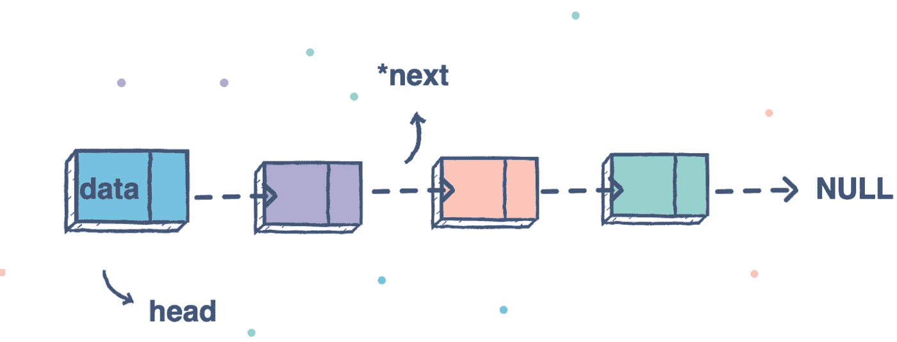
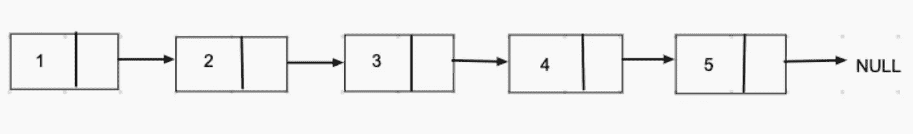
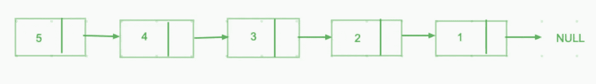

# JavaScript 算法:如何反转链表

> 原文：<https://javascript.plainenglish.io/javascript-algorithm-how-to-reverse-linked-list-ab06b55e71b6?source=collection_archive---------10----------------------->

[https://www.educative.io/api/edpresso/shot/5077575695073280/image/5192456339456000](https://www.educative.io/api/edpresso/shot/5077575695073280/image/5192456339456000)

## [***先决条件:***JavaScript 中的单链表](https://medium.com/swlh/singly-linked-list-in-javascript-a0e58d045561)

当给定一个单链表时，我们如何能设法反转它？像下面这个例子，如果输入链表是 1->2->3->4->5->NULL，我们是否可以把它反过来变成输出为 5->4->3->2->1->NULL？

Example Input

Example Output

链表的每个节点将有两个属性:value & next，链表将有 head、tail 和 length 属性。

[https://gist.github.com/GAierken/6e15c82f5e3457fa2d16e29400e130aa](https://gist.github.com/GAierken/6e15c82f5e3457fa2d16e29400e130aa)

反转单链表有两种方法:迭代和递归。

***迭代:***

通过迭代的方法，当我们访问每个节点时，我们存储前一个节点，将下一个节点的 next 设置为前一个节点。由于链表的末尾是空值，我们将前一个节点初始化为空值。

[https://gist.github.com/GAierken/c8a55e24b95cb80654145e14f799790d.js](https://gist.github.com/GAierken/c8a55e24b95cb80654145e14f799790d.js)

上述解的时间复杂度为 O(n)，空间复杂度为 O(1)。

**递归:递归:**

为了遍历一个链表，我们也可以使用递归。而方法类似于迭代求解，我们需要将前一个节点初始化为空。为了在递归中实现前一个变量的初始化，我们可以将它作为函数的另一个参数传递。基本情况是什么？和上面的解决方案一样，当头为空时，我们可以返回反向链表。

[https://gist.github.com/GAierken/a418faaa2e3d557a72f989ffc5fd6484](https://gist.github.com/GAierken/a418faaa2e3d557a72f989ffc5fd6484)

上述解的时间复杂度为 O(n)，空间复杂度为 O(n)。

我希望这能帮助你对解决类似的问题有不同的见解。

***资源:***

 [## 反向链表- LeetCode

### 提高你的编码技能，迅速找到工作。这是扩展你的知识和做好准备的最好地方…

leetcode.com](https://leetcode.com/problems/reverse-linked-list/)  [## JavaScript 中的单链表

### 链表和数组一样，是一种线性数据结构。它包含头部、尾部和长度属性。如下图所示…

medium.com](https://medium.com/swlh/singly-linked-list-in-javascript-a0e58d045561)