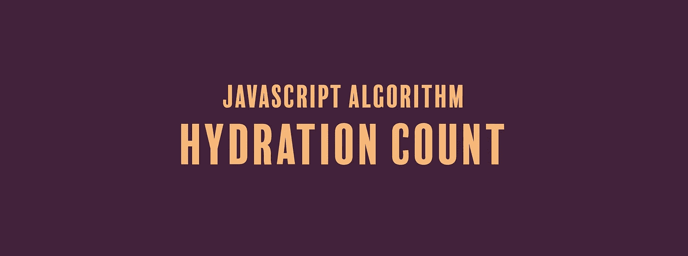

# JavaScript 算法:水合计数

> 原文：<https://javascript.plainenglish.io/javascript-algorithm-hydration-count-9793a40e9a03?source=collection_archive---------6----------------------->

## 我们要写一个函数，返回一个叫阿奇的年轻人应该喝多少升水来保持水分



我们将编写一个名为`liters`的函数，它将一个数字(`time`)作为参数。

我们有个年轻人叫阿奇。阿奇喜欢慢跑，但他也喜欢水和保持水分。他非常喜欢水，以至于睡在他的游泳池里。不管他的皮肤肿胀，反正他打算变成一条鱼。

当他出去慢跑时，他每小时喝大约 0.5 升水。鉴于`time`在小时返回阿奇需要喝多少升水来保持水分。返回向下舍入到最小值的数字。这里有一个例子:

```
let time = 6.7;
```

如果阿奇慢跑 6.7 小时，他每小时喝 0.5 升水，我们乘以`6.7 * 0.5`得到`3.35`升。我们将该数字向下舍入，函数将返回`3`。

因为我们所做的就是将`time`乘以`0.5`，所以我们的等式是:

```
time * 0.5
```

我们希望我们的数字是一个整数，所以如果我们遇到一个小数，我们将使用`Math.floor()`向下舍入。

```
return Math.floor(time * 0.5);
```

将`time`乘以`0.5`也相当于将`time`除以 2。

```
return Math.floor(time / 2);
```

下面是我们函数的其余部分:

```
function liters(time) {
  return Math.floor(time * 0.5);
}
```

如果你觉得这个算法有帮助，看看我的其他 JavaScript 算法解决方案:

[](https://medium.com/javascript-in-plain-english/javascript-algorithm-soccer-goal-totals-93223792b67f) [## JavaScript 算法:足球进球总数

### 我们将解决并研究在 JavaScript 中，在一个函数中添加多个数字总和的许多方法。

medium.com](https://medium.com/javascript-in-plain-english/javascript-algorithm-soccer-goal-totals-93223792b67f) [](https://codeburst.io/javascript-algorithm-short-long-short-8142ae853513) [## JavaScript 算法:短长短

### 对于今天的算法，我们将编写一个名为 solution 的函数来探索字符串的基础…

codeburst.io](https://codeburst.io/javascript-algorithm-short-long-short-8142ae853513) [](https://medium.com/javascript-in-plain-english/javascript-algorithm-viral-advertising-168a872cb557) [## JavaScript 算法:病毒式广告

### 对于今天的算法，我们要写一个叫做 viralAdvertising 的函数，它接受一个整数 n 作为…

medium.com](https://medium.com/javascript-in-plain-english/javascript-algorithm-viral-advertising-168a872cb557) 

【JavaScript 用简单英语写的一句话:我们总是对帮助推广优质内容感兴趣。如果你有一篇文章想用简单的英语提交给 JavaScript，用你的 Medium 用户名给我们发邮件到[submissions@javascriptinplainenglish.com](mailto:submissions@javascriptinplainenglish.com)，我们会把你添加为作者。