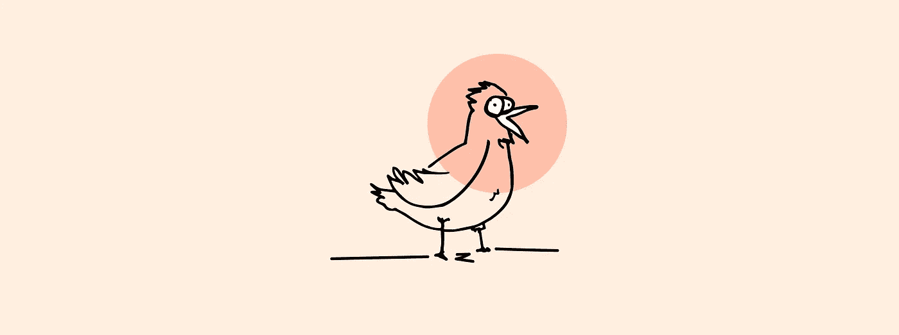
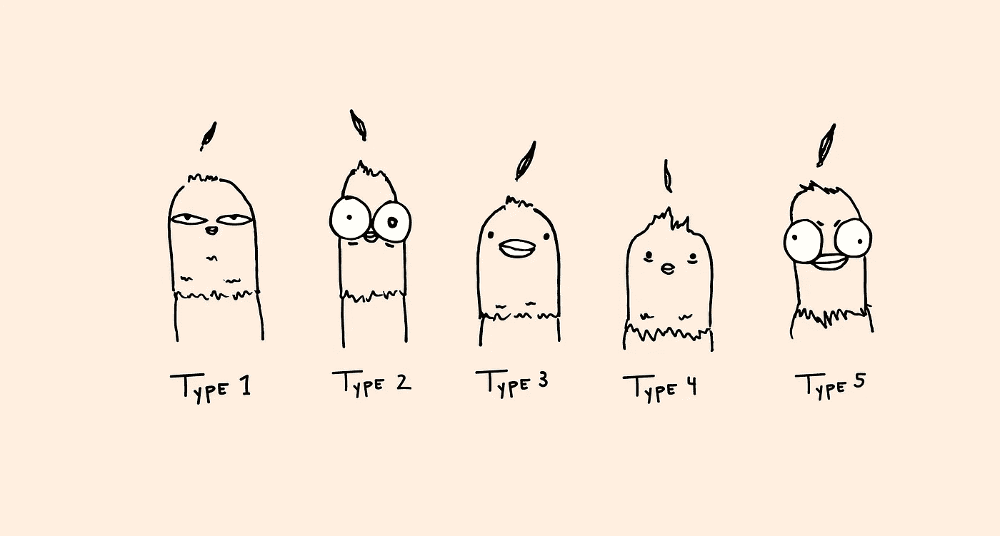

# JavaScript 算法:候鸟

> 原文：<https://javascript.plainenglish.io/javascript-algorithm-migratory-birds-848ad6a99ac3?source=collection_archive---------5----------------------->



对于今天的算法，我们将编写一个名为`migratoryBirds`的函数，在这个函数中，我们将接受一个数组。

你的任务是研究鸟类的数量，你记录下你看到的每一只鸟。每种鸟都有一个 ID 号，所以每次你看到一只鸟并识别出它的鸟的类型，你就把鸟的 ID 写下来。记下您看到的鸟之后，您有一个列表或一个整数数组，指示您看到的所有鸟的鸟的类型 ID。这个数组是你的输入。


You don’t use a binocular, you are the binocular.

该函数的目标是查看哪种鸟是最常见的。该函数将输出最常见鸟类的 ID。如果您找到了最常见的鸟类类型，但发现还有其他鸟类具有相同的观察次数，则输出 ID 号最小的类型。



请注意，你正在研究的鸟类只有 5 种。他们的 ID 从 1 到 5 不等。

下面是一个数组示例:

```
let arr = [2, 4, 5, 3, 4, 1, 4];
```

在`arr`阵列中，您发现了 7 只鸟:

类型 1: 1 鸟

类型 2: 1 鸟

类型 3: 1 鸟

类型 4: 3 只鸟

类型 5: 1 鸟

该函数将输出 4，因为类型 4 的鸟具有最高的观察次数。

让我们看另一个例子:

```
let arr = [2, 2, 1, 4, 1];
```

在`arr`阵中，你发现了 5 只鸟:

类型 1: 2 只鸟

类型 2: 2 只鸟

类型 3: 0 鸟类

类型 4: 1 鸟

类型 5: 0 鸟类

该函数将输出 1。尽管第一类和第二类鸟类的出现次数最多，但它们也有相同的价值。1 是两个 ID 中最小的一个，因此该函数将输出 1。

现在我们可以把它转化成代码。以下是我们的变量:

```
let largest = 1;
let counter = largest;
let type = 0;
```

`**largest**`变量将保存特定 ID 的观鸟次数。我们将默认值设置为 1，因为为了让一种鸟出现在数组中，这意味着至少有一只该类型的鸟出现。

`**counter**` 变量是我们用来比较`**largest**`的变量。`**largest**`变量只统计观鸟次数，但我们需要另一个变量(这个)来保存其他类型的观鸟次数。两者中较大的一个将进入`**largest**`变量。

`**type**` 变量保存鸟的 ID 号。该值被设置为零，但是稍后我们将使用该变量来输出与最高观鸟次数相关联的类型。

为了使下一个任务更容易，我们要做的下一件事是使用`Array.sort()`对数组进行排序。我们的输入数组变量是`**arr**`。

```
arr.sort();
```

下一步是遍历数组:

```
for (let i = 0; i < arr.length; i++) {
    largest = (arr.lastIndexOf(arr[i]) - arr.indexOf(arr[i])) + 1; if (largest > counter) {
        counter = largest;
        type = arr[i];
    }
}
```

在我们的 for-loop 块的第一行，循环在我们的排序数组中遇到的第一个鸟 ID，我们计算我们看到的那个鸟类型的出现次数。因为我们已经对数组进行了排序，所以我们可以通过使用`lastIndexOf()`和`indexOf()`很容易地做到这一点。`indexOf()`方法返回给定输入在数组中的第一个索引。`lastIndexOf()`方法做相反的事情，返回数组中给定输入的最后一个索引。

我们从第一次出现的值中减去最后一次出现的值的指数，以获得该特定鸟 ID 的总目击次数。两个 indexOf 方法都从零开始计数，所以我们加 1 得到总值，就好像我们从 1 开始计数一样。

接下来，我们将最大的变量与计数器变量进行比较。计数器获取最后一次观察数量最多的鸟类的值。我们将其与`**largest**`变量进行比较，以查看当前的鸟类型是否比之前的鸟类型有更多的目击次数。如果是，我们将计数器设置为`**largest**`。我们通过将 ID 赋给变量`**type**`来记录被看到次数最多的鸟的 ID(数组中的实际值)。

我们只做`>`而不做`>=`是很重要的，因为当我们发现有相同数量的观鸟时，我们希望保留 ID 号最低的那个。因为我们对数组进行了排序，如果有相同数量的多次出现，我们找到的第一种鸟也将具有最低的 ID 号，所以我们忽略了具有相同数量的其他 ID。

循环完数组后，我们返回与最大数量的观鸟相关联的类型。

```
return type;
```

下面是该函数的其余部分:

```
function migratoryBirds(arr) {
    let largest = 1;
    let counter = largest;
    let type = 0; arr.sort(); for (let i = 0; i < arr.length; i++) {
        largest = (arr.lastIndexOf(arr[i]) - arr.indexOf(arr[i])) + 1;
        if (largest > counter) {
            counter = largest;
            type = arr[i];
        }
    }return type;}
```


如果你想阅读更多的 JavaScript 算法文章，这里有一些最近的:

[](https://medium.com/javascript-in-plain-english/javascript-algorithm-grading-students-210a89c5496f) [## JavaScript 算法:给学生评分

### 对于今天的算法，我们将编写一个名为 gradingStudents 的函数，在这个函数中，我们将…

medium.com](https://medium.com/javascript-in-plain-english/javascript-algorithm-grading-students-210a89c5496f) [](https://levelup.gitconnected.com/javascript-algorithm-time-conversion-71dc15dd13b8) [## JavaScript 算法:时间转换

### 对于今天的算法，我们将创建一个名为 timeConversion 的函数。这个函数将接受一个字符串作为…

levelup.gitconnected.com](https://levelup.gitconnected.com/javascript-algorithm-time-conversion-71dc15dd13b8)