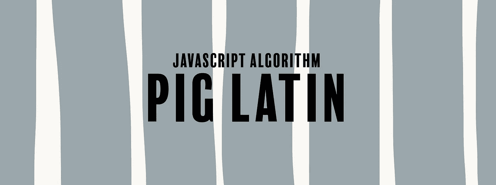

# JavaScript 算法:猪拉丁

> 原文：<https://javascript.plainenglish.io/javascript-algorithm-pig-latin-82402739bc3f?source=collection_archive---------0----------------------->

## 我们写了一个函数，将一个单词转换成拉丁文。



我们将编写一个名为`translatePigLatin`的函数，它将接受一个字符串(`str`)作为参数。

该函数的目标是将单词翻译成拉丁文。猪拉丁语是改变英语单词的一种奇怪方式。规则如下:

*   如果一个单词以辅音开头，则取第一个辅音或辅音群，并将其移动到单词的末尾。一旦完成，在结尾加上一个“是”。

例 1: " **c** 穹窿"→"穹窿 **c** ay "

例 2:"**GL**ove "→" ove**GL**ay "

*   如果这个单词没有元音，就在末尾加一个“ay”。

例 1:“节奏”→“韵律可能”

*   如果一个单词是以元音开头的，那么在末尾加上“way”就可以了。

例 1:“八”→“八路”

例 2:“算法”→“算法途径”

让我们写我们的函数。

首先，我们将创建两个变量:

```
let vowels = ['a', 'e', 'i', 'o', 'u'];
let newStr = "";
```

`vowels`变量是一个元音数组。我们将用这个来检查`str`的第一个字符是否是元音。

`newStr`变量将保存我们的猪拉丁字符串。

接下来，我们编写一个条件，查看字符串输入的第一个字符。

```
if (vowels.indexOf(str[0]) > -1) {
    newStr = str + "way";
    return newStr;
} else {
    let firstMatch = str.match(/[aeiou]/g) || 0;
    let vowel = str.indexOf(firstMatch[0]);
    newStr = str.substring(vowel) + str.substring(0, vowel) + "ay";
    return newStr;
}
```

我们的 if 语句检查字符串的第一个字母是否是元音字母。我们使用`indexOf()`方法来检查第一个字符是否存在于我们的`vowels`数组中。如果是，我们将“way”添加到字符串的末尾并返回`newStr`。

如果第一个字符不是元音，那么我们就进入 else 块。让我们仔细看看。

```
let firstMatch = str.match(/[aeiou]/g) || 0;
let vowel = str.indexOf(firstMatch[0]);
newStr = str.substring(vowel) + str.substring(0, vowel) + "ay";
return newStr;
```

对于我们的`firstMatch`变量，我们使用正则表达式方法`match()`。`match()`所做的是返回一个包含所有匹配正则表达式模式的字符索引的数组。我们的模式着眼于任何是元音的字符。如果没有元音，那么我们给`firstMatch`分配`0`的值。

使用`indexOf()`，变量`vowel`将给出字符串中第一个元音的索引。由于`match()`给了我们一个数组，所以我们只关心数组中的第一项。同样，如果`firstMatch`是`0`，那么`vowel`变量无关紧要。

现在我们有了第一个出现的元音的索引，我们使用这个数字作为我们的`substring()`方法的起始值参数。

`str.substring(vowel)`表示没有辅音开头的字符串部分。

`str.substring(0, vowel)`代表辅音或辅音群。当我们将两个字符串连接在一起，并在末尾加上一个“ay”时，我们就有了我们的猪拉丁字符串。

如果字符串没有元音字母，`str.substring(vowel)`将返回整个字符串。因为`substring(0,0)`什么都不是，所以`str.substring(0, vowel)`将什么都不返回。最后，我们在原始字符串的末尾加上了“ay”。

我们现在可以返回这个字符串了。

```
return newStr;
```

下面是该函数的其余部分:

## JavaScript 用简单的英语写的一个注释:

我们已经推出了三种新的出版物！请关注我们的新出版物: [**AI in Plain English**](https://medium.com/ai-in-plain-english) ，[**UX in Plain English**](https://medium.com/ux-in-plain-english)，[**Python in Plain English**](https://medium.com/python-in-plain-english)**——谢谢，继续学习！**

**如果你觉得这个算法有帮助，看看我的其他 JavaScript 算法解决方案:**

**[](https://medium.com/javascript-in-plain-english/javascript-algorithm-wherefore-art-thou-1e6eb6c10ba2) [## JavaScript 算法:你是为什么

### 我们编写一个函数，它返回一个数组中的所有对象，该数组包含来自源的所有名称/值对…

medium.com](https://medium.com/javascript-in-plain-english/javascript-algorithm-wherefore-art-thou-1e6eb6c10ba2) [](https://levelup.gitconnected.com/javascript-algorithm-difference-of-two-arrays-5bea5ea50e1f) [## JavaScript 算法:两个数组的区别

### 我们将编写一个函数，返回两个数组的对称差。

levelup.gitconnected.com](https://levelup.gitconnected.com/javascript-algorithm-difference-of-two-arrays-5bea5ea50e1f) [](https://medium.com/javascript-in-plain-english/javascript-algorithm-sum-all-numbers-in-a-range-49f8d37a3fec) [## JavaScript 算法:对一个范围内的所有数字求和

### 我们编写一个函数，返回两个整数范围内所有数字的和。

medium.com](https://medium.com/javascript-in-plain-english/javascript-algorithm-sum-all-numbers-in-a-range-49f8d37a3fec)**