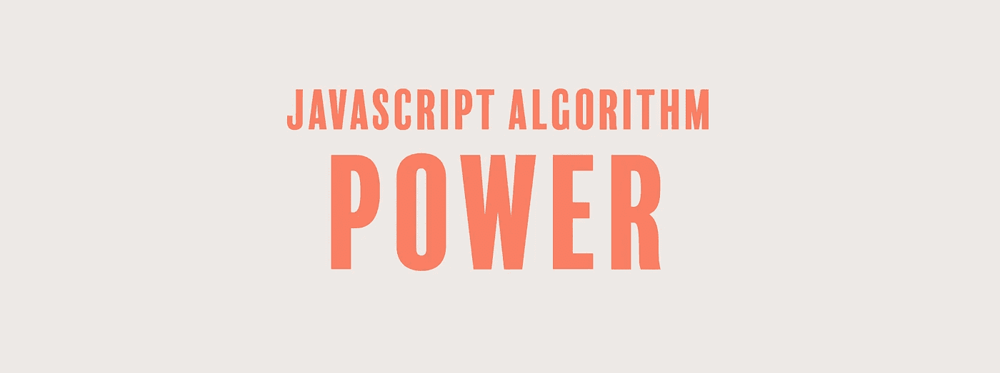

# JavaScript 算法:Power

> 原文：<https://javascript.plainenglish.io/javascript-algorithm-power-2cbedf59f40c?source=collection_archive---------8----------------------->

## 我们将编写一个函数，不使用任何内置的数学函数来返回一个数的幂。



今天我们将编写一个名为`numberToPower`的函数，它将接受两个整数`number`和`power`作为输入。

正如函数名所示，我们的目标是计算并返回一个数字的 n 次方。n 次方或指数为`power`。不过有一个问题，我们将在没有任何内置数学函数的帮助下解决这个问题。我们可以使用 while 循环和 for 循环来解决这个问题。我们先来看 for 循环。

## For 循环解决方案

当我们取一个数的 n 次方时，我们将这个数乘以它本身 n 次。

我们如何将一个数乘以它自己？通过让`total`变量等于`1`，这个变量将帮助我们乘以`number`本身。我们将`number * 1`乘以一定的次数(幂),每次都将结果乘以`total`。

```
function numberToPower(number, power){
  let total = 1;
  for (let i = 1; i <= power; i++) { 
    total = total * number;
  }
  return total;
}
```

在循环结束时，我们返回总数。

## While 循环解决方案

while-loop 解决方案做了同样的事情，除了我们在每次循环后将`power`递减到 0 时结束循环。

```
function numberToPower(number, power){
  let total = 1;
  while(power > 0){
    total *= number;
    power--;
  }
  return total;
}
```

虽然使用内置数学函数返回一个数的幂可能更好，特别是当指数是分数时，但该函数的目的是不依赖于内置函数。您可能会发现自己正在学习另一种编程语言，这种语言可能没有 JavaScript 的所有内置功能。您必须通过手动解决问题来解决它。

如果你觉得这个算法有帮助，可以看看我最近的其他 JavaScript 算法解决方案:

[](https://medium.com/javascript-in-plain-english/javascript-algorithm-chuck-norris-true-or-false-52d5cd8c1fc7) [## JavaScript 算法:Chuck Norris——对还是错？

### 我们要写一个不使用关键字 false 就返回 false 的函数。

medium.com](https://medium.com/javascript-in-plain-english/javascript-algorithm-chuck-norris-true-or-false-52d5cd8c1fc7) [](https://medium.com/javascript-in-plain-english/javascript-algorithm-first-reverse-85243cccdb3d) [## JavaScript 算法:先反向

### 我们要写一个函数，输出一个反过来写的字符串。

medium.com](https://medium.com/javascript-in-plain-english/javascript-algorithm-first-reverse-85243cccdb3d) [](https://medium.com/javascript-in-plain-english/javascript-algorithm-funny-string-adabc8eac4d7) [## JavaScript 算法:有趣的字符串

### 对于今天的算法，我们要写一个叫做 funnyString 的函数，它接受一个输入:一个字符串，s。

medium.com](https://medium.com/javascript-in-plain-english/javascript-algorithm-funny-string-adabc8eac4d7)