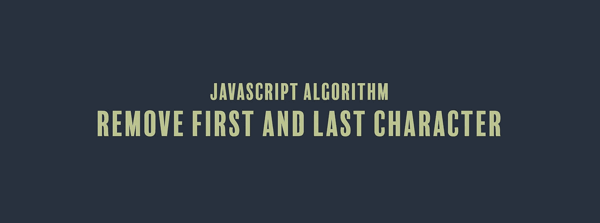

# JavaScript 算法:删除第一个和最后一个字符

> 原文：<https://javascript.plainenglish.io/javascript-algorithm-remove-first-and-last-character-a80b7bc28536?source=collection_archive---------4----------------------->

## 我们编写了一个函数来删除字符串的第一个和最后一个字符



我们将编写一个名为`firstAndLast`的函数，它将接受一个字符串(`str`)作为参数。

您会得到一串由单个空格分隔的字符序列。该函数的目标是删除序列的第一个和最后一个字符，并返回字符串。如果删除第一个和最后一个字符产生一个空字符串，返回`null`。

以下是一些例子:

```
"1 2 3" --> "2""43f b6 abb 2 a" --> "b6 abb 2""6 65" --> null
```

让我们写我们的函数。

我们首先使用`split()`方法将字符串转换成一个字符数组。使用正则表达式，我们在有非单词字符或`\W`的地方拆分字符。这些字符包括空格、字母数字字符和下划线。我们将其赋给一个名为`newArr`的变量。

```
let newArr = str.split(/\W/g);
```

接下来，我们使用新的数组并使用`slice()`方法提取数组中从第二个字符到最后一个字符的所有项目，但不包括最后一个字符。slice 方法返回这个数组部分的一个浅层副本，所以我们将它赋给一个名为`arrSlice`的变量。

我们使用`join()`方法将数组转换回字符串。请确保在每个字符之间添加一个空格。

```
let arrSlice = newArr.slice(1, newArr.length-1).join(" ");
```

我们返回一行条件操作符，检查字符串是否为空。

如果我们的字符串序列在删除第一个和最后一个字符后至少还有一个字符，我们返回`arrSlice`。

如果`arrSlice`中没有剩余的字符，我们返回`null`。

```
return arrSlice ? arrSlice : null;
```

下面是该函数的其余部分:

```
function firstAndLast(str){
  let newArr = str.split(/\W/g);
  let arrSlice = newArr.slice(1, newArr.length-1).join(" ");
  return arrSlice ? arrSlice : null;
}
```

如果你觉得这个算法有帮助，看看我的其他 JavaScript 算法解决方案:

[](https://medium.com/javascript-in-plain-english/javascript-algorithm-vowel-remover-c8808868ee55) [## JavaScript 算法:元音去除器

### 我们将创建一个函数来删除字符串中的所有元音

medium.com](https://medium.com/javascript-in-plain-english/javascript-algorithm-vowel-remover-c8808868ee55) [](https://medium.com/javascript-in-plain-english/javascript-algorithm-chuck-norris-true-or-false-52d5cd8c1fc7) [## JavaScript 算法:Chuck Norris——对还是错？

### 我们要写一个不使用关键字 false 就返回 false 的函数。

medium.com](https://medium.com/javascript-in-plain-english/javascript-algorithm-chuck-norris-true-or-false-52d5cd8c1fc7) [](https://medium.com/@endubueze00/javascript-algorithm-alphabet-soup-91f5dea79e51) [## JavaScript 算法:字母汤

### 我们要写一个函数，返回一个按字母顺序排列的字符串。

medium.com](https://medium.com/@endubueze00/javascript-algorithm-alphabet-soup-91f5dea79e51) 

【JavaScript 用简单英语写的一句话:我们总是对帮助推广优质内容感兴趣。如果你有一篇文章想用简单的英语提交给 JavaScript，请用你的 Medium 用户名给我们发一封电子邮件到[submissions@javascriptinplainenglish.com](mailto:submissions@javascriptinplainenglish.com)，我们会把你添加为作者。