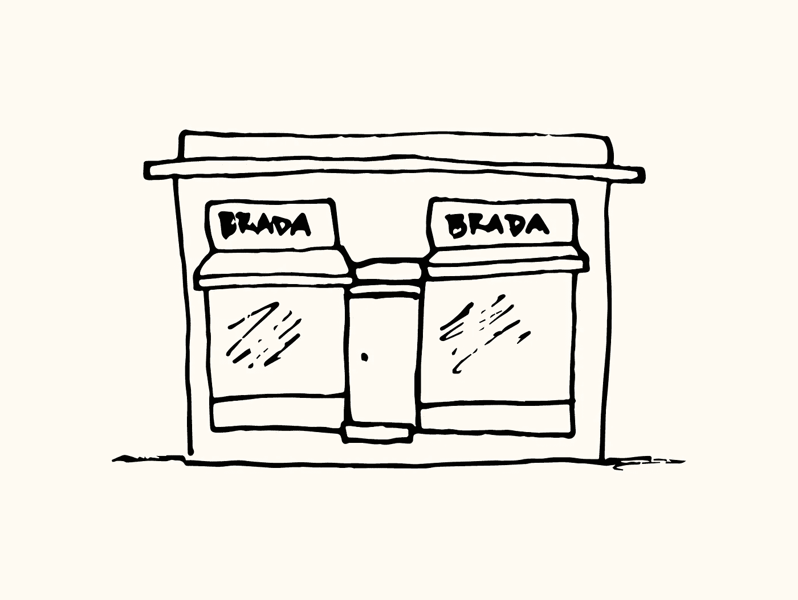

# JavaScript 算法:袜子商人

> 原文：<https://javascript.plainenglish.io/javascript-algorithm-sock-merchant-de9ffa754dfc?source=collection_archive---------4----------------------->


对于今天的算法，我们将编写一个名为`sockMerchant`的函数，它将接受两个输入，一个整数`n`和一个数组`ar`。



A store called Brada.

想象一下，你在一家服装店工作，你有一大堆袜子，你必须在商店开门前按颜色配对。这个函数的目的是确定有多少双袜子可以搭配成对。该数组包含表示颜色类型的整数。让我们看一个例子。

```
let n = 7; // the array length
let ar = [1, 2, 1, 2, 4, 4, 2];
```

我们有两个输入，`n`表示数组长度或袜子的数量，`ar`表示数组本身包含袜子。在阵列中，我们可以看到:

有两只颜色为 1 的袜子。

有三双颜色为 2 的袜子。

有两只颜色为 4 的袜子。

查看上面的信息，我们可以看到我们可以创建一双颜色为 1 的袜子，我们可以创建另一双颜色为 4 的袜子。对于颜色为 2 的袜子，有三只袜子，我们只能从这些袜子中创建一双。这样我们就剩下三双袜子和一只剩下的袜子了。该功能将输出`3`。

让我们把这变成代码。我们创造变量。

```
let numPairs = 0;
let currentColor = 0;
```

`numPairs`变量将保存袜子对的数量。这是函数将输出的变量。

`currentColor`变量将保存颜色类型。我们将在遍历数组时使用这个变量。

我们要做的第一件事是对数组输入进行排序。

```
let arSorted = ar.sort(function(a, b) {
    return a - b;
});
```

我们本可以使用`ar.sort()`，但问题是当我们的数组包含一位数到多位数的组合值时。让我们使用一个示例数组:

```
let arr = [2, 32, 5, 63, 6].sort();
// will output [2, 32, 5, 6, 63] ???
```

sort 方法的作用是将值转换成字符串，然后根据 UTF-16 代码单元值对它们进行排序。我们希望 sort 方法将我们的数字作为数字而不是字符串进行比较，所以我们使用了 compare 函数。为了比较数字，我们使用 compare 函数从 a 中减去 b。

```
function compareNumbers(a, b) {
  return a - b;
}
```

接下来，我们用 for 循环遍历数组。

```
for (let i = 0; i < n; i++) {
    if (arSorted[i] === currentColor) {
        continue;
    } else {
        numPairs += Math.floor(((arSorted.lastIndexOf(arSorted[i]) - arSorted.indexOf(arSorted[i])) + 1) / 2);
        currentColor = arSorted[i];
    }
}
```

先来看看我们的`else`块。我们有一个很长的等式分配给`numPairs`变量。让我们仔细看看，从最里面的括号开始，然后一步步来。

```
(arSorted.lastIndexOf(arSorted[i]) - arSorted.indexOf(arSorted[i])) + 1
```

因为我们对数组进行了排序，所以所有重复的颜色类型都在一起。我们可以很容易地使用`lastIndexOf`和`indexOf`方法从颜色类型的第一个出现值的索引中减去最后一个出现值的索引。这个计算计算了在我们的数组中有多少只这种颜色的袜子。IndexOf 方法从零开始计数，所以我们加 1 得到总值，就好像我们从 1 开始计数一样。

```
(arSorted.lastIndexOf(arSorted[i]) - arSorted.indexOf(arSorted[i])) + 1) / 2
```

现在我们知道有多少只特定颜色的袜子，我们除以 2，因为我们在数双。

```
Math.floor(((arSorted.lastIndexOf(arSorted[i]) - arSorted.indexOf(arSorted[i])) + 1) / 2);
```

我们取这个数字并使用`Math.floor`,这样如果我们遇到带小数的数字，我们就想向下取整，以得到袜子堆中该颜色的最大数量。

```
numPairs += Math.floor(((arSorted.lastIndexOf(arSorted[i]) - arSorted.indexOf(arSorted[i])) + 1) / 2);
```

我们获取该值并将其添加到我们的`numPairs`变量中。我们使用 JavaScript 的赋值操作符来帮助缩短我们的语句。

回到 for 循环中的条件，我们将当前的颜色类型赋给了`currentColor`变量。这是为了当我们转到数组中的下一个值时，如果我们遇到相同的颜色类型，我们使用`continue`关键字跳过数组中具有相同数字的其余值。我们已经知道在`currentColor`变量中有多少对颜色类型，所以我们跳过，直到我们得到另一种颜色类型。

循环结束后，我们返回袜子对的数量。

```
return numPairs;
```

我们的功能到此结束。这是我们的完整代码。

```
function sockMerchant(n, ar) {

    let numPairs = 0;
    let currentColor = 0; let arSorted = ar.sort(function(a, b) {
        return a - b;
    }); for (let i = 0; i < arSorted.length; i++) {
        if (arSorted[i] === currentColor) {
            continue;
        } else {
            numPairs += Math.floor(((arSorted.lastIndexOf(arSorted[i]) - arSorted.indexOf(arSorted[i])) + 1) / 2);
            currentColor = arSorted[i];
        }
    }
    return numPairs;
}
```


在本文中，我们讨论了方法索引和赋值操作符。关于这些文章中的那些，你可以看看我的其他文章:

[](https://medium.com/javascript-in-plain-english/javascript-algorithm-migratory-birds-848ad6a99ac3) [## JavaScript 算法:候鸟

### 对于今天的算法，我们将编写一个名为 migratoryBirds 的函数，在这个函数中，我们将接受一个…

medium.com](https://medium.com/javascript-in-plain-english/javascript-algorithm-migratory-birds-848ad6a99ac3) [](https://levelup.gitconnected.com/javascript-basics-mathematical-assignment-operators-e888e78fd391) [## JavaScript 基础:数学赋值运算符

### 在 JavaScript 中做数学运算时，您可能希望继续增加值。我们可以通过以下组合来实现这一点…

levelup.gitconnected.com](https://levelup.gitconnected.com/javascript-basics-mathematical-assignment-operators-e888e78fd391)