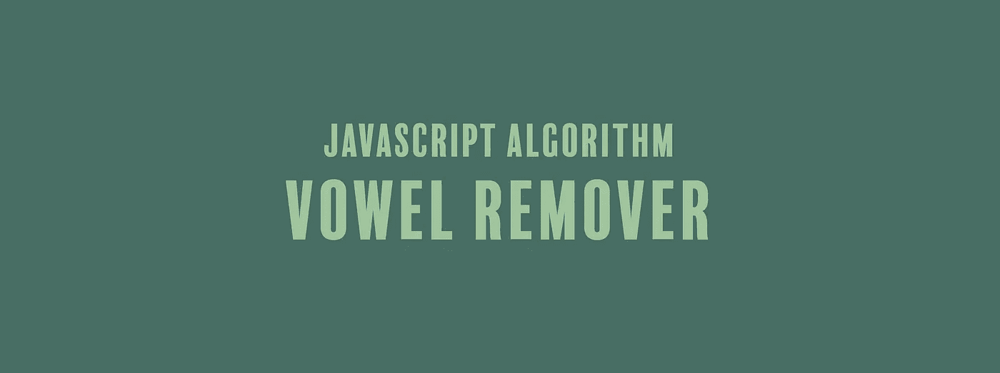

# JavaScript 算法:元音去除器

> 原文：<https://javascript.plainenglish.io/javascript-algorithm-vowel-remover-c8808868ee55?source=collection_archive---------3----------------------->

## 我们将创建一个函数来删除字符串中的所有元音



我们将编写一个名为`shortcut`的函数，它将接受一个字符串(`string`)作为参数。

这个函数的目标是从一个字符串中删除所有的小写元音并返回无元音的字符串。假设我们的字符串参数总是小写。以下是一些例子:

```
goodbye // --> gdby
hello // --> hll
complain // --> cmpln
```

首先，我们将创建一个匹配字符串中所有元音的正则表达式。我们将这个正则表达式赋给一个名为`vowels`的变量。

```
const vowels = /[aeiou]+/g;
```

接下来，我们将使用名为`replace()`的字符串方法。我们想要删除字符串中的每个元音。物理上去掉某样东西，就相当于拿走了某样东西，又用什么都不换。这就是我们用 replace 方法做的事情。

我们结合使用正则表达式和`replace()`方法来扫描字符串中的所有字符。如果字符是一个元音，它会被删除。

```
return string.replace(vowels, "");
```

这就是我们功能的结束。以下是剩余的代码:

```
function shortcut(string){
  const vowels = /[aeiou]+/g;
  return string.replace(vowels, "");
}
```

您也可以通过完全移除`vowel`变量声明来返回一行程序。

```
function shortcut(string){
  return string.replace(/[aeiou]+/g, "");
}
```

如果你觉得这个算法有帮助，看看我的其他 JavaScript 算法解决方案:

[](https://medium.com/@endubueze00/javascript-algorithm-stand-in-line-92e1e21e2f52) [## JavaScript 算法:排队

### 我们将编写一个基于计算机科学概念的函数，称为队列，在这里我们添加和删除项目到…

medium.com](https://medium.com/@endubueze00/javascript-algorithm-stand-in-line-92e1e21e2f52) [](https://medium.com/javascript-in-plain-english/javascript-algorithm-soccer-goal-totals-93223792b67f) [## JavaScript 算法:足球进球总数

### 我们将解决并研究在 JavaScript 中，在一个函数中添加多个数字总和的许多方法。

medium.com](https://medium.com/javascript-in-plain-english/javascript-algorithm-soccer-goal-totals-93223792b67f) [](https://medium.com/javascript-in-plain-english/javascript-algorithm-calculate-body-mass-index-6f14dce4075d) [## JavaScript 算法:计算身体质量指数

### 我们写了一个函数，计算你的身体质量指数，并确定你是否超重，体重不足，肥胖或正常。

medium.com](https://medium.com/javascript-in-plain-english/javascript-algorithm-calculate-body-mass-index-6f14dce4075d) 

## **用简单的英语写的 JavaScript 的注释:**

我们总是有兴趣帮助推广高质量的内容。如果你有一篇文章想用简单的英语提交给 JavaScript，请用你的 Medium 用户名发邮件到[submissions@javascriptinplainenglish.com](mailto:submissions@javascriptinplainenglish.com)给我们，我们会把你添加为作者。