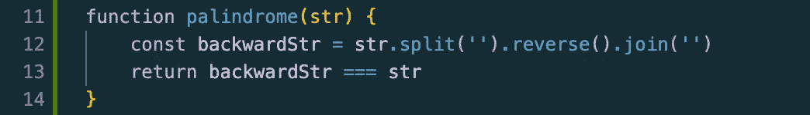
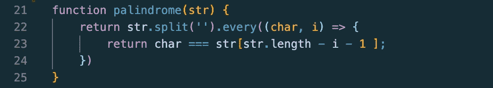

# JavaScript 算法:检查回文

> 原文：<https://javascript.plainenglish.io/javascript-algorithms-checking-for-palindromes-5db4b844ef41?source=collection_archive---------11----------------------->

你可能已经猜到了，但是我们今天要学习回文。具体来说，我们如何测试一个回文？我的初学者数据结构和算法博客系列的第三部分。

Photo by [Moritz Schmidt](https://unsplash.com/@moroo?utm_source=medium&utm_medium=referral)

上周，我们讨论了整数反转。本周，我们将检查回文。回文是一个在前景和背景中拼写相同的单词。简单回文的一个例子是世界“赛车”。由于我们只是从简单的问题开始，这个回文检查器将会是比未来版本更简单的版本。我们将只传入不包含特殊字符或大写字母的字符串参数。

在我们讨论完这个问题之后，我会给出一些提示，告诉我们如何处理更复杂的字符串。现在，让我们先看看简单的回文验证问题:

**给定一个字符串，写一个函数检查该字符串是否是回文。如果字符串是回文，函数将返回 true。如果不是回文，函数将返回 false。例如，“赛车”、“眼睛”和“夫人”都将返回 true，而“苹果”、“水”和“窗户”都将返回 false。**

## **方案一**

在我讨论字符串反转的第一个问题中，我介绍了三种简化字符串反转过程的辅助方法:split、reverse 和 join。为了检查一个回文，我们需要做的就是确保单词的拼写和它倒着拼写的完全一样！为了做到这一点，我们必须声明一个变量来分配反向拼写的字符串，然后将其与原始字符串进行比较。下面的代码看起来与第一个问题非常相似，只是多了一行用于严格的等式测试。我将在解决方案后更详细地讨论三重等号。

第 12 行的代码并不新鲜。我把字符串拆开，然后把它转换成一个数组，把数组中的每一个字母反过来，再把它们连接起来形成一个字符串。在第 13 行，我使用三重等号来测试严格相等性，这意味着 backwardStr 中的值必须与 Str 中的值完全相等。使用三等号和双等号之间有一些非常明显的区别。布兰登·莫雷利的博客对此做了很好的解释。

让我们试着给这个函数传入一个字符串。如果我们传入一个单词，比如 eye，它将返回 true。然而，如果我们传入一个像 apple 这样的单词，它将比较“elppa”和“apple”，这将返回 false。这就是回文检查的基础！现在让我们深入一个需要稍微复杂一点的逻辑的解决方案。

## **解决方案 2**

如果一个回文前后相同，这意味着左边的每一个字母或字符，应该在右边完全相反的位置有一个相等的字符。下一个解决方案可能看起来有点吓人，但是我向你保证，一旦我解释了 *every* helper 方法是如何工作的，它就会变得更有意义。

开始也是这样，在字符串上使用 split 创建一个数组。 *every* array helper 方法接受几个参数，但是这个问题只需要两个参数，即每次传递的元素以及该元素的索引。在解决方案中，这些被标记为字符的*字符*和索引的 *i* 。Char 表示迭代中传递的每个字符，所以如果我们以数组["r "、" a "、" c "、" e "、" c "、" a "、" r"]为例，在数组的第一次迭代中，char 将等于 *r* 。 *i* 表示字符的索引，因此在第一次迭代中， *i* 将等于 0。记住数组索引从 0 开始。数组[0]是 *r，*数组[1]是 *a* ，数组[2]*是 *c* ，以此类推。*

*every* 助手的迷人之处在于它根据传入的特定条件返回一个布尔值。在第 23 行，我指定的条件是，如果当前字符等于字符串长度索引处的字符减当前字符索引减 1，那么我们返回 true 并继续下一个字符。有很多东西需要理解，所以让我们来分析一下。字符串长度不是从 0 开始，这与数组索引不同。所以 racecar 的字符串长度是 7，而其字符的最后一个索引是 6。这就是为什么我们要从字符串长度中减去 1。我们从字符串长度中减去当前字符索引，以便根据我们已经进入字符串的程度进行递减。例如，如果我们测试第二个字符，或者索引为 1 的数组，我们也想从右边开始测试第二个字符。如果我们创建的数组来自字符串“racecar ”,我们测试的是*、一个*、或者从左边数第二个字符，数组长度 7 减 1 得到 6，减去索引 1 得到 5。Array[5]会给我们*一个*，它正好是右边第二个字符。

这种解释可能真的令人困惑，所以我强烈建议熟悉数组索引和导航的最好方法是通过实践！打开您的 Google 命令控制台，编写一个字符串，将它的分割版本设置为一个变量，然后摆弄索引！

在这两行代码之后，我们的返回值要么是真，要么是假。如果在任何时候，我们测试的字符与另一端的字符不匹配，那么 *every* 函数将立即返回 false。如果它成功地比较了所有的字符，并且没有一个布尔值返回 false，那么 every 将返回 true，我们就有了一个回文！

接下来的这一周可能会令人困惑，但如果你明白了一切，干得好！如果没有，那完全没关系。尝试，尝试，再尝试！不要忘记休息。如果你在数组索引上有一点困难，那对我来说也是一个挑战。对自己要有耐心，要知道你用得越多，事情就会变得越容易。你能行的！

下周，我将处理一个概念而不是一个问题。我在数据结构博客的第一周提到了这个概念:时间和空间复杂性，也称为大 O 符号！我将解释它是什么，谈论各种类型，然后我将回顾前三个问题，谈论它们的时间和空间复杂性。这也是一个很难理解的话题，所以如果你很好奇，[现在就开始阅读吧！](https://www.freecodecamp.org/news/my-first-foray-into-technology-c5b6e83fe8f1/)

喜欢这篇文章吗？如果有，通过 [**订阅获取更多类似内容解码，我们的 YouTube 频道**](https://www.youtube.com/channel/UCtipWUghju290NWcn8jhyAw) **！**