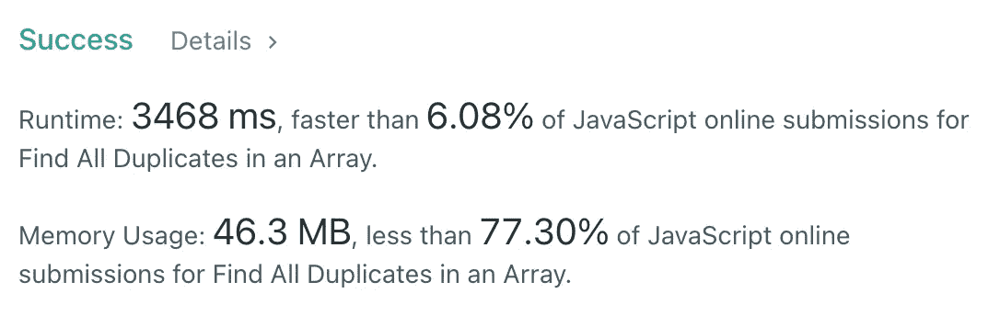
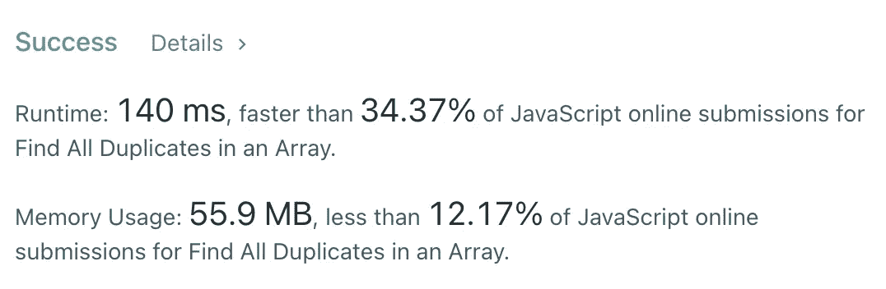

# JavaScript 算法:查找数组中的所有重复项(LeetCode)

> 原文：<https://javascript.plainenglish.io/javascript-algorithms-find-all-duplicates-in-an-array-leetcode-fb7b8c01a93a?source=collection_archive---------3----------------------->

Photo by [Beth Jnr](https://unsplash.com/@bthjnr?utm_source=medium&utm_medium=referral) on [Unsplash](https://unsplash.com?utm_source=medium&utm_medium=referral)

# 描述

给定一个整数数组，1≤a[I]≤*n*(*n*=数组大小)，有些元素出现**两次**，有些出现**一次**。

找出在这个数组中出现两次的**的所有元素。**

你能在没有额外空间的情况下在 O( *n* )运行时完成吗？

**例如:**

# 解决办法

我想到的第一个解决方案是两个嵌套的 for 循环:

时间复杂度为`O(n²)`，空间复杂度为`O(1)`。然而，我们需要用线性时间复杂度来实现。

我想到的第二个解决方案是用一个`map`来计算所有的字符，然后循环遍历它，把所有大于`1`的字符推到`result`。

时间复杂度是`O(n)`，空间复杂度也是。我们已经做到了，但仍然不够好。让我们考虑一下如何在没有额外内存的情况下，用线性时间来求解…

Photo by [Fabrizio Verrecchia](https://unsplash.com/@fabrizioverrecchia?utm_source=medium&utm_medium=referral) on [Unsplash](https://unsplash.com?utm_source=medium&utm_medium=referral)

提示在上面的描述中。`Given an array of integers, 1 ≤ a[i] ≤ n` *。如果我们从 T7 开始，我们可以说 T8 是这个项目的索引。因此，让我们想象我们有一个从`1`开始的索引数组。我们如何找到所有只出现两次的元素？我们可以标记每个`nums[index]`它们的负拷贝。正如我们决定的那样`index`将会是`nums[i]`。*

我知道，这看起来很棘手。让我们用**例子 1:** 来看看这个解决方案

时间复杂度是线性的，空间复杂度是常数。

我希望，它对你有用。感谢阅读！期待您的反馈。回头见，✌️