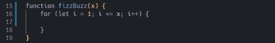
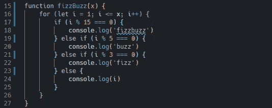

# JavaScript 算法:FizzBuzz

> 原文：<https://javascript.plainenglish.io/javascript-algorithms-fizzbuzz-ebb58951b82e?source=collection_archive---------8----------------------->

*嘶嘶……嗡嗡……嘶嘶嗡嗡？这个经典而有趣的小技术面试问题将真正解决你对模数运算符的理解！*


Photo by [Crissy Jarvis](https://unsplash.com/@crissyjarvis?utm_source=medium&utm_medium=referral)

FizzBuzz 是一个经常出现的非常简单的面试问题。这是那种在你看过一次答案后，你会一直记得如何解决它的问题。整个问题中唯一棘手的部分是模数运算符的使用。根据 [MDN Web Docs](https://developer.mozilla.org/en-US/docs/Web/JavaScript/Reference/Operators/Remainder) ，模数/余数运算符(%)返回一个操作数除以第二个操作数后的余数。它总是带着被除数的符号。因此，如果我写 *12 % 5，*它将返回 2，因为 5 进入 12 两次，余数为 2。说完这些，我们开始吧:

**写一个函数，打印出一个从 1 到 x 的数字。但是，你必须遵守这些规则:**

对于 3 的每个倍数，打印“fizz”而不是数字。
对于 5 的每一个倍数，打印“buzz”而不是数字。
对于 3 和 5 的每个倍数，打印“fizzbuzz”而不是数字。

**比如** `**fizzBuzz(5)**` **会返回:**

```
**1
2
fizz
4
buzz**
```

如果我们将问题分解成更小的部分，第一部分只是从 1 到 x 进行迭代。这可以通过使用手动 *for* 循环轻松完成:



在 *for* 循环中，我们将设置几个条件。具体地说，打印出的数字是 3、5 或 3 和 5 的倍数(基本上是 15)的情况。这些条件将使用模运算符，因为在任何时候，如果打印出的数字可以被 3、5 或 15 整除，那么模应该返回 0。让我们实现这些条件:



最后，我们希望确保在所有条件都不匹配的情况下打印出数字，这就是为什么我们在最后有一个 console.log(i)。

如果我们运行 fizzBuzz(5)的例子，我们从 1 开始运行条件语句。因为它不满足任何条件，所以将被打印出来。2 也是如此。一旦我们点击 3，因为 3 模 3 给我们 0，条件变成真，我们将打印出 fizz。4 也不满足任何条件，所以会重新打印出来。当我们点击 5，5 模 5 等于 0，所以条件也返回真，因此打印出嗡嗡声。

这个问题简短而有趣，但我认为它可以很好地进入更复杂的算法，包括检查特定的情况，并使用条件语句捕捉它们。

下周，我将尝试解释递归！