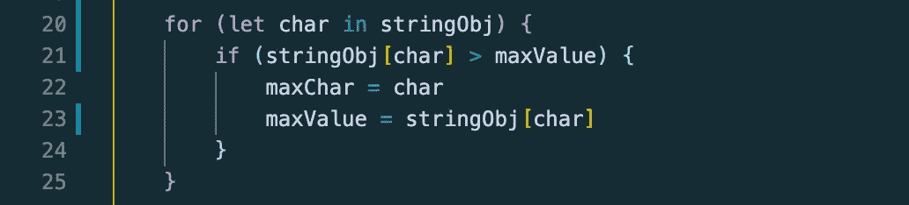
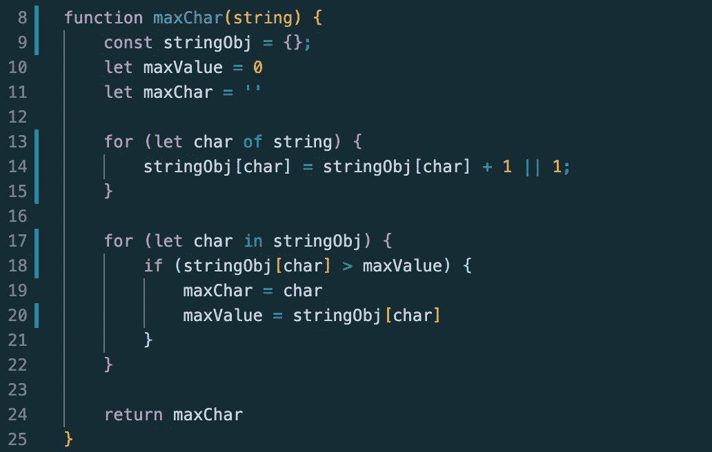

# JavaScript 算法:最大字符数

> 原文：<https://javascript.plainenglish.io/javascript-algorithms-max-characters-41b88e02044f?source=collection_archive---------10----------------------->

字母“I”在密西西比出现了多少次？那“s”和“p”呢？哪一个最常出现？在这篇博客中，我们将讨论如何在字符串中找到最常用的字符，这个问题可能会在你的下一次技术面试中出现。


Photo by [Joshua Hoehne](https://unsplash.com/@mrthetrain?utm_source=medium&utm_medium=referral)

这个问题是理解 JavaScript 对象用法的一个很好的例子，特别是如何访问和操作对象内部的值。它还测试你的 JavaScript 循环知识，比如知道 *for…of 和 for…in 的区别。*对于这个问题，要理解的对象的最重要属性是键值对的用法。当在代码中调用一个键时，它将返回被引用的值。下面是我在 prices 对象中调用苹果价格的一小段代码:


您可以使用符号 *object["key"]* 来调用对象内的键值。注意，传入的键是一个字符串。如果我想要橙子的价格，我只需输入 *prices["oranges"]* ，它将返回字符串" $3 "。下一步要理解的是如何使用中的*for…和*中的*for…进行循环。我在之前的一篇名为 [*的博文中简要解释了 JavaScript 算法:简单的字符串反转*](https://medium.com/javascript-in-plain-english/simple-string-reversal-ds-a-i-b43b0ef2619f?sk=d65372e798324da4ec026e3af497d013) *，*因此，如果您忘记了它是做什么的，可以随时回去查看一下！*循环中的*for…有点不同，因为它不迭代可迭代对象，比如字符串或数组。根据 MDN 文档，在* 循环中的[*for……遍历一个对象的所有*](https://developer.mozilla.org/en-US/docs/Web/JavaScript/Reference/Statements/for...in)*[可枚举属性](https://developer.mozilla.org/en-US/docs/Web/JavaScript/Enumerability_and_ownership_of_properties)，这些属性由字符串作为关键字。这意味着如果我们试图只访问一个对象中特定键的值，那么*循环中的*for……就是最好的方法。*

这个解决方案的方法之一是创建一个 JavaScript 对象，将字符作为键，将使用次数作为值。一旦使用给定的字符串创建了该对象，我们就遍历该对象以找到最大值，然后返回它的键。听起来解释起来很简单……而且执行起来也应该相当简单。我们开始吧！

***给定一个字符串，返回该字符串中最常用的字符。例如，如果字符串是“apple”，函数将返回“p”。如果单词是“数据”，函数将返回“a”。***

为了开始这个问题，我将创建一个名为 stringObj 的空对象。这个对象将携带所有的键值对，字符串中的每个字符作为键，该字符的频率作为值。为了实现这一点，我需要使用循环的*for…来迭代给定的字符串。我还将创建两个变量:一个保存当前的最大值，另一个保存当前的字符。*


循环中的逻辑一开始可能有点混乱，所以让我们一起来看一下。在前面的价格表中，我谈到了我们如何通过使用符号 *object["key"]* 来引用一个值。条件的第一部分是调用 object-key，并将其设置为当前值加 1。如果我们不能给引用值加 1，那么我们将把它设置为 1。这是考虑到字符还没有被添加到对象的情况。所以我们以一个字符串为例:“hello”。for…of 循环的第一个字符是“h”。我们希望通过将 stringObj["h"]设置为 1，将这个字符添加到 stringObj 对象中。因为这个值还不存在，所以尝试引用它将返回 undefined，这是一个 false-y 值，因此逻辑 OR(||)运算符会将 undefined 值设置为 1。如果我们在字符串中遇到另一个“h ”,因为引用的值现在包含值“1 ”,并且不再是未定义的，所以它将递增，而不是设置为 1。这个循环将遍历给定字符串中的每个字符，并为每个字符创建一个键值对，将它们放在 stringObj 对象中。

下一步是找到具有最高值/频率的字符。前面，我们初始化了 maxValue 和 maxChar 来分别表示值和字符。现在我们需要遍历 stringObj 对象，并相应地更新 maxValue 和 maxChar 的值。这就是 for…in 循环至关重要的地方。



这个 for…in 循环将检查 stringObj 中的每个字符键，并检查它的值是否大于 maxValue。如果它大于 maxValue，maxValue 将更改为字符的值，然后 maxChar 将更改为具有 maxValue 的字符。这听起来有点混乱，但在下面的例子中会更有意义。

假设我们有一串“abbcccddddeeeee”。如果我们运行我们的 maxChar 函数，在我们的 for…of 循环(代码中的第一个循环)完成后，我们将得到一个如下所示的 stringObj 对象:


我们可以很明显地看出，字母“e”是最常见的字母，但如果字符串明显更长呢？这就是为什么我们遍历对象并相应地更新我们的 maxChar 和 maxValue。for…in 循环第一次运行时，maxChar 将等于“a”，maxValue 将等于“1”。第二次运行时，由于“b”的值大于“a ”, max char 被替换为“b ”, max value 将被更改为“2”。这种情况一直持续到整个循环迭代完毕。

在我们函数的最后，你不能忘记我们要回答这个问题！为此，我们必须返回 maxChar，这将是字符串中最常用的字符。在上面的例子中，我们将得到返回值“e”。

这里是完整的代码解决方案。试着浏览每一行，看看是否还有意义。



实际上有类似的问题有几乎与这个解决方案相同的方法，例如使用变位词(“字符串 A 与字符串 B 具有相同的字符数量和类型吗？”)和重复字符(“给定的字符串中有重复字符吗？”).任何涉及计数或比较字符串中的字符的事情都很好地说明了何时使用对象来解决问题。

我希望这篇博客最终对您理解 JavaScript 对象的用法有所帮助。在下周的博客中，我将解释有史以来最常见的面试问题之一:FizzBuzz！这也是我个人的最爱之一，因为它让我真正理解了 JavaScript 模操作符。

下面是问题的预览。如果你愿意的话，你可以自己尝试一下！

编写一个函数，打印出从 1 到 x 的数字。但是，您必须遵守以下规则:

对于 3 的每个倍数，打印“fizz”而不是数字。
对于 5 的每一个倍数，打印“buzz”而不是数字。
对于 3 和 5 的每个倍数，打印“fizzbuzz”而不是数字。

例如，`fizzBuzz(5)`将返回:

```
1
2
fizz
4
buzz
```

玩得开心，别忘了休息！记住这是一场马拉松，不是短跑。