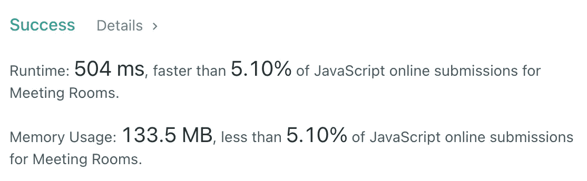
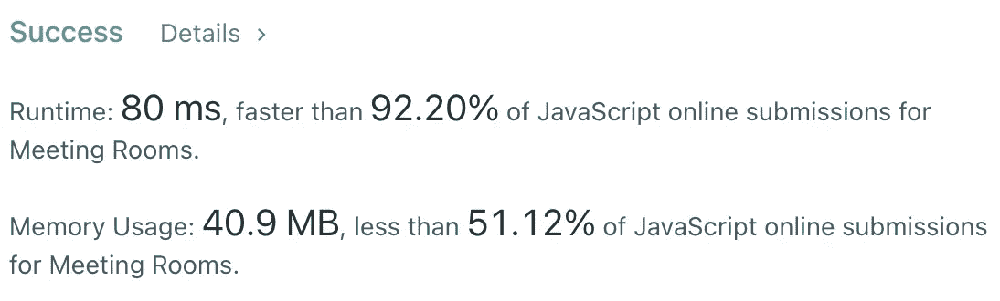

# JavaScript 算法:会议室(LeetCode)

> 原文：<https://javascript.plainenglish.io/javascript-algorithms-meeting-rooms-leetcode-2385465b92f0?source=collection_archive---------4----------------------->


Photo by [Benjamin Child](https://unsplash.com/@bchild311?utm_source=medium&utm_medium=referral) on [Unsplash](https://unsplash.com?utm_source=medium&utm_medium=referral)

# 描述

给定一组会议时间`intervals`，其中`intervals[i] = [starti, endi]`，确定一个人是否可以参加所有会议。

**例 1:**

```
**Input:** intervals = [[0,30],[5,10],[15,20]]
**Output:** false
```

**例 2:**

```
**Input:** intervals = [[7,10],[2,4]]
**Output:** true
```

**约束:**

*   `0 <= intervals.length <= 104`
*   `intervals[i].length == 2`
*   `0 <= starti < endi <= 106`

# 解决办法

当我第一次看到这个问题时，我想到了一个暴力解决方案。我们可以遍历`intervals`数组并创建一个包含所有繁忙时间的`Set`。如果我们看到一分钟已经在`Set`中，我们将返回`false`，否则返回`true`。

让我们来看看例子 **:**

让我们试着实现它



所以根据约束条件，时间复杂度为`O(n * m)`，其中`n`是`intervals`的个数，`m`是`starti`和`endi`的差值。空间复杂度为`O(n)`，其中`n`为`starti`和`endi`之间所有差异的个数。

让我们想想如何改进这个算法。如果我们提前按`starti`排序呢？

之后，我们可以检查每个会议是否在新的会议开始之前结束:

排序的时间复杂度为`O(nlogn)`，空间复杂度为`O(n)`。



我希望，它对你有用。感谢阅读！期待您的反馈。回头见，✌️