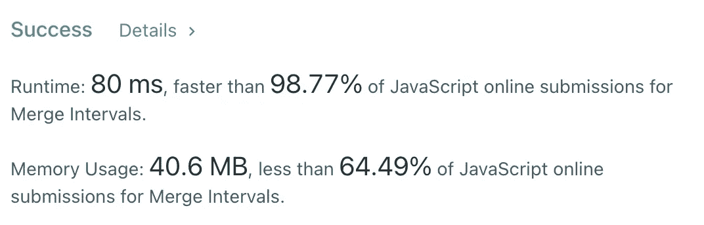

# JavaScript 算法:合并间隔(LeetCode)

> 原文：<https://javascript.plainenglish.io/javascript-algorithms-merge-intervals-leetcode-98da240805bc?source=collection_archive---------1----------------------->


Photo by [Maxim Melnikov](https://unsplash.com/@bbsody?utm_source=medium&utm_medium=referral) on [Unsplash](https://unsplash.com?utm_source=medium&utm_medium=referral)

# 描述

给定一个`intervals`的数组，其中`intervals[i] = [starti, endi]`，合并所有重叠区间，返回*一个非重叠区间的数组，覆盖输入*中的所有区间。

**例 1:**

```
**Input:** intervals = [[1,3],[2,6],[8,10],[15,18]]
**Output:** [[1,6],[8,10],[15,18]]
**Explanation:** Since intervals [1,3] and [2,6] overlaps, merge them into [1,6].
```

**例 2:**

```
**Input:** intervals = [[1,4],[4,5]]
**Output:** [[1,5]]
**Explanation:** Intervals [1,4] and [4,5] are considered overlapping.
```

**约束:**

*   `1 <= intervals.length <= 104`
*   `intervals[i].length == 2`
*   `0 <= starti <= endi <= 104`

# 解决办法

在这个问题中，我们可以预先对`intervals`进行排序，然后我们可以遍历排序后的数组，并尝试以某种方式合并这些区间。这里的关键是想出如何合并音程。

一个想法很简单。我们需要检查当前的`interval`是否在前一个`interval`结束后开始。我们可以很容易地检查它，因为我们已经对`intervals`进行了排序。



因为排序，时间复杂度是`O(nlogn)`，因为我们用`result`存储合并的`intervals`，空间复杂度是`O(n)`。

我希望，它对你有用。感谢阅读！期待您的反馈。回头见，✌️